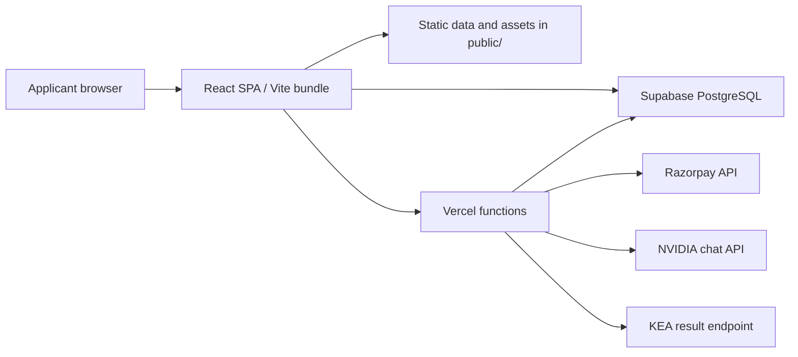

# KCETCoded
## Official Project Documentation

**Document classification:** Internal / Company operational reference  
**System:** KCETCoded (`kcet-compass`)  
**Baseline inspected:** 6 August 2026  
**Status:** Code-grounded implementation documentation  
**Review requirement:** Review before any production release or changes to data, payments, database policies, APIs, privacy practice, or third-party integrations.

---

## Document purpose

This is the single consolidated technical and operational description of KCETCoded as implemented in this repository. It is written for company use: engineering, operations, product review, security review, data maintenance, handover, and due diligence.

It intentionally distinguishes implemented capabilities from assumptions and records operational limitations. It is not a promotional document, a claim of admission accuracy, a legal opinion, a privacy certification, or a statement of affiliation with any external organisation.

KCETCoded is an independent product. It is not operated by, affiliated with, or an official service of KEA, COMEDK, any educational institution, Razorpay, Supabase, Vercel, NVIDIA, or any government authority. Users must verify consequential admissions decisions with the relevant current official notices and documents.

---

## Contents

1. Product summary and scope
2. Architecture and runtime model
3. Technology stack
4. Complete active route catalogue
5. Feature and page inventory
6. Repository and code structure
7. Core business logic and browser state
8. Static data, sources, and data pipeline
9. Database and Supabase integration
10. Serverless API reference
11. Payments, donors, and access-code flow
12. AI and external-service integrations
13. Configuration and environment variables
14. Hosting, headers, PWA, SEO, and analytics
15. Security, privacy, and governance assessment
16. Development, testing, and quality assurance
17. Release, data-refresh, and rollback procedures
18. Incident response
19. Known limitations and required remediation
20. Ownership and change management

---

# 1. Product summary and scope

## 1.1 What the system is

KCETCoded is a React-based web application intended to help KCET and COMEDK applicants research counselling outcomes and prepare for counselling. It combines historical cutoff data, rank and round estimates, college discovery, planning tools, resource pages, community contribution flows, previous-year-question practice, payments/donations, and selected AI-assisted user experiences.

The product is primarily browser-led. Core static data is delivered from the site itself. Supabase provides shared storage for selected features, and Vercel functions provide server-side integrations where secrets or edge rendering are involved.

## 1.2 Product domains

| Domain | Implemented purpose | Important limitation |
| --- | --- | --- |
| Admission intelligence | KCET/COMEDK rank estimates, cutoffs, trends, round estimates, college matching and simulation | Estimates and historical data are not official outcomes or guarantees |
| College research | College pages, comparison, reviews, placement/ROI-related data and suggestions | Source completeness and community content need ongoing validation/moderation |
| Counselling support | Documents, round tracking, mock verification, materials and information pages | Informational only; does not replace the authority process |
| Practice and engagement | PYQ tests, daily challenge, Cutoff Clash, Squad Finder and mapping tools | Coverage and content quality vary by feature/data set |
| Community | Reviews, comments, reports, suggestions, polls and feedback | Public write policies must be audited and hardened |
| Payments / access | Razorpay order and verification flow, donor records and access codes | Browser unlock logic is not strong authorization |
| AI assistance | AI counsellor and AI-assisted college listing | External model reliability, cost and output safety require controls |

## 1.3 Product modes

`src/contexts/ExamModeContext.tsx` controls the global KCET/COMEDK mode. The selection is persisted in browser local storage under `kcet.exam-mode.v1`. The selected mode changes the behaviour of shared rank-predictor and cutoff-explorer routes and related navigation language. A dedicated COMEDK explorer route also exists.

## 1.4 What the system must not claim

- It must not claim to be an official counselling portal or official source of results.
- It must not claim predicted rank, allotment, cutoff or college chance as certain.
- It must not claim that cached/parsing-assisted results are authoritative.
- It must not describe browser-stored access status or a client-visible admin passphrase as secure authentication.
- It must not claim data accuracy without a documented source and release validation record.

---

# 2. Architecture and runtime model

## 2.1 Logical architecture



## 2.2 Runtime characteristics

| Layer | Implementation | Responsibility |
| --- | --- | --- |
| Presentation | React 18 components/pages | UI, client calculations, navigation and browser interactions |
| Routing | React Router DOM | SPA route selection and fallback page |
| Styling | Tailwind CSS, Radix UI primitives, local CSS | Responsive UI and accessible building blocks |
| Static data | `public/data/`, public PDFs/XLSX assets | High-volume cutoff and supporting data delivery |
| Shared data | Supabase via `@supabase/supabase-js` | Community, practice, donor/access, suggestions and selected cache records |
| Server logic | Vercel functions in `api/` | Payments, AI, result lookups, social metadata/image generation |
| Build/deploy | Vite and Vercel | Client bundle build, route rewrite and function deployment |

## 2.3 Application bootstrapping and state

`src/main.tsx` mounts the React application. `src/App.tsx` defines routes and composes top-level providers. Shared state is mixed by design:

- React context: exam mode and presence/block-related state.
- Lightweight custom store: predictor-related shared state in `src/store/predictorStore.ts`.
- Browser local/session storage: settings, exam mode, selected preferences, some progress and unlock state.
- React Query: available for asynchronous client queries.
- Supabase: selected shared persistent records.

There is no single universal state-management system. Feature maintainers must identify the actual storage/authority for each item before changing it.

## 2.4 Application shell

`Layout.tsx`, `AppSidebar.tsx`, `Navbar.tsx`, `MobileNav.tsx`, and `CommandPalette.tsx` form the principal application shell. Layout-wrapped pages share this navigation experience. Homepage, daily challenge, Cutoff Clash, Squad Finder, metro/BMTC mappers, Hidden Gems, and the admin hub intentionally render as standalone pages.

---

# 3. Technology stack

| Category | Technology present in the repository |
| --- | --- |
| Language | TypeScript, JavaScript, SQL, Python |
| Frontend | React 18, React DOM, React Router DOM |
| Build | Vite 5, SWC React plugin, TypeScript |
| UI | Tailwind CSS, Radix UI, Lucide, Framer Motion, Sonner, cmdk |
| Forms / validation | React Hook Form, Zod, Hook Form resolvers |
| Data / charts | TanStack React Query, Recharts, XLSX, PDF.js |
| Backend | Vercel Node/Edge functions |
| Database | Supabase PostgreSQL and generated client types |
| Payments | Razorpay |
| AI | NVIDIA chat-completions API; OpenRouter-referencing client module |
| Analytics | Vercel Analytics |
| Testing | Vitest, Testing Library, JSDOM |
| Extraction tooling | Node scripts, Python scripts, PDF/XLSX/OCR support packages |

The exact package versions are controlled by `package.json` and `package-lock.json`. Do not treat this table as a substitute for dependency vulnerability management.

---

# 4. Complete active route catalogue

The following routes are declared in `src/App.tsx` at the baseline date. A “Shell” route uses `Layout`; a “Standalone” route does not.

| Path | Component / behaviour | Form |
| --- | --- | --- |
| `/` | `Homepage` | Standalone |
| `/daily-challenge` | `DailyChallenge` | Standalone |
| `/cutoff-clash` | `CutoffClash` | Standalone |
| `/dashboard` | `Dashboard` | Shell |
| `/rank-predictor` | Mode-aware KCET or COMEDK rank predictor | Shell |
| `/cutoff-explorer` | Mode-aware KCET or COMEDK cutoff explorer | Shell |
| `/comedk-explorer` | `ComedkExplorer` | Shell |
| `/college-predictor` | `CollegePredictor` | Shell |
| `/college-finder` | Redirects to `/college-predictor` | Redirect |
| `/cutoff-trends` | `CutoffTrends` | Shell |
| `/cutoff-predictor` | `RoundPredictor` | Shell |
| `/round-predictor` | `RoundPredictor` | Shell |
| `/mock-simulator` | `MockSimulator` | Shell |
| `/round-tracker` | `RoundTracker` | Shell |
| `/college-compare` | `CollegeCompare` | Shell |
| `/documents` | `Documents` | Shell |
| `/document-verification` | `MockVerification` | Shell |
| `/reviews` | `Reviews` | Shell |
| `/reviews/:collegeCode` | `CollegeReviewPage` | Shell |
| `/colleges` | `CollegeInfoHub` | Shell |
| `/college-list` | `CollegeInfoHub` | Shell |
| `/college-cutoffs` | `CollegeCutoffs` | Shell |
| `/info-centre` | `InfoCentre` | Shell |
| `/materials` | `Materials` | Shell |
| `/cet-news` | `CETNews` | Shell |
| `/ai-counselor` | `AICounselor` | Shell |
| `/college/:collegeCode` | `CollegeDetail` | Shell |
| `/privacy` | `PrivacyPolicy` | Shell |
| `/terms` | `Terms` | Shell |
| `/payment-policy` | `PaymentPolicy` | Shell |
| `/about` | `About` | Shell |
| `/request-feature` | `FeatureRequest` | Shell |
| `/pyq-test` | `PYQTest` | Shell |
| `/donate` | `Donate` | Shell |
| `/supporters` | `Supporters` | Shell |
| `/squad-finder` | `SquadFinder` | Standalone |
| `/metro-mapper` | `MetroMapper` | Standalone |
| `/bmtc-mapper` | `BmtcMapper` | Standalone |
| `/hidden-gems` | `HiddenGems` | Standalone |
| `/admin` | `AdminHub` | Standalone |
| `*` | `NotFound` | Standalone |

Route-level files may exist without an active route declaration, including `Analytics.tsx`, `FeeCalculator.tsx`, `Planner.tsx`, and `XLSXDemo.tsx`. Presence in the source tree must not be described as an active public feature without verifying the route and navigation wiring.

---

# 5. Feature and page inventory

## 5.1 Admission and college intelligence

| Feature | Principal modules | Function |
| --- | --- | --- |
| Rank prediction | `RankPredictor`, `ComedkRankPredictor`, `rank-predictor.ts`, `comedk-rank-predictor.ts` | Produces estimated rank ranges from relevant input data |
| Cutoff exploration | `CutoffExplorer`, `ComedkExplorer`, `cutoff-service.ts` | Filters and displays historical cutoff records |
| College prediction | `CollegePredictor`, cutoff/college services | Identifies potential college-course choices using rank/category criteria |
| College cutoffs/details | `CollegeCutoffs`, `CollegeDetail`, `CollegeInfoHub` | College-first views and contextual information |
| College comparison | `CollegeCompare` | Comparison of selected colleges and course data |
| Trend and round tools | `CutoffTrends`, `RoundPredictor`, `round-drift-predictor.ts`, `cutoff-predictor.ts` | Historical movement and future-round estimation |
| Mock simulator | `MockSimulator`, `mock-simulator.ts` | Preference/allotment-style simulation based on available data |

## 5.2 Counselling and informational surfaces

`Documents`, `RoundTracker`, `MockVerification`, `InfoCentre`, `Materials`, `CETNews`, `About`, `PrivacyPolicy`, `Terms`, and `PaymentPolicy` present guidance, policy or information. These pages must remain aligned with actual data handling and payment processes. In particular, document-verification and result-related experiences must be clearly labelled as non-official assistance.

## 5.3 Community and engagement surfaces

Reviews, college-specific review pages, community discussion components, feature requests, polls, suggestions, Daily Challenge, PYQ Test, Cutoff Clash, Squad Finder, support/donation pages, and the supporter view create user input or engagement. Content involving reviews, comments, suggestions, actual ranks, donors, and results requires abuse prevention, ownership rules, moderation, retention, and deletion procedures.

## 5.4 Transport, discovery, and specialist utilities

`MetroMapper`, `BmtcMapper`, and `HiddenGems` use local data/services to support practical college research. Their outputs are convenience features and must not be treated as live transport or institution guarantees without documented data refreshes.

## 5.5 Administrative tooling

`AdminHub` and related components support PYQ management, access-code handling, college suggestions, college editing, review/report work, feedback, actual-rank-related material and AI extraction support. The current gate is browser-side and is not enterprise administration. Administrative mutations require server-side identity, role checks, audited actions, and restrictive database policies before the area can be treated as secure.

---

# 6. Repository and code structure

| Path | Responsibility |
| --- | --- |
| `src/pages/` | Route-level product pages |
| `src/components/` | Reusable UI, widgets, analytic visuals, community and admin components |
| `src/contexts/` | Cross-cutting providers such as exam mode and presence state |
| `src/data/` | Embedded question-bank and college data |
| `src/lib/` | Business logic, predictors, parsers, loaders, services and security helpers |
| `src/store/` | Lightweight shared predictor state |
| `src/integrations/supabase/` | Supabase client and generated database types |
| `api/` | Vercel serverless and edge endpoints |
| `public/` | PWA/SEO assets, static data, PDFs and downloadable resources |
| `scripts/` | Data extraction, merge, validation, news and asset-generation tools |
| `supabase/` | Database bootstrap schema, migrations and configuration |
| `reports/` | Data audit and validation outputs |
| root PDFs/XLSX/JSON/debug files | Source material, raw extracts, backups and working artifacts |

The repository currently mixes product source, delivered artifacts, raw documents, generated outputs and investigation/debug material. This assists research provenance but makes the authoritative artifact set harder to identify. A formal data manifest and archive policy are required.

---

# 7. Core business logic and browser state

## 7.1 Main logic modules

| Module group | Key files | Responsibility |
| --- | --- | --- |
| Rank and cutoff modelling | `rank-predictor.ts`, `comedk-rank-predictor.ts`, `cutoff-predictor.ts`, `round-drift-predictor.ts` | Estimate ranks and trend/round outcomes |
| Allocation simulation | `mock-simulator.ts` | Model preference and allotment-related scenarios |
| College data | `college-service.ts`, `collegeRoi.ts`, `college-placements.ts`, `courses.ts` | College profiles, review integration, economics/placement-support data |
| Cutoff data | `cutoff-service.ts`, course-normalisation modules | Load, filter and normalise cutoff material |
| Source traceability | `pdf-parser.ts`, `pdf-url-mapper.ts`, `pdf-config.ts`, `xlsx-loader.ts` | Read/expose source document and spreadsheet context |
| Community | `feature-request-service.ts`, `poll-service.ts`, `popup-service.ts`, `actual-rank-service.ts` | Community/feedback shared records |
| Access | `unlock.ts`, `settings.ts`, `security.ts` | Access UI, settings, client utility behaviour |

## 7.2 Browser storage

Browser state is used for selected settings, mode, local user experience, progress and unlock/access-code storage. Browser storage must be assumed editable by users and must never be an authorization authority. It is suitable for preferences and convenience; it is not suitable for access enforcement, admin authentication, confidential data, payment evidence, or definitive user identity.

---

# 8. Static data, sources, and data pipeline

## 8.1 Delivered data

`public/data/` contains high-volume KCET and COMEDK cutoff artifacts, additional cutoff variants, course mappings, source-PDF indexes, raw extraction text/tables and news artifacts. Multiple formats coexist: JSON, DAT, CSV, XLSX and PDF. Additional raw source PDFs/XLSX are also stored at repository root and in topic-specific folders.

The static artifacts are a key runtime source for cutoff features. The database is not the sole source of truth for browsing them. The currently live artifact must be identified by a release manifest, not inferred from any older README count or similarly named file.

## 8.2 Script categories

| Category | Typical script names | Purpose |
| --- | --- | --- |
| Extraction | `extract-*`, `parse-*` | Extract source PDF, XLSX or HTML content |
| Consolidation | `merge-*`, `clean-*`, `create-*-dataset` | Merge, normalise and construct usable data sets |
| Validation | `validate-*`, `verify-*`, `test-*`, `audit-*` | Check extraction quality and compare data |
| News | `fetch-*`, `refresh-news`, `news-webhook` | Collect and publish news artifacts |
| Assets/indexes | `generate-*`, `split-data` | Build PWA/static support and data indexes |

Scripts are working utilities, not a single workflow orchestrator. Operators must record exact source input, command, parser version/commit, output artifact, validation results and reviewer for every release.

## 8.3 Mandatory data-release procedure

1. Preserve the original official source with URL, authority, publication date, acquisition time and checksum.
2. Use a dedicated branch and execute the relevant extraction/consolidation script.
3. Validate schema, years, rounds, category labels, ranks, duplicate keys and row counts.
4. Compare output with the preceding published data set and investigate material differences.
5. Spot-check records against primary PDFs/XLSX files across common and edge categories.
6. Run applicable repository validation/audit scripts.
7. Publish only the intended served artifact under `public/data/` and keep a recoverable previous version.
8. Test the explorer/predictor locally with the updated artifact.
9. Obtain a second reviewer approval for consequential releases, deploy, and record release provenance.

---

# 9. Database and Supabase integration

## 9.1 Integration pattern

The browser initialises Supabase from `src/integrations/supabase/client.ts`. Selected Vercel functions initialise their own client. The client uses browser local storage for session persistence. The code includes fallback Supabase configuration; this makes deployment configuration less explicit and should be removed from server-sensitive paths.

## 9.2 Database record groups

| Group | Tables referenced in schema, migrations or application |
| --- | --- |
| Core admissions | `users`, `colleges`, `branches`, `cutoffs`, `seat_matrix` |
| Community | `college_reviews`, `college_comments`, `review_reports`, `user_suggestions`, `college_suggestions` |
| Predictions/practice | `rank_predictions`, `mock_simulations`, `actual_rank_submissions`, `pyq_questions` |
| Operations | `admin_activities`, `notification_subscriptions`, `polls`, `popups` |
| Results/engagement | `ugcet_results_cache`, `bring_it_back_votes`, `coping_hugs` |
| Payments/access | `donors`, `access_codes` |

`supabase/schema.sql` is a broad bootstrap schema. Timestamped migrations are the more reliable history for additions made later. Before changing a schema, review both the live project state and migrations; do not assume the root schema exactly matches production.

## 9.3 Access-control requirement

Supabase anon access is public configuration. RLS policies are the actual browser-data boundary. The root schema contains broad public mutation policies for a number of tables. This requires direct live-policy audit. Public clients must not have unrestricted write or delete access to donor records, access codes, administrative activity, moderation outcomes, or any private result data.

Every database migration must include: table change, indexes where required, RLS state, explicit policies, role tests (anonymous/authenticated/admin), and generated-type update when types are relied on.

---

# 10. Serverless API reference

| Endpoint | Method | Purpose | Key dependencies and considerations |
| --- | --- | --- | --- |
| `/api/ai-lister` | POST | Requests AI-assisted ranking/selection of candidate colleges | NVIDIA key; client body needs strict validation, rate limit and cost controls |
| `/api/nvidia-chat` | POST | Streams NVIDIA chat-completion responses | NVIDIA key; accepts messages array; needs abuse controls and output safety treatment |
| `/api/create-order` | POST | Creates Razorpay payment order | Razorpay ID/secret; validates integer paise and minimum amount |
| `/api/verify-payment` | POST | Verifies Razorpay HMAC signature and may create donor/access records | Razorpay secret and Supabase; must use authoritative payment data |
| `/api/check-result` | POST | Fetches/parses configured KEA result page and uses a cache | External markup/service; sensitive data/retention risk |
| `/api/share` | GET | Serves social metadata HTML and redirects | Query content must be escaped; redirect path must be constrained |
| `/api/og` | GET | Generates OG image from title/subtitle query values | Edge runtime and `@vercel/og` |

## 10.1 API rules

- Reject unsupported methods, malformed JSON and invalid schemas.
- Enforce body-size limits and rate limits before expensive provider calls.
- Log request IDs and outcomes but never raw credentials, signatures, application numbers, full results or payment data unnecessarily.
- Return generic safe errors to the client and retain technical diagnostics in protected server logs.
- Use server-side authorization for sensitive actions; do not depend on a UI flag.
- Add contract tests for valid, invalid, provider-failure, rate-limit and unauthorized cases.

---

# 11. Payments, donors, and access-code flow

## 11.1 Current flow

1. The client calls `/api/create-order` with an amount in paise.
2. The server validates basic amount input and creates a Razorpay order using server credentials.
3. The browser opens Razorpay checkout using `VITE_RAZORPAY_KEY_ID`.
4. Checkout response is sent to `/api/verify-payment`.
5. The function calculates/compares HMAC signature data using `RAZORPAY_KEY_SECRET`.
6. On success, donor and access-code records may be created in Supabase and an access code is returned.
7. `unlock.ts` saves access state/code in browser storage and updates local UI state.

## 11.2 Required integrity controls

- Verify order, payment amount, currency and completion state from Razorpay server-side; do not persist a client-provided amount as authoritative.
- Use privileged Supabase credentials only in the server environment, never in a Vite client variable.
- Establish idempotency to prevent duplicated donor/access records on retries.
- Protect donor/contact information with least-privilege policies and a retention policy.
- Enforce premium entitlement server-side whenever a feature or paid resource needs real protection.
- Reconcile payment provider records with donor/access records and have a defined refund/support process.

## 11.3 Current limitation

The client’s global unlock state and saved access code are user-interface mechanisms. Since browser storage can be altered, they are not secure access control. A client-visible admin passphrase is likewise not secure administration.

---

# 12. AI and external-service integrations

| Integration | Use | Main risk |
| --- | --- | --- |
| NVIDIA API | Chat and AI listing | Cost, prompt/input abuse, incorrect output, provider outage |
| Razorpay | Payments | Payment integrity, web/API attack surface, personal data handling |
| KEA result endpoint | Result lookup/parsing | Non-official proxy risk, external markup changes, sensitive data retention |
| Supabase | Shared data | RLS misconfiguration and excessive client permissions |
| Vercel | Hosting/functions/analytics | Deployment secrets, function observability and third-party processing |
| OpenRouter reference | Client-side AI helper module | Private key exposure if configured with `VITE_OPENROUTER_API_KEY` |
| Ad/social sources | CSP-approved/linked services | Third-party tracking, policy and availability dependencies |

AI outputs must be labelled as generated assistance, screened for unsafe/incorrect claims where material, and never treated as official counselling direction. If `VITE_OPENROUTER_API_KEY` is configured, it is exposed to browser clients; it must be replaced by a server-side integration and any exposed key must be rotated.

---

# 13. Configuration and environment variables

| Variable | Used by | Classification / rule |
| --- | --- | --- |
| `VITE_SUPABASE_URL` | Browser and selected functions | Public configuration |
| `VITE_SUPABASE_ANON_KEY` | Browser and selected functions | Public anon key; protected by RLS, not secrecy |
| `NEWS_API_KEY` | News scripts | Secret |
| `WEBHOOK_SECRET` | News workflow | Secret |
| `NVIDIA_API_KEY` | AI API endpoints / dev setup | Secret |
| `VITE_ACCESS_KEY` | Browser access-key flow | Public at build time; never use as a secret |
| `VITE_RAZORPAY_KEY_ID` | Browser checkout | Public publishable identifier |
| `RAZORPAY_KEY_ID` | Server order creation | Credential |
| `RAZORPAY_KEY_SECRET` | Server order creation/payment verification | Secret |
| `SUPABASE_SERVICE_ROLE_KEY` | Server-side privileged Supabase use | Highly privileged secret |
| `VITE_ADMIN_PASSPHRASE` | Current browser admin gate | Public at build time; not secure |
| `VITE_OPENROUTER_API_KEY` | Client `gemini.ts` module | Unsafe for a private API key; must not be used in production client build |

Any name beginning with `VITE_` is bundled into browser-delivered code. Never place a secret, service-role key, admin credential, payment secret, or paid API secret in it. Store secrets in Vercel/Supabase approved secret management and keep development/staging/production credentials separate.

---

# 14. Hosting, headers, PWA, SEO, and analytics

## 14.1 Vercel configuration

`vercel.json` configures broad no-store cache headers, security-related headers, a CORS/data rule and SPA rewrites that exclude `/api/`. It sets Content Security Policy, `X-Content-Type-Options`, `X-Frame-Options`, `Referrer-Policy`, and `Permissions-Policy` headers.

The CSP currently permits multiple external sources and includes `unsafe-inline` and `unsafe-eval`. These directives weaken CSP protection and must be removed incrementally with compatibility testing. All assets are broadly configured no-store, which favours immediate freshness but may increase bandwidth, latency and cost for large cutoff files. Adopt versioned artifacts and measured cache policy instead of changing this casually.

## 14.2 PWA and static assets

The repository includes a manifest, service worker and icon files. This demonstrates installability support, not a guaranteed offline experience. Offline critical paths must be explicitly tested. `public/sitemap.xml`, `robots.txt`, share/OG functions and index metadata support discoverability/social presentation.

## 14.3 Analytics

Vercel Analytics is included. The privacy policy must accurately state what analytics and any advertising/third-party tooling collect or process. Do not describe analytics as anonymous or non-identifying unless the deployed configuration and provider terms support that statement.

---

# 15. Security, privacy, and governance assessment

## 15.1 Data inventory

| Data class | Examples | Main storage/transit |
| --- | --- | --- |
| Public admissions data | Cutoffs, college/course metadata, source documents | Static files and browser downloads |
| Academic inputs | Marks, PUC aggregate, rank, category, preferences | Browser state; selected Supabase records |
| Result lookup data | Application number, parsed results | Result API and `ugcet_results_cache` |
| Community content | Reviews, comments, reports, suggestions | Supabase |
| Payment/support data | Amount, name, anonymous preference, access code | Razorpay flow and Supabase |
| Technical data | Browser storage, server logs, analytics | Browser, Vercel, external providers |

## 15.2 Trust boundaries

1. Browser code and storage are untrusted and alterable.
2. Supabase anon key is public; RLS is the data boundary.
3. Vercel functions are the server boundary for secrets and privileged logic.
4. Third parties have independent availability, security and privacy obligations.
5. Static data is only trustworthy when source provenance and validation are maintained.

## 15.3 Controls visible in the repository

- Razorpay HMAC signature verification occurs in a server function.
- Security-related Vercel headers are configured.
- RLS is enabled for a number of schema tables.
- API handlers generally reject unsupported HTTP methods.
- Some review workflows use validation/sanitisation helpers.
- The product includes non-official and verification-oriented messaging.

These are partial controls, not security certification or complete protection.

## 15.4 Material findings

| Priority | Finding | Required remediation |
| --- | --- | --- |
| Critical | Client-side `VITE_ADMIN_PASSPHRASE` gate is extractable/bypassable | Replace with server-verified identity and RBAC enforced by RLS/API |
| Critical | Browser unlock/access code controls premium UI | Server-enforce entitlement for protected data/actions |
| Critical | Schema shows broad public mutation policies | Audit live RLS table by table; remove broad mutations and add owner/admin rules |
| High | Server/client code contains fallback Supabase configuration | Fail closed when config absent; audit RLS and remove server fallbacks |
| High | Client OpenRouter variable may expose a paid secret | Move all private AI credentials behind a server endpoint and rotate exposed key |
| High | No evident comprehensive rate limiting/body limits/abuse monitoring | Add edge/server rate limit, payload caps, schemas, metrics and alerts |
| High | `share` interpolates query values into HTML/redirect | Escape values and restrict to safe same-origin relative path |
| High | Result lookup caches potentially sensitive student data | Define consent, minimum fields, access control, TTL/deletion and legal review |
| Medium | CSP permits `unsafe-inline` and `unsafe-eval` | Harden CSP with nonce/hash approach after compatibility tests |
| Medium | Payment flow trusts client-provided metadata | Read authoritative order/payment facts from provider server-side |
| Medium | Large raw/debug/backup artifacts are retained in repo | Classify, remove PII, archive appropriately and establish retention policy |
| Medium | Limited automated API/RLS/payment/E2E coverage | Add tests and enforce release gates |

## 15.5 Required operating rules

- Never commit `.env`, payment secrets, provider keys, result data or unnecessary personal data.
- Rotate credentials after exposure, incorrect distribution, public build inclusion, or suspected compromise.
- Do not log application numbers, result contents, payment signatures, secrets or access codes unnecessarily.
- Apply database migrations in staging first and test every affected policy using anonymous, normal and admin identities.
- Apply least privilege to browser data access.
- Maintain documented retention/deletion processes for cached results, community content and donor records.
- Keep privacy, terms and payment-policy pages synchronized with actual implementation.

---

# 16. Development, testing, and quality assurance

## 16.1 Prerequisites

- Node.js 18+; Node.js 20 LTS is recommended for operating consistency.
- npm.
- Python 3 for relevant extraction/validation scripts.
- Supabase/Vercel access only when changing shared environment or deployment.

## 16.2 Local setup

```powershell
npm install
Copy-Item env.example .env
npm run dev
```

Use non-production secrets/credentials for development. Do not commit `.env`.

## 16.3 Package-script reference

| Command | Purpose |
| --- | --- |
| `npm run dev` | Start Vite development server |
| `npm run build` | Production bundle build |
| `npm run build:dev` | Development-mode build |
| `npm run preview` | Preview production bundle |
| `npm run lint` | ESLint |
| `npm test` | Vitest |
| `npm run test:ui` | Vitest UI |
| `npm run extract:cutoffs` | KCET extraction entry point |
| `npm run extract:comedk` | COMEDK extraction entry point |
| `npm run move:xlsx` | Publish/move XLSX assets for app consumption |
| `npm run fetch:news`, `fetch:news:advanced`, `refresh:news`, `fetch:kcet`, `news:webhook` | News workflow entry points |
| `npm run build:summary` | Generate summary output |

## 16.4 Current test posture

Vitest configuration and tests for rank predictor, round drift predictor and mock simulator are present. A full automated test suite for page navigation, browser accessibility, artifact contracts, payment verification, API validation, RLS, result lookup and deployed-function smoke testing is not evident. A successful build does not prove data accuracy, payment integrity, policy correctness, privacy compliance, or reliable external integrations.

## 16.5 Required quality gates

Before merging/releasing relevant changes run lint, unit tests and production build. Add and execute targeted tests for any data, API, payment or policy change. The minimum future test suite should include artifact schema contracts, malformed API bodies, provider failure paths, anonymous/authenticated/admin RLS tests, payment signature/error paths, accessibility checks, and end-to-end smoke flows for core rank/cutoff/college journeys.

---

# 17. Release, data-refresh, and rollback procedures

## 17.1 General release checklist

1. Review the change set and ensure no secret, `.env`, personal data, unsupported claim, or unintended generated asset is included.
2. Run `npm run lint`, `npm test`, and `npm run build`.
3. Smoke-test navigation, mobile navigation, critical static-data loading and errors.
4. Complete data release checks for data changes.
5. Apply and test database migrations/policies in staging before production.
6. Check all Vercel variables and confirm only public values use `VITE_*` names.
7. Test relevant functions for wrong method, invalid body, valid flow and safe error handling.
8. Test payment changes with provider test flows, including cancellation and invalid signature.
9. Deploy and run production smoke checks.
10. Record deployment ID/URL, commit SHA, data version, migration identifiers, reviewer and rollback point.

## 17.2 Production smoke checks

- Homepage and main static assets load.
- `/dashboard`, `/rank-predictor`, `/cutoff-explorer`, `/college-predictor`, and `/cet-news` render without console failures.
- One KCET and one COMEDK query return expected-form results.
- Policy pages load.
- `/api/og` produces an image; `/api/share` is limited to a safe internal redirect.
- AI, payment and result lookup failure states are safe and understandable when providers are unavailable.
- Review/PYQ paths behave correctly under an anonymous browser session and no excessive permissions are granted.

## 17.3 Rollback

Redeploy the previous known-good Vercel deployment or Git commit. For data-only faults, restore the preceding versioned static artifact and deploy it. For schema changes, use a separately reviewed corrective migration; do not execute destructive production rollback actions without approved backups and a recorded change plan.

---

# 18. Incident response

| Event | Immediate action |
| --- | --- |
| Cutoff data error | Disable or rollback affected artifact/feature, preserve evidence, compare against official source |
| AI spend/error spike | Disable/restrict AI routes, investigate rate/traffic without recording private prompt data, rotate exposed key |
| Payment verification issue | Stop reporting payment success, reconcile provider state, preserve safe logs and resolve before grant |
| Suspected RLS bypass | Restrict affected policy/function, record scope, test live roles, rotate privileged secrets if involved |
| Result lookup failure | Mark unavailable or disable; do not aggressively retry against external authority |
| Credential exposure | Revoke/rotate immediately, update deployment config, inspect build/history/log exposure and document scope |

General response sequence: contain, preserve minimum necessary evidence, assess scope, patch/rotate, validate correction, follow applicable notification duties, and document root cause plus a preventive test/control.

---

# 19. Known limitations and required remediation

The following are factual operational limitations of the current repository and must remain documented until resolved:

1. Client-side admin gating and unlock status are not secure authorization.
2. Supabase policy security cannot be confirmed from source alone; live RLS requires audit.
3. API abuse controls, input schemas, body limits and monitoring are incomplete/not demonstrated comprehensively.
4. The result lookup depends on third-party availability and HTML structure and may handle sensitive information.
5. Historical cutoff quality depends on manual/extraction validation; multiple similarly named data artifacts coexist.
6. CSP is present but weakened by `unsafe-inline` and `unsafe-eval`.
7. The codebase includes raw artifacts, backups and debug output whose retention/classification is not centrally governed.
8. Automated testing exists but does not demonstrate complete end-to-end, policy, payment, accessibility or external-service coverage.
9. Page/component existence does not always mean the feature is actively routed or production-ready.
10. Predictions, simulations, community reports and AI outputs require visible uncertainty/disclaimer treatment.

Priority order: replace client-side administration/access control; audit/enforce RLS; remove client-held private keys and source fallbacks; harden/rate-limit APIs; establish result-data governance; validate payment authority server-side; make data provenance/releases reproducible; expand automated verification.

---

# 20. Ownership and change management

Every production change must have a responsible owner, a reviewer, a release/rollback record, and an updated documentation statement where it affects product behaviour. The following require elevated review:

- Supabase migrations, RLS or client database permissions.
- Payment, donor, access-code or entitlement logic.
- Server API input/output processing and external integrations.
- Cutoff/news/static-data releases and source provenance.
- Result lookup, any personal data field, retention/deletion practice, or policy-page statement.
- CSP, deployment security headers, secrets, analytics or advertising integrations.
- Any external claim about official status, accuracy, privacy or availability.

This document is the single PDF-ready master reference. It must be revised in the same change set whenever those controlled areas change. The supporting files under `docs/` are working references; this file is the consolidated company document for export and circulation.
