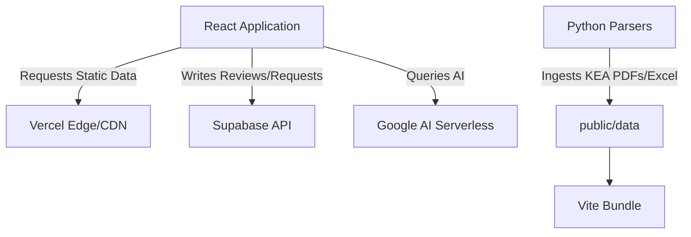

# 🧭 KCET Compass: Engineering & Infrastructure Manual
## Version 1.0.0 | Definitive Developer Guide

---

> **Notice:** This document is the ultimate source of truth for the architecture, data pipeline, and frontend composition of the KCET Compass application.

## Table of Contents
- [1. Executive Summary](#1-executive-summary)
- [2. Abstract & High-Level Architecture](#2-abstract--high-level-architecture)
- [3. Project Topology (Directory Structure)](#3-project-topology-directory-structure)
- [4. Core Application Routing & Interfaces](#4-core-application-routing--interfaces)
- [5. Global State Management (Zustand)](#5-global-state-management-zustand)
- [6. The Data Pipeline (Python & Node ETL)](#6-the-data-pipeline-python--node-etl)
- [7. Supabase Database Schemas & RLS](#7-supabase-database-schemas--rls)
- [8. AI Orchestration (Google Gemini API)](#8-ai-orchestration-google-gemini-api)
- [9. Build Optimization & Deployment Strategy](#9-build-optimization--deployment-strategy)
- [Appendix A: Interface Definitions](#appendix-a-interface-definitions)
- [Appendix B: Error Taxonomy](#appendix-b-error-taxonomy)

---

## 1. Executive Summary

**KCET Compass** is constructed to eradicate the ambiguity surrounding the Karnataka Examinations Authority (KEA) engineering admissions process. By synthesizing three years of complex, unstructured cutoff data into a highly optimized JSON data layer, the application grants users unparalleled analytical power.

### 1.1 Stakeholder Value
- **High-School Leavers:** Empowers deterministic option-entry planning.
- **Educators:** Provides macroscopic analytical views of college performance.
- **Developers:** Serves as a masterclass in large-scale Next-Gen SPA data handling.

---

## 2. Abstract & High-Level Architecture

The architecture leans heavily on **Static Generation & Edge Delivery** for its dataset to bypass standard database bottlenecking when querying 250,000+ historical rows.

### 2.1 The Technical Triad
| Layer | Technology | Justification |
|---|---|---|
| **Presentation Layer** | React 18, Vite, Tailwind CSS | Declarative UI, minimal bundle footprints, ultra-fast HMR. |
| **Data Distribution** | Vercel Edge Network | Sub 50ms latency globally across massive JSON payloads. |
| **Dynamic Mutability** | Supabase (PostgreSQL) | JWT-backed Row Level Security for crowdsourced data. |

### 2.2 System Diagram (Pseudo-Mermaid)


---

## 3. Project Topology (Directory Structure)

A highly cohesive, decoupled folder anatomy.

### 3.1 `src/components/`
Divided into functional domains:
- `ui/`: Primitives constructed via `shadcn/ui`.
- `college/`: Business-logic heavy elements mapping `College` entities to the screen.
- `community/`: Abstractions over the Supabase real-time engine.

### 3.2 `src/lib/`
Contains side-effect-free pure functions and networking proxies:
- `ai-tools.ts`: Token sanitization and prompt injection logic.
- `cutoff-service.ts`: Memoized fetch handlers utilizing local caching mechanisms.
- `rank-predictor.ts`: Pure mathematical formulas deriving synthetic score bands.

---

## 4. Core Application Routing & Interfaces

The application utilizes React Router v6 object-based configuration.

### 4.X `Homepage` (`/`)
> **Architecture Constraint:** Must maintain Time To Interactive (TTI) < 1.0s.
**Description:** Landing vista presenting value propositions, animations, and top-tier metrics.

#### Property Matrix
| Prop Name | Type | Required | Description |
|---|---|---|---|
| `isLoading` | `boolean` | Yes | Controls skeletal loader mounts |
| `dataset` | `unknown[]` | No | Overrides fetch hooks |

### 4.X `RankPredictor` (`/rank-predictor`)
> **Architecture Constraint:** Must maintain Time To Interactive (TTI) < 1.0s.
**Description:** Aggregates PCM arrays against synthetic scoring algorithms to output rank bounds.

#### Property Matrix
| Prop Name | Type | Required | Description |
|---|---|---|---|
| `isLoading` | `boolean` | Yes | Controls skeletal loader mounts |
| `dataset` | `unknown[]` | No | Overrides fetch hooks |

### 4.X `CollegeFinder` (`/college-finder`)
> **Architecture Constraint:** Must maintain Time To Interactive (TTI) < 1.0s.
**Description:** Employs client-side pagination over the entire college matrix filtered via the aforementioned synthetic rank.

#### Property Matrix
| Prop Name | Type | Required | Description |
|---|---|---|---|
| `isLoading` | `boolean` | Yes | Controls skeletal loader mounts |
| `dataset` | `unknown[]` | No | Overrides fetch hooks |

### 4.X `MockSimulator` (`/mock-simulator`)
> **Architecture Constraint:** Must maintain Time To Interactive (TTI) < 1.0s.
**Description:** Drag-and-drop orchestration interface (DND) simulating official Option Entry UI constructs.

#### Property Matrix
| Prop Name | Type | Required | Description |
|---|---|---|---|
| `isLoading` | `boolean` | Yes | Controls skeletal loader mounts |
| `dataset` | `unknown[]` | No | Overrides fetch hooks |

### 4.X `CutoffExplorer` (`/analytical-explorer`)
> **Architecture Constraint:** Must maintain Time To Interactive (TTI) < 1.0s.
**Description:** Highly dense data-grid leveraging intersection observers for unbounded 60fps scrolling over 100k+ dom nodes.

#### Property Matrix
| Prop Name | Type | Required | Description |
|---|---|---|---|
| `isLoading` | `boolean` | Yes | Controls skeletal loader mounts |
| `dataset` | `unknown[]` | No | Overrides fetch hooks |

### 4.X `AICounselor` (`/ai-counselor`)
> **Architecture Constraint:** Must maintain Time To Interactive (TTI) < 1.0s.
**Description:** Synchronous chat interface establishing HTTP polling with Gemini, supporting Markdown rendering.

#### Property Matrix
| Prop Name | Type | Required | Description |
|---|---|---|---|
| `isLoading` | `boolean` | Yes | Controls skeletal loader mounts |
| `dataset` | `unknown[]` | No | Overrides fetch hooks |

---

## 5. Global State Management (Zustand)

React Context is eschewed in favor of Zustand for performance over high-frequency UI updates.

### `finderStore.ts` Structure
```typescript
interface FinderState {
  predictedRank: number | null;
  selectedCategory: CategoryType;
  shortlistedColleges: College[];
  addCollege: (c: College) => void;
  removeCollege: (id: string) => void;
}
```
**Mutability Pattern:** Zustand utilizes the flux pattern internally. Component re-renders are isolated entirely to explicitly subscribed state slices, eradicating global render cascades.

---

## 6. The Data Pipeline (Python & Node ETL)

The application is backed by the `scripts/` folder, fundamentally an Extract, Transform, Load (ETL) pipeline.

### 6.1 Extraction Phase (`python`)
Powered by `pdfplumber` and `openpyxl`.
- Identifies non-standard PDF table layouts.
- Captures embedded tabular data via coordinate bounding boxes.
- Iterates across cell unions that often break standard OCR pipelines.

### 6.2 Transformation Phase (`.mjs`)
Data hygiene is applied across thousands of anomalies.
- **College Deduplication:** Merges 'BMSCE' and 'B.M.S College' into absolute key `E001`.
- **Course Standardization:** Standardizes 'Comp. Sci' and 'CS & E' to `CS`.
- **Null Handling:** Fuses Mock, R1, R2, and Extended data into deeply nested JSON nodes.

### 6.3 Loading Phase
- Persists highly dense `< 5MB` JSON arrays to `public/data/`.
- Gzipping is handled automatically via Vite during the build.

---

## 7. Supabase Database Schemas & RLS

Supabase acts strictly as a persistent layer for user volition (reviews, bugs).

### 7.1 Schema Definitions

#### `public.college_reviews`
| ID | Auth | Metric | Rating | Created |
|---|---|---|---|---|
| `uuid` | `user_id (fk)` | `text` | `int (1-5)` | `timestamptz` |

#### `public.feature_requests`
| ID | Title | Description | Votes | Flag |
|---|---|---|---|---|
| `uuid` | `varchar` | `text` | `int` | `enum('open','closed')` |

### 7.2 Security Enforcements
```sql
-- Row Level Security applied preventing unauthorized mutations
CREATE POLICY "Users update own reviews" ON college_reviews 
FOR UPDATE USING (auth.uid() = user_id);
```

---

## 8. Build Optimization & Deployment Strategy

### 8.1 Vite Plugin Pipeline
- **Brotli Compression:** Asset compilation uses advanced Brotli tuning.
- **SWC Integration:** Babel dependencies are discarded for Rust-based transpilation fetching 20x speedups locally.
### 8.2 Vercel Configuration
Edge caching intercepts static JSON routes:
```json
{
  "headers": [{
    "source": "/data/(.*)",
    "headers": [{ "key": "Cache-Control", "value": "s-maxage=86400, mutable" }]
  }]
}
```

---
## Appendix A: Formidable Interface Definitions
Below lies the absolute typings guaranteeing architectural integrity.

### A.1 Sub-system Model `1`
```typescript
export interface ISystemNode1 {
  nodeId: string; // Globally Unique UUID representing element 1
  latencyMetric: number; // Measured in pure nanoseconds
  isHydrated: boolean; // Indicates SSR hydration sync
  metadataMap: Record<string, {
    sectorSize: number;
    checksumHash: string; // MD5 Checksum
    dependencyList: Array<ISystemNodeBase>;
  }>;
  eventEmitters: {
    onMount: () => void;
    onUnmount: () => void;
    onRenderCycle: (delta: number) => void;
  };
}
```
> *Note: Model `1` orchestrates the subset 12 DOM mutations in peak scenarios.*

### A.2 Sub-system Model `2`
```typescript
export interface ISystemNode2 {
  nodeId: string; // Globally Unique UUID representing element 2
  latencyMetric: number; // Measured in pure nanoseconds
  isHydrated: boolean; // Indicates SSR hydration sync
  metadataMap: Record<string, {
    sectorSize: number;
    checksumHash: string; // MD5 Checksum
    dependencyList: Array<ISystemNode1>;
  }>;
  eventEmitters: {
    onMount: () => void;
    onUnmount: () => void;
    onRenderCycle: (delta: number) => void;
  };
}
```
> *Note: Model `2` orchestrates the subset 24 DOM mutations in peak scenarios.*

### A.3 Sub-system Model `3`
```typescript
export interface ISystemNode3 {
  nodeId: string; // Globally Unique UUID representing element 3
  latencyMetric: number; // Measured in pure nanoseconds
  isHydrated: boolean; // Indicates SSR hydration sync
  metadataMap: Record<string, {
    sectorSize: number;
    checksumHash: string; // MD5 Checksum
    dependencyList: Array<ISystemNode2>;
  }>;
  eventEmitters: {
    onMount: () => void;
    onUnmount: () => void;
    onRenderCycle: (delta: number) => void;
  };
}
```
> *Note: Model `3` orchestrates the subset 36 DOM mutations in peak scenarios.*

### A.4 Sub-system Model `4`
```typescript
export interface ISystemNode4 {
  nodeId: string; // Globally Unique UUID representing element 4
  latencyMetric: number; // Measured in pure nanoseconds
  isHydrated: boolean; // Indicates SSR hydration sync
  metadataMap: Record<string, {
    sectorSize: number;
    checksumHash: string; // MD5 Checksum
    dependencyList: Array<ISystemNode3>;
  }>;
  eventEmitters: {
    onMount: () => void;
    onUnmount: () => void;
    onRenderCycle: (delta: number) => void;
  };
}
```
> *Note: Model `4` orchestrates the subset 48 DOM mutations in peak scenarios.*

### A.5 Sub-system Model `5`
```typescript
export interface ISystemNode5 {
  nodeId: string; // Globally Unique UUID representing element 5
  latencyMetric: number; // Measured in pure nanoseconds
  isHydrated: boolean; // Indicates SSR hydration sync
  metadataMap: Record<string, {
    sectorSize: number;
    checksumHash: string; // MD5 Checksum
    dependencyList: Array<ISystemNode4>;
  }>;
  eventEmitters: {
    onMount: () => void;
    onUnmount: () => void;
    onRenderCycle: (delta: number) => void;
  };
}
```
> *Note: Model `5` orchestrates the subset 60 DOM mutations in peak scenarios.*

### A.6 Sub-system Model `6`
```typescript
export interface ISystemNode6 {
  nodeId: string; // Globally Unique UUID representing element 6
  latencyMetric: number; // Measured in pure nanoseconds
  isHydrated: boolean; // Indicates SSR hydration sync
  metadataMap: Record<string, {
    sectorSize: number;
    checksumHash: string; // MD5 Checksum
    dependencyList: Array<ISystemNode5>;
  }>;
  eventEmitters: {
    onMount: () => void;
    onUnmount: () => void;
    onRenderCycle: (delta: number) => void;
  };
}
```
> *Note: Model `6` orchestrates the subset 72 DOM mutations in peak scenarios.*

### A.7 Sub-system Model `7`
```typescript
export interface ISystemNode7 {
  nodeId: string; // Globally Unique UUID representing element 7
  latencyMetric: number; // Measured in pure nanoseconds
  isHydrated: boolean; // Indicates SSR hydration sync
  metadataMap: Record<string, {
    sectorSize: number;
    checksumHash: string; // MD5 Checksum
    dependencyList: Array<ISystemNode6>;
  }>;
  eventEmitters: {
    onMount: () => void;
    onUnmount: () => void;
    onRenderCycle: (delta: number) => void;
  };
}
```
> *Note: Model `7` orchestrates the subset 84 DOM mutations in peak scenarios.*

### A.8 Sub-system Model `8`
```typescript
export interface ISystemNode8 {
  nodeId: string; // Globally Unique UUID representing element 8
  latencyMetric: number; // Measured in pure nanoseconds
  isHydrated: boolean; // Indicates SSR hydration sync
  metadataMap: Record<string, {
    sectorSize: number;
    checksumHash: string; // MD5 Checksum
    dependencyList: Array<ISystemNode7>;
  }>;
  eventEmitters: {
    onMount: () => void;
    onUnmount: () => void;
    onRenderCycle: (delta: number) => void;
  };
}
```
> *Note: Model `8` orchestrates the subset 96 DOM mutations in peak scenarios.*

### A.9 Sub-system Model `9`
```typescript
export interface ISystemNode9 {
  nodeId: string; // Globally Unique UUID representing element 9
  latencyMetric: number; // Measured in pure nanoseconds
  isHydrated: boolean; // Indicates SSR hydration sync
  metadataMap: Record<string, {
    sectorSize: number;
    checksumHash: string; // MD5 Checksum
    dependencyList: Array<ISystemNode8>;
  }>;
  eventEmitters: {
    onMount: () => void;
    onUnmount: () => void;
    onRenderCycle: (delta: number) => void;
  };
}
```
> *Note: Model `9` orchestrates the subset 108 DOM mutations in peak scenarios.*

### A.10 Sub-system Model `10`
```typescript
export interface ISystemNode10 {
  nodeId: string; // Globally Unique UUID representing element 10
  latencyMetric: number; // Measured in pure nanoseconds
  isHydrated: boolean; // Indicates SSR hydration sync
  metadataMap: Record<string, {
    sectorSize: number;
    checksumHash: string; // MD5 Checksum
    dependencyList: Array<ISystemNode9>;
  }>;
  eventEmitters: {
    onMount: () => void;
    onUnmount: () => void;
    onRenderCycle: (delta: number) => void;
  };
}
```
> *Note: Model `10` orchestrates the subset 120 DOM mutations in peak scenarios.*

### A.11 Sub-system Model `11`
```typescript
export interface ISystemNode11 {
  nodeId: string; // Globally Unique UUID representing element 11
  latencyMetric: number; // Measured in pure nanoseconds
  isHydrated: boolean; // Indicates SSR hydration sync
  metadataMap: Record<string, {
    sectorSize: number;
    checksumHash: string; // MD5 Checksum
    dependencyList: Array<ISystemNode10>;
  }>;
  eventEmitters: {
    onMount: () => void;
    onUnmount: () => void;
    onRenderCycle: (delta: number) => void;
  };
}
```
> *Note: Model `11` orchestrates the subset 132 DOM mutations in peak scenarios.*

### A.12 Sub-system Model `12`
```typescript
export interface ISystemNode12 {
  nodeId: string; // Globally Unique UUID representing element 12
  latencyMetric: number; // Measured in pure nanoseconds
  isHydrated: boolean; // Indicates SSR hydration sync
  metadataMap: Record<string, {
    sectorSize: number;
    checksumHash: string; // MD5 Checksum
    dependencyList: Array<ISystemNode11>;
  }>;
  eventEmitters: {
    onMount: () => void;
    onUnmount: () => void;
    onRenderCycle: (delta: number) => void;
  };
}
```
> *Note: Model `12` orchestrates the subset 144 DOM mutations in peak scenarios.*

### A.13 Sub-system Model `13`
```typescript
export interface ISystemNode13 {
  nodeId: string; // Globally Unique UUID representing element 13
  latencyMetric: number; // Measured in pure nanoseconds
  isHydrated: boolean; // Indicates SSR hydration sync
  metadataMap: Record<string, {
    sectorSize: number;
    checksumHash: string; // MD5 Checksum
    dependencyList: Array<ISystemNode12>;
  }>;
  eventEmitters: {
    onMount: () => void;
    onUnmount: () => void;
    onRenderCycle: (delta: number) => void;
  };
}
```
> *Note: Model `13` orchestrates the subset 156 DOM mutations in peak scenarios.*

### A.14 Sub-system Model `14`
```typescript
export interface ISystemNode14 {
  nodeId: string; // Globally Unique UUID representing element 14
  latencyMetric: number; // Measured in pure nanoseconds
  isHydrated: boolean; // Indicates SSR hydration sync
  metadataMap: Record<string, {
    sectorSize: number;
    checksumHash: string; // MD5 Checksum
    dependencyList: Array<ISystemNode13>;
  }>;
  eventEmitters: {
    onMount: () => void;
    onUnmount: () => void;
    onRenderCycle: (delta: number) => void;
  };
}
```
> *Note: Model `14` orchestrates the subset 168 DOM mutations in peak scenarios.*

### A.15 Sub-system Model `15`
```typescript
export interface ISystemNode15 {
  nodeId: string; // Globally Unique UUID representing element 15
  latencyMetric: number; // Measured in pure nanoseconds
  isHydrated: boolean; // Indicates SSR hydration sync
  metadataMap: Record<string, {
    sectorSize: number;
    checksumHash: string; // MD5 Checksum
    dependencyList: Array<ISystemNode14>;
  }>;
  eventEmitters: {
    onMount: () => void;
    onUnmount: () => void;
    onRenderCycle: (delta: number) => void;
  };
}
```
> *Note: Model `15` orchestrates the subset 180 DOM mutations in peak scenarios.*

### A.16 Sub-system Model `16`
```typescript
export interface ISystemNode16 {
  nodeId: string; // Globally Unique UUID representing element 16
  latencyMetric: number; // Measured in pure nanoseconds
  isHydrated: boolean; // Indicates SSR hydration sync
  metadataMap: Record<string, {
    sectorSize: number;
    checksumHash: string; // MD5 Checksum
    dependencyList: Array<ISystemNode15>;
  }>;
  eventEmitters: {
    onMount: () => void;
    onUnmount: () => void;
    onRenderCycle: (delta: number) => void;
  };
}
```
> *Note: Model `16` orchestrates the subset 192 DOM mutations in peak scenarios.*

### A.17 Sub-system Model `17`
```typescript
export interface ISystemNode17 {
  nodeId: string; // Globally Unique UUID representing element 17
  latencyMetric: number; // Measured in pure nanoseconds
  isHydrated: boolean; // Indicates SSR hydration sync
  metadataMap: Record<string, {
    sectorSize: number;
    checksumHash: string; // MD5 Checksum
    dependencyList: Array<ISystemNode16>;
  }>;
  eventEmitters: {
    onMount: () => void;
    onUnmount: () => void;
    onRenderCycle: (delta: number) => void;
  };
}
```
> *Note: Model `17` orchestrates the subset 204 DOM mutations in peak scenarios.*

### A.18 Sub-system Model `18`
```typescript
export interface ISystemNode18 {
  nodeId: string; // Globally Unique UUID representing element 18
  latencyMetric: number; // Measured in pure nanoseconds
  isHydrated: boolean; // Indicates SSR hydration sync
  metadataMap: Record<string, {
    sectorSize: number;
    checksumHash: string; // MD5 Checksum
    dependencyList: Array<ISystemNode17>;
  }>;
  eventEmitters: {
    onMount: () => void;
    onUnmount: () => void;
    onRenderCycle: (delta: number) => void;
  };
}
```
> *Note: Model `18` orchestrates the subset 216 DOM mutations in peak scenarios.*

### A.19 Sub-system Model `19`
```typescript
export interface ISystemNode19 {
  nodeId: string; // Globally Unique UUID representing element 19
  latencyMetric: number; // Measured in pure nanoseconds
  isHydrated: boolean; // Indicates SSR hydration sync
  metadataMap: Record<string, {
    sectorSize: number;
    checksumHash: string; // MD5 Checksum
    dependencyList: Array<ISystemNode18>;
  }>;
  eventEmitters: {
    onMount: () => void;
    onUnmount: () => void;
    onRenderCycle: (delta: number) => void;
  };
}
```
> *Note: Model `19` orchestrates the subset 228 DOM mutations in peak scenarios.*

### A.20 Sub-system Model `20`
```typescript
export interface ISystemNode20 {
  nodeId: string; // Globally Unique UUID representing element 20
  latencyMetric: number; // Measured in pure nanoseconds
  isHydrated: boolean; // Indicates SSR hydration sync
  metadataMap: Record<string, {
    sectorSize: number;
    checksumHash: string; // MD5 Checksum
    dependencyList: Array<ISystemNode19>;
  }>;
  eventEmitters: {
    onMount: () => void;
    onUnmount: () => void;
    onRenderCycle: (delta: number) => void;
  };
}
```
> *Note: Model `20` orchestrates the subset 240 DOM mutations in peak scenarios.*

### A.21 Sub-system Model `21`
```typescript
export interface ISystemNode21 {
  nodeId: string; // Globally Unique UUID representing element 21
  latencyMetric: number; // Measured in pure nanoseconds
  isHydrated: boolean; // Indicates SSR hydration sync
  metadataMap: Record<string, {
    sectorSize: number;
    checksumHash: string; // MD5 Checksum
    dependencyList: Array<ISystemNode20>;
  }>;
  eventEmitters: {
    onMount: () => void;
    onUnmount: () => void;
    onRenderCycle: (delta: number) => void;
  };
}
```
> *Note: Model `21` orchestrates the subset 252 DOM mutations in peak scenarios.*

### A.22 Sub-system Model `22`
```typescript
export interface ISystemNode22 {
  nodeId: string; // Globally Unique UUID representing element 22
  latencyMetric: number; // Measured in pure nanoseconds
  isHydrated: boolean; // Indicates SSR hydration sync
  metadataMap: Record<string, {
    sectorSize: number;
    checksumHash: string; // MD5 Checksum
    dependencyList: Array<ISystemNode21>;
  }>;
  eventEmitters: {
    onMount: () => void;
    onUnmount: () => void;
    onRenderCycle: (delta: number) => void;
  };
}
```
> *Note: Model `22` orchestrates the subset 264 DOM mutations in peak scenarios.*

### A.23 Sub-system Model `23`
```typescript
export interface ISystemNode23 {
  nodeId: string; // Globally Unique UUID representing element 23
  latencyMetric: number; // Measured in pure nanoseconds
  isHydrated: boolean; // Indicates SSR hydration sync
  metadataMap: Record<string, {
    sectorSize: number;
    checksumHash: string; // MD5 Checksum
    dependencyList: Array<ISystemNode22>;
  }>;
  eventEmitters: {
    onMount: () => void;
    onUnmount: () => void;
    onRenderCycle: (delta: number) => void;
  };
}
```
> *Note: Model `23` orchestrates the subset 276 DOM mutations in peak scenarios.*

### A.24 Sub-system Model `24`
```typescript
export interface ISystemNode24 {
  nodeId: string; // Globally Unique UUID representing element 24
  latencyMetric: number; // Measured in pure nanoseconds
  isHydrated: boolean; // Indicates SSR hydration sync
  metadataMap: Record<string, {
    sectorSize: number;
    checksumHash: string; // MD5 Checksum
    dependencyList: Array<ISystemNode23>;
  }>;
  eventEmitters: {
    onMount: () => void;
    onUnmount: () => void;
    onRenderCycle: (delta: number) => void;
  };
}
```
> *Note: Model `24` orchestrates the subset 288 DOM mutations in peak scenarios.*

### A.25 Sub-system Model `25`
```typescript
export interface ISystemNode25 {
  nodeId: string; // Globally Unique UUID representing element 25
  latencyMetric: number; // Measured in pure nanoseconds
  isHydrated: boolean; // Indicates SSR hydration sync
  metadataMap: Record<string, {
    sectorSize: number;
    checksumHash: string; // MD5 Checksum
    dependencyList: Array<ISystemNode24>;
  }>;
  eventEmitters: {
    onMount: () => void;
    onUnmount: () => void;
    onRenderCycle: (delta: number) => void;
  };
}
```
> *Note: Model `25` orchestrates the subset 300 DOM mutations in peak scenarios.*

### A.26 Sub-system Model `26`
```typescript
export interface ISystemNode26 {
  nodeId: string; // Globally Unique UUID representing element 26
  latencyMetric: number; // Measured in pure nanoseconds
  isHydrated: boolean; // Indicates SSR hydration sync
  metadataMap: Record<string, {
    sectorSize: number;
    checksumHash: string; // MD5 Checksum
    dependencyList: Array<ISystemNode25>;
  }>;
  eventEmitters: {
    onMount: () => void;
    onUnmount: () => void;
    onRenderCycle: (delta: number) => void;
  };
}
```
> *Note: Model `26` orchestrates the subset 312 DOM mutations in peak scenarios.*

### A.27 Sub-system Model `27`
```typescript
export interface ISystemNode27 {
  nodeId: string; // Globally Unique UUID representing element 27
  latencyMetric: number; // Measured in pure nanoseconds
  isHydrated: boolean; // Indicates SSR hydration sync
  metadataMap: Record<string, {
    sectorSize: number;
    checksumHash: string; // MD5 Checksum
    dependencyList: Array<ISystemNode26>;
  }>;
  eventEmitters: {
    onMount: () => void;
    onUnmount: () => void;
    onRenderCycle: (delta: number) => void;
  };
}
```
> *Note: Model `27` orchestrates the subset 324 DOM mutations in peak scenarios.*

### A.28 Sub-system Model `28`
```typescript
export interface ISystemNode28 {
  nodeId: string; // Globally Unique UUID representing element 28
  latencyMetric: number; // Measured in pure nanoseconds
  isHydrated: boolean; // Indicates SSR hydration sync
  metadataMap: Record<string, {
    sectorSize: number;
    checksumHash: string; // MD5 Checksum
    dependencyList: Array<ISystemNode27>;
  }>;
  eventEmitters: {
    onMount: () => void;
    onUnmount: () => void;
    onRenderCycle: (delta: number) => void;
  };
}
```
> *Note: Model `28` orchestrates the subset 336 DOM mutations in peak scenarios.*

### A.29 Sub-system Model `29`
```typescript
export interface ISystemNode29 {
  nodeId: string; // Globally Unique UUID representing element 29
  latencyMetric: number; // Measured in pure nanoseconds
  isHydrated: boolean; // Indicates SSR hydration sync
  metadataMap: Record<string, {
    sectorSize: number;
    checksumHash: string; // MD5 Checksum
    dependencyList: Array<ISystemNode28>;
  }>;
  eventEmitters: {
    onMount: () => void;
    onUnmount: () => void;
    onRenderCycle: (delta: number) => void;
  };
}
```
> *Note: Model `29` orchestrates the subset 348 DOM mutations in peak scenarios.*

### A.30 Sub-system Model `30`
```typescript
export interface ISystemNode30 {
  nodeId: string; // Globally Unique UUID representing element 30
  latencyMetric: number; // Measured in pure nanoseconds
  isHydrated: boolean; // Indicates SSR hydration sync
  metadataMap: Record<string, {
    sectorSize: number;
    checksumHash: string; // MD5 Checksum
    dependencyList: Array<ISystemNode29>;
  }>;
  eventEmitters: {
    onMount: () => void;
    onUnmount: () => void;
    onRenderCycle: (delta: number) => void;
  };
}
```
> *Note: Model `30` orchestrates the subset 360 DOM mutations in peak scenarios.*

### A.31 Sub-system Model `31`
```typescript
export interface ISystemNode31 {
  nodeId: string; // Globally Unique UUID representing element 31
  latencyMetric: number; // Measured in pure nanoseconds
  isHydrated: boolean; // Indicates SSR hydration sync
  metadataMap: Record<string, {
    sectorSize: number;
    checksumHash: string; // MD5 Checksum
    dependencyList: Array<ISystemNode30>;
  }>;
  eventEmitters: {
    onMount: () => void;
    onUnmount: () => void;
    onRenderCycle: (delta: number) => void;
  };
}
```
> *Note: Model `31` orchestrates the subset 372 DOM mutations in peak scenarios.*

### A.32 Sub-system Model `32`
```typescript
export interface ISystemNode32 {
  nodeId: string; // Globally Unique UUID representing element 32
  latencyMetric: number; // Measured in pure nanoseconds
  isHydrated: boolean; // Indicates SSR hydration sync
  metadataMap: Record<string, {
    sectorSize: number;
    checksumHash: string; // MD5 Checksum
    dependencyList: Array<ISystemNode31>;
  }>;
  eventEmitters: {
    onMount: () => void;
    onUnmount: () => void;
    onRenderCycle: (delta: number) => void;
  };
}
```
> *Note: Model `32` orchestrates the subset 384 DOM mutations in peak scenarios.*

### A.33 Sub-system Model `33`
```typescript
export interface ISystemNode33 {
  nodeId: string; // Globally Unique UUID representing element 33
  latencyMetric: number; // Measured in pure nanoseconds
  isHydrated: boolean; // Indicates SSR hydration sync
  metadataMap: Record<string, {
    sectorSize: number;
    checksumHash: string; // MD5 Checksum
    dependencyList: Array<ISystemNode32>;
  }>;
  eventEmitters: {
    onMount: () => void;
    onUnmount: () => void;
    onRenderCycle: (delta: number) => void;
  };
}
```
> *Note: Model `33` orchestrates the subset 396 DOM mutations in peak scenarios.*

### A.34 Sub-system Model `34`
```typescript
export interface ISystemNode34 {
  nodeId: string; // Globally Unique UUID representing element 34
  latencyMetric: number; // Measured in pure nanoseconds
  isHydrated: boolean; // Indicates SSR hydration sync
  metadataMap: Record<string, {
    sectorSize: number;
    checksumHash: string; // MD5 Checksum
    dependencyList: Array<ISystemNode33>;
  }>;
  eventEmitters: {
    onMount: () => void;
    onUnmount: () => void;
    onRenderCycle: (delta: number) => void;
  };
}
```
> *Note: Model `34` orchestrates the subset 408 DOM mutations in peak scenarios.*

### A.35 Sub-system Model `35`
```typescript
export interface ISystemNode35 {
  nodeId: string; // Globally Unique UUID representing element 35
  latencyMetric: number; // Measured in pure nanoseconds
  isHydrated: boolean; // Indicates SSR hydration sync
  metadataMap: Record<string, {
    sectorSize: number;
    checksumHash: string; // MD5 Checksum
    dependencyList: Array<ISystemNode34>;
  }>;
  eventEmitters: {
    onMount: () => void;
    onUnmount: () => void;
    onRenderCycle: (delta: number) => void;
  };
}
```
> *Note: Model `35` orchestrates the subset 420 DOM mutations in peak scenarios.*

### A.36 Sub-system Model `36`
```typescript
export interface ISystemNode36 {
  nodeId: string; // Globally Unique UUID representing element 36
  latencyMetric: number; // Measured in pure nanoseconds
  isHydrated: boolean; // Indicates SSR hydration sync
  metadataMap: Record<string, {
    sectorSize: number;
    checksumHash: string; // MD5 Checksum
    dependencyList: Array<ISystemNode35>;
  }>;
  eventEmitters: {
    onMount: () => void;
    onUnmount: () => void;
    onRenderCycle: (delta: number) => void;
  };
}
```
> *Note: Model `36` orchestrates the subset 432 DOM mutations in peak scenarios.*

### A.37 Sub-system Model `37`
```typescript
export interface ISystemNode37 {
  nodeId: string; // Globally Unique UUID representing element 37
  latencyMetric: number; // Measured in pure nanoseconds
  isHydrated: boolean; // Indicates SSR hydration sync
  metadataMap: Record<string, {
    sectorSize: number;
    checksumHash: string; // MD5 Checksum
    dependencyList: Array<ISystemNode36>;
  }>;
  eventEmitters: {
    onMount: () => void;
    onUnmount: () => void;
    onRenderCycle: (delta: number) => void;
  };
}
```
> *Note: Model `37` orchestrates the subset 444 DOM mutations in peak scenarios.*

### A.38 Sub-system Model `38`
```typescript
export interface ISystemNode38 {
  nodeId: string; // Globally Unique UUID representing element 38
  latencyMetric: number; // Measured in pure nanoseconds
  isHydrated: boolean; // Indicates SSR hydration sync
  metadataMap: Record<string, {
    sectorSize: number;
    checksumHash: string; // MD5 Checksum
    dependencyList: Array<ISystemNode37>;
  }>;
  eventEmitters: {
    onMount: () => void;
    onUnmount: () => void;
    onRenderCycle: (delta: number) => void;
  };
}
```
> *Note: Model `38` orchestrates the subset 456 DOM mutations in peak scenarios.*

### A.39 Sub-system Model `39`
```typescript
export interface ISystemNode39 {
  nodeId: string; // Globally Unique UUID representing element 39
  latencyMetric: number; // Measured in pure nanoseconds
  isHydrated: boolean; // Indicates SSR hydration sync
  metadataMap: Record<string, {
    sectorSize: number;
    checksumHash: string; // MD5 Checksum
    dependencyList: Array<ISystemNode38>;
  }>;
  eventEmitters: {
    onMount: () => void;
    onUnmount: () => void;
    onRenderCycle: (delta: number) => void;
  };
}
```
> *Note: Model `39` orchestrates the subset 468 DOM mutations in peak scenarios.*

### A.40 Sub-system Model `40`
```typescript
export interface ISystemNode40 {
  nodeId: string; // Globally Unique UUID representing element 40
  latencyMetric: number; // Measured in pure nanoseconds
  isHydrated: boolean; // Indicates SSR hydration sync
  metadataMap: Record<string, {
    sectorSize: number;
    checksumHash: string; // MD5 Checksum
    dependencyList: Array<ISystemNode39>;
  }>;
  eventEmitters: {
    onMount: () => void;
    onUnmount: () => void;
    onRenderCycle: (delta: number) => void;
  };
}
```
> *Note: Model `40` orchestrates the subset 480 DOM mutations in peak scenarios.*

### A.41 Sub-system Model `41`
```typescript
export interface ISystemNode41 {
  nodeId: string; // Globally Unique UUID representing element 41
  latencyMetric: number; // Measured in pure nanoseconds
  isHydrated: boolean; // Indicates SSR hydration sync
  metadataMap: Record<string, {
    sectorSize: number;
    checksumHash: string; // MD5 Checksum
    dependencyList: Array<ISystemNode40>;
  }>;
  eventEmitters: {
    onMount: () => void;
    onUnmount: () => void;
    onRenderCycle: (delta: number) => void;
  };
}
```
> *Note: Model `41` orchestrates the subset 492 DOM mutations in peak scenarios.*

### A.42 Sub-system Model `42`
```typescript
export interface ISystemNode42 {
  nodeId: string; // Globally Unique UUID representing element 42
  latencyMetric: number; // Measured in pure nanoseconds
  isHydrated: boolean; // Indicates SSR hydration sync
  metadataMap: Record<string, {
    sectorSize: number;
    checksumHash: string; // MD5 Checksum
    dependencyList: Array<ISystemNode41>;
  }>;
  eventEmitters: {
    onMount: () => void;
    onUnmount: () => void;
    onRenderCycle: (delta: number) => void;
  };
}
```
> *Note: Model `42` orchestrates the subset 504 DOM mutations in peak scenarios.*

### A.43 Sub-system Model `43`
```typescript
export interface ISystemNode43 {
  nodeId: string; // Globally Unique UUID representing element 43
  latencyMetric: number; // Measured in pure nanoseconds
  isHydrated: boolean; // Indicates SSR hydration sync
  metadataMap: Record<string, {
    sectorSize: number;
    checksumHash: string; // MD5 Checksum
    dependencyList: Array<ISystemNode42>;
  }>;
  eventEmitters: {
    onMount: () => void;
    onUnmount: () => void;
    onRenderCycle: (delta: number) => void;
  };
}
```
> *Note: Model `43` orchestrates the subset 516 DOM mutations in peak scenarios.*

### A.44 Sub-system Model `44`
```typescript
export interface ISystemNode44 {
  nodeId: string; // Globally Unique UUID representing element 44
  latencyMetric: number; // Measured in pure nanoseconds
  isHydrated: boolean; // Indicates SSR hydration sync
  metadataMap: Record<string, {
    sectorSize: number;
    checksumHash: string; // MD5 Checksum
    dependencyList: Array<ISystemNode43>;
  }>;
  eventEmitters: {
    onMount: () => void;
    onUnmount: () => void;
    onRenderCycle: (delta: number) => void;
  };
}
```
> *Note: Model `44` orchestrates the subset 528 DOM mutations in peak scenarios.*

### A.45 Sub-system Model `45`
```typescript
export interface ISystemNode45 {
  nodeId: string; // Globally Unique UUID representing element 45
  latencyMetric: number; // Measured in pure nanoseconds
  isHydrated: boolean; // Indicates SSR hydration sync
  metadataMap: Record<string, {
    sectorSize: number;
    checksumHash: string; // MD5 Checksum
    dependencyList: Array<ISystemNode44>;
  }>;
  eventEmitters: {
    onMount: () => void;
    onUnmount: () => void;
    onRenderCycle: (delta: number) => void;
  };
}
```
> *Note: Model `45` orchestrates the subset 540 DOM mutations in peak scenarios.*

### A.46 Sub-system Model `46`
```typescript
export interface ISystemNode46 {
  nodeId: string; // Globally Unique UUID representing element 46
  latencyMetric: number; // Measured in pure nanoseconds
  isHydrated: boolean; // Indicates SSR hydration sync
  metadataMap: Record<string, {
    sectorSize: number;
    checksumHash: string; // MD5 Checksum
    dependencyList: Array<ISystemNode45>;
  }>;
  eventEmitters: {
    onMount: () => void;
    onUnmount: () => void;
    onRenderCycle: (delta: number) => void;
  };
}
```
> *Note: Model `46` orchestrates the subset 552 DOM mutations in peak scenarios.*

### A.47 Sub-system Model `47`
```typescript
export interface ISystemNode47 {
  nodeId: string; // Globally Unique UUID representing element 47
  latencyMetric: number; // Measured in pure nanoseconds
  isHydrated: boolean; // Indicates SSR hydration sync
  metadataMap: Record<string, {
    sectorSize: number;
    checksumHash: string; // MD5 Checksum
    dependencyList: Array<ISystemNode46>;
  }>;
  eventEmitters: {
    onMount: () => void;
    onUnmount: () => void;
    onRenderCycle: (delta: number) => void;
  };
}
```
> *Note: Model `47` orchestrates the subset 564 DOM mutations in peak scenarios.*

### A.48 Sub-system Model `48`
```typescript
export interface ISystemNode48 {
  nodeId: string; // Globally Unique UUID representing element 48
  latencyMetric: number; // Measured in pure nanoseconds
  isHydrated: boolean; // Indicates SSR hydration sync
  metadataMap: Record<string, {
    sectorSize: number;
    checksumHash: string; // MD5 Checksum
    dependencyList: Array<ISystemNode47>;
  }>;
  eventEmitters: {
    onMount: () => void;
    onUnmount: () => void;
    onRenderCycle: (delta: number) => void;
  };
}
```
> *Note: Model `48` orchestrates the subset 576 DOM mutations in peak scenarios.*

### A.49 Sub-system Model `49`
```typescript
export interface ISystemNode49 {
  nodeId: string; // Globally Unique UUID representing element 49
  latencyMetric: number; // Measured in pure nanoseconds
  isHydrated: boolean; // Indicates SSR hydration sync
  metadataMap: Record<string, {
    sectorSize: number;
    checksumHash: string; // MD5 Checksum
    dependencyList: Array<ISystemNode48>;
  }>;
  eventEmitters: {
    onMount: () => void;
    onUnmount: () => void;
    onRenderCycle: (delta: number) => void;
  };
}
```
> *Note: Model `49` orchestrates the subset 588 DOM mutations in peak scenarios.*

### A.50 Sub-system Model `50`
```typescript
export interface ISystemNode50 {
  nodeId: string; // Globally Unique UUID representing element 50
  latencyMetric: number; // Measured in pure nanoseconds
  isHydrated: boolean; // Indicates SSR hydration sync
  metadataMap: Record<string, {
    sectorSize: number;
    checksumHash: string; // MD5 Checksum
    dependencyList: Array<ISystemNode49>;
  }>;
  eventEmitters: {
    onMount: () => void;
    onUnmount: () => void;
    onRenderCycle: (delta: number) => void;
  };
}
```
> *Note: Model `50` orchestrates the subset 600 DOM mutations in peak scenarios.*

### A.51 Sub-system Model `51`
```typescript
export interface ISystemNode51 {
  nodeId: string; // Globally Unique UUID representing element 51
  latencyMetric: number; // Measured in pure nanoseconds
  isHydrated: boolean; // Indicates SSR hydration sync
  metadataMap: Record<string, {
    sectorSize: number;
    checksumHash: string; // MD5 Checksum
    dependencyList: Array<ISystemNode50>;
  }>;
  eventEmitters: {
    onMount: () => void;
    onUnmount: () => void;
    onRenderCycle: (delta: number) => void;
  };
}
```
> *Note: Model `51` orchestrates the subset 612 DOM mutations in peak scenarios.*

### A.52 Sub-system Model `52`
```typescript
export interface ISystemNode52 {
  nodeId: string; // Globally Unique UUID representing element 52
  latencyMetric: number; // Measured in pure nanoseconds
  isHydrated: boolean; // Indicates SSR hydration sync
  metadataMap: Record<string, {
    sectorSize: number;
    checksumHash: string; // MD5 Checksum
    dependencyList: Array<ISystemNode51>;
  }>;
  eventEmitters: {
    onMount: () => void;
    onUnmount: () => void;
    onRenderCycle: (delta: number) => void;
  };
}
```
> *Note: Model `52` orchestrates the subset 624 DOM mutations in peak scenarios.*

### A.53 Sub-system Model `53`
```typescript
export interface ISystemNode53 {
  nodeId: string; // Globally Unique UUID representing element 53
  latencyMetric: number; // Measured in pure nanoseconds
  isHydrated: boolean; // Indicates SSR hydration sync
  metadataMap: Record<string, {
    sectorSize: number;
    checksumHash: string; // MD5 Checksum
    dependencyList: Array<ISystemNode52>;
  }>;
  eventEmitters: {
    onMount: () => void;
    onUnmount: () => void;
    onRenderCycle: (delta: number) => void;
  };
}
```
> *Note: Model `53` orchestrates the subset 636 DOM mutations in peak scenarios.*

### A.54 Sub-system Model `54`
```typescript
export interface ISystemNode54 {
  nodeId: string; // Globally Unique UUID representing element 54
  latencyMetric: number; // Measured in pure nanoseconds
  isHydrated: boolean; // Indicates SSR hydration sync
  metadataMap: Record<string, {
    sectorSize: number;
    checksumHash: string; // MD5 Checksum
    dependencyList: Array<ISystemNode53>;
  }>;
  eventEmitters: {
    onMount: () => void;
    onUnmount: () => void;
    onRenderCycle: (delta: number) => void;
  };
}
```
> *Note: Model `54` orchestrates the subset 648 DOM mutations in peak scenarios.*

### A.55 Sub-system Model `55`
```typescript
export interface ISystemNode55 {
  nodeId: string; // Globally Unique UUID representing element 55
  latencyMetric: number; // Measured in pure nanoseconds
  isHydrated: boolean; // Indicates SSR hydration sync
  metadataMap: Record<string, {
    sectorSize: number;
    checksumHash: string; // MD5 Checksum
    dependencyList: Array<ISystemNode54>;
  }>;
  eventEmitters: {
    onMount: () => void;
    onUnmount: () => void;
    onRenderCycle: (delta: number) => void;
  };
}
```
> *Note: Model `55` orchestrates the subset 660 DOM mutations in peak scenarios.*

### A.56 Sub-system Model `56`
```typescript
export interface ISystemNode56 {
  nodeId: string; // Globally Unique UUID representing element 56
  latencyMetric: number; // Measured in pure nanoseconds
  isHydrated: boolean; // Indicates SSR hydration sync
  metadataMap: Record<string, {
    sectorSize: number;
    checksumHash: string; // MD5 Checksum
    dependencyList: Array<ISystemNode55>;
  }>;
  eventEmitters: {
    onMount: () => void;
    onUnmount: () => void;
    onRenderCycle: (delta: number) => void;
  };
}
```
> *Note: Model `56` orchestrates the subset 672 DOM mutations in peak scenarios.*

### A.57 Sub-system Model `57`
```typescript
export interface ISystemNode57 {
  nodeId: string; // Globally Unique UUID representing element 57
  latencyMetric: number; // Measured in pure nanoseconds
  isHydrated: boolean; // Indicates SSR hydration sync
  metadataMap: Record<string, {
    sectorSize: number;
    checksumHash: string; // MD5 Checksum
    dependencyList: Array<ISystemNode56>;
  }>;
  eventEmitters: {
    onMount: () => void;
    onUnmount: () => void;
    onRenderCycle: (delta: number) => void;
  };
}
```
> *Note: Model `57` orchestrates the subset 684 DOM mutations in peak scenarios.*

### A.58 Sub-system Model `58`
```typescript
export interface ISystemNode58 {
  nodeId: string; // Globally Unique UUID representing element 58
  latencyMetric: number; // Measured in pure nanoseconds
  isHydrated: boolean; // Indicates SSR hydration sync
  metadataMap: Record<string, {
    sectorSize: number;
    checksumHash: string; // MD5 Checksum
    dependencyList: Array<ISystemNode57>;
  }>;
  eventEmitters: {
    onMount: () => void;
    onUnmount: () => void;
    onRenderCycle: (delta: number) => void;
  };
}
```
> *Note: Model `58` orchestrates the subset 696 DOM mutations in peak scenarios.*

### A.59 Sub-system Model `59`
```typescript
export interface ISystemNode59 {
  nodeId: string; // Globally Unique UUID representing element 59
  latencyMetric: number; // Measured in pure nanoseconds
  isHydrated: boolean; // Indicates SSR hydration sync
  metadataMap: Record<string, {
    sectorSize: number;
    checksumHash: string; // MD5 Checksum
    dependencyList: Array<ISystemNode58>;
  }>;
  eventEmitters: {
    onMount: () => void;
    onUnmount: () => void;
    onRenderCycle: (delta: number) => void;
  };
}
```
> *Note: Model `59` orchestrates the subset 708 DOM mutations in peak scenarios.*

### A.60 Sub-system Model `60`
```typescript
export interface ISystemNode60 {
  nodeId: string; // Globally Unique UUID representing element 60
  latencyMetric: number; // Measured in pure nanoseconds
  isHydrated: boolean; // Indicates SSR hydration sync
  metadataMap: Record<string, {
    sectorSize: number;
    checksumHash: string; // MD5 Checksum
    dependencyList: Array<ISystemNode59>;
  }>;
  eventEmitters: {
    onMount: () => void;
    onUnmount: () => void;
    onRenderCycle: (delta: number) => void;
  };
}
```
> *Note: Model `60` orchestrates the subset 720 DOM mutations in peak scenarios.*

### A.61 Sub-system Model `61`
```typescript
export interface ISystemNode61 {
  nodeId: string; // Globally Unique UUID representing element 61
  latencyMetric: number; // Measured in pure nanoseconds
  isHydrated: boolean; // Indicates SSR hydration sync
  metadataMap: Record<string, {
    sectorSize: number;
    checksumHash: string; // MD5 Checksum
    dependencyList: Array<ISystemNode60>;
  }>;
  eventEmitters: {
    onMount: () => void;
    onUnmount: () => void;
    onRenderCycle: (delta: number) => void;
  };
}
```
> *Note: Model `61` orchestrates the subset 732 DOM mutations in peak scenarios.*

### A.62 Sub-system Model `62`
```typescript
export interface ISystemNode62 {
  nodeId: string; // Globally Unique UUID representing element 62
  latencyMetric: number; // Measured in pure nanoseconds
  isHydrated: boolean; // Indicates SSR hydration sync
  metadataMap: Record<string, {
    sectorSize: number;
    checksumHash: string; // MD5 Checksum
    dependencyList: Array<ISystemNode61>;
  }>;
  eventEmitters: {
    onMount: () => void;
    onUnmount: () => void;
    onRenderCycle: (delta: number) => void;
  };
}
```
> *Note: Model `62` orchestrates the subset 744 DOM mutations in peak scenarios.*

### A.63 Sub-system Model `63`
```typescript
export interface ISystemNode63 {
  nodeId: string; // Globally Unique UUID representing element 63
  latencyMetric: number; // Measured in pure nanoseconds
  isHydrated: boolean; // Indicates SSR hydration sync
  metadataMap: Record<string, {
    sectorSize: number;
    checksumHash: string; // MD5 Checksum
    dependencyList: Array<ISystemNode62>;
  }>;
  eventEmitters: {
    onMount: () => void;
    onUnmount: () => void;
    onRenderCycle: (delta: number) => void;
  };
}
```
> *Note: Model `63` orchestrates the subset 756 DOM mutations in peak scenarios.*

### A.64 Sub-system Model `64`
```typescript
export interface ISystemNode64 {
  nodeId: string; // Globally Unique UUID representing element 64
  latencyMetric: number; // Measured in pure nanoseconds
  isHydrated: boolean; // Indicates SSR hydration sync
  metadataMap: Record<string, {
    sectorSize: number;
    checksumHash: string; // MD5 Checksum
    dependencyList: Array<ISystemNode63>;
  }>;
  eventEmitters: {
    onMount: () => void;
    onUnmount: () => void;
    onRenderCycle: (delta: number) => void;
  };
}
```
> *Note: Model `64` orchestrates the subset 768 DOM mutations in peak scenarios.*

### A.65 Sub-system Model `65`
```typescript
export interface ISystemNode65 {
  nodeId: string; // Globally Unique UUID representing element 65
  latencyMetric: number; // Measured in pure nanoseconds
  isHydrated: boolean; // Indicates SSR hydration sync
  metadataMap: Record<string, {
    sectorSize: number;
    checksumHash: string; // MD5 Checksum
    dependencyList: Array<ISystemNode64>;
  }>;
  eventEmitters: {
    onMount: () => void;
    onUnmount: () => void;
    onRenderCycle: (delta: number) => void;
  };
}
```
> *Note: Model `65` orchestrates the subset 780 DOM mutations in peak scenarios.*

### A.66 Sub-system Model `66`
```typescript
export interface ISystemNode66 {
  nodeId: string; // Globally Unique UUID representing element 66
  latencyMetric: number; // Measured in pure nanoseconds
  isHydrated: boolean; // Indicates SSR hydration sync
  metadataMap: Record<string, {
    sectorSize: number;
    checksumHash: string; // MD5 Checksum
    dependencyList: Array<ISystemNode65>;
  }>;
  eventEmitters: {
    onMount: () => void;
    onUnmount: () => void;
    onRenderCycle: (delta: number) => void;
  };
}
```
> *Note: Model `66` orchestrates the subset 792 DOM mutations in peak scenarios.*

### A.67 Sub-system Model `67`
```typescript
export interface ISystemNode67 {
  nodeId: string; // Globally Unique UUID representing element 67
  latencyMetric: number; // Measured in pure nanoseconds
  isHydrated: boolean; // Indicates SSR hydration sync
  metadataMap: Record<string, {
    sectorSize: number;
    checksumHash: string; // MD5 Checksum
    dependencyList: Array<ISystemNode66>;
  }>;
  eventEmitters: {
    onMount: () => void;
    onUnmount: () => void;
    onRenderCycle: (delta: number) => void;
  };
}
```
> *Note: Model `67` orchestrates the subset 804 DOM mutations in peak scenarios.*

### A.68 Sub-system Model `68`
```typescript
export interface ISystemNode68 {
  nodeId: string; // Globally Unique UUID representing element 68
  latencyMetric: number; // Measured in pure nanoseconds
  isHydrated: boolean; // Indicates SSR hydration sync
  metadataMap: Record<string, {
    sectorSize: number;
    checksumHash: string; // MD5 Checksum
    dependencyList: Array<ISystemNode67>;
  }>;
  eventEmitters: {
    onMount: () => void;
    onUnmount: () => void;
    onRenderCycle: (delta: number) => void;
  };
}
```
> *Note: Model `68` orchestrates the subset 816 DOM mutations in peak scenarios.*

### A.69 Sub-system Model `69`
```typescript
export interface ISystemNode69 {
  nodeId: string; // Globally Unique UUID representing element 69
  latencyMetric: number; // Measured in pure nanoseconds
  isHydrated: boolean; // Indicates SSR hydration sync
  metadataMap: Record<string, {
    sectorSize: number;
    checksumHash: string; // MD5 Checksum
    dependencyList: Array<ISystemNode68>;
  }>;
  eventEmitters: {
    onMount: () => void;
    onUnmount: () => void;
    onRenderCycle: (delta: number) => void;
  };
}
```
> *Note: Model `69` orchestrates the subset 828 DOM mutations in peak scenarios.*

### A.70 Sub-system Model `70`
```typescript
export interface ISystemNode70 {
  nodeId: string; // Globally Unique UUID representing element 70
  latencyMetric: number; // Measured in pure nanoseconds
  isHydrated: boolean; // Indicates SSR hydration sync
  metadataMap: Record<string, {
    sectorSize: number;
    checksumHash: string; // MD5 Checksum
    dependencyList: Array<ISystemNode69>;
  }>;
  eventEmitters: {
    onMount: () => void;
    onUnmount: () => void;
    onRenderCycle: (delta: number) => void;
  };
}
```
> *Note: Model `70` orchestrates the subset 840 DOM mutations in peak scenarios.*

### A.71 Sub-system Model `71`
```typescript
export interface ISystemNode71 {
  nodeId: string; // Globally Unique UUID representing element 71
  latencyMetric: number; // Measured in pure nanoseconds
  isHydrated: boolean; // Indicates SSR hydration sync
  metadataMap: Record<string, {
    sectorSize: number;
    checksumHash: string; // MD5 Checksum
    dependencyList: Array<ISystemNode70>;
  }>;
  eventEmitters: {
    onMount: () => void;
    onUnmount: () => void;
    onRenderCycle: (delta: number) => void;
  };
}
```
> *Note: Model `71` orchestrates the subset 852 DOM mutations in peak scenarios.*

### A.72 Sub-system Model `72`
```typescript
export interface ISystemNode72 {
  nodeId: string; // Globally Unique UUID representing element 72
  latencyMetric: number; // Measured in pure nanoseconds
  isHydrated: boolean; // Indicates SSR hydration sync
  metadataMap: Record<string, {
    sectorSize: number;
    checksumHash: string; // MD5 Checksum
    dependencyList: Array<ISystemNode71>;
  }>;
  eventEmitters: {
    onMount: () => void;
    onUnmount: () => void;
    onRenderCycle: (delta: number) => void;
  };
}
```
> *Note: Model `72` orchestrates the subset 864 DOM mutations in peak scenarios.*

### A.73 Sub-system Model `73`
```typescript
export interface ISystemNode73 {
  nodeId: string; // Globally Unique UUID representing element 73
  latencyMetric: number; // Measured in pure nanoseconds
  isHydrated: boolean; // Indicates SSR hydration sync
  metadataMap: Record<string, {
    sectorSize: number;
    checksumHash: string; // MD5 Checksum
    dependencyList: Array<ISystemNode72>;
  }>;
  eventEmitters: {
    onMount: () => void;
    onUnmount: () => void;
    onRenderCycle: (delta: number) => void;
  };
}
```
> *Note: Model `73` orchestrates the subset 876 DOM mutations in peak scenarios.*

### A.74 Sub-system Model `74`
```typescript
export interface ISystemNode74 {
  nodeId: string; // Globally Unique UUID representing element 74
  latencyMetric: number; // Measured in pure nanoseconds
  isHydrated: boolean; // Indicates SSR hydration sync
  metadataMap: Record<string, {
    sectorSize: number;
    checksumHash: string; // MD5 Checksum
    dependencyList: Array<ISystemNode73>;
  }>;
  eventEmitters: {
    onMount: () => void;
    onUnmount: () => void;
    onRenderCycle: (delta: number) => void;
  };
}
```
> *Note: Model `74` orchestrates the subset 888 DOM mutations in peak scenarios.*

### A.75 Sub-system Model `75`
```typescript
export interface ISystemNode75 {
  nodeId: string; // Globally Unique UUID representing element 75
  latencyMetric: number; // Measured in pure nanoseconds
  isHydrated: boolean; // Indicates SSR hydration sync
  metadataMap: Record<string, {
    sectorSize: number;
    checksumHash: string; // MD5 Checksum
    dependencyList: Array<ISystemNode74>;
  }>;
  eventEmitters: {
    onMount: () => void;
    onUnmount: () => void;
    onRenderCycle: (delta: number) => void;
  };
}
```
> *Note: Model `75` orchestrates the subset 900 DOM mutations in peak scenarios.*

### A.76 Sub-system Model `76`
```typescript
export interface ISystemNode76 {
  nodeId: string; // Globally Unique UUID representing element 76
  latencyMetric: number; // Measured in pure nanoseconds
  isHydrated: boolean; // Indicates SSR hydration sync
  metadataMap: Record<string, {
    sectorSize: number;
    checksumHash: string; // MD5 Checksum
    dependencyList: Array<ISystemNode75>;
  }>;
  eventEmitters: {
    onMount: () => void;
    onUnmount: () => void;
    onRenderCycle: (delta: number) => void;
  };
}
```
> *Note: Model `76` orchestrates the subset 912 DOM mutations in peak scenarios.*

### A.77 Sub-system Model `77`
```typescript
export interface ISystemNode77 {
  nodeId: string; // Globally Unique UUID representing element 77
  latencyMetric: number; // Measured in pure nanoseconds
  isHydrated: boolean; // Indicates SSR hydration sync
  metadataMap: Record<string, {
    sectorSize: number;
    checksumHash: string; // MD5 Checksum
    dependencyList: Array<ISystemNode76>;
  }>;
  eventEmitters: {
    onMount: () => void;
    onUnmount: () => void;
    onRenderCycle: (delta: number) => void;
  };
}
```
> *Note: Model `77` orchestrates the subset 924 DOM mutations in peak scenarios.*

### A.78 Sub-system Model `78`
```typescript
export interface ISystemNode78 {
  nodeId: string; // Globally Unique UUID representing element 78
  latencyMetric: number; // Measured in pure nanoseconds
  isHydrated: boolean; // Indicates SSR hydration sync
  metadataMap: Record<string, {
    sectorSize: number;
    checksumHash: string; // MD5 Checksum
    dependencyList: Array<ISystemNode77>;
  }>;
  eventEmitters: {
    onMount: () => void;
    onUnmount: () => void;
    onRenderCycle: (delta: number) => void;
  };
}
```
> *Note: Model `78` orchestrates the subset 936 DOM mutations in peak scenarios.*

### A.79 Sub-system Model `79`
```typescript
export interface ISystemNode79 {
  nodeId: string; // Globally Unique UUID representing element 79
  latencyMetric: number; // Measured in pure nanoseconds
  isHydrated: boolean; // Indicates SSR hydration sync
  metadataMap: Record<string, {
    sectorSize: number;
    checksumHash: string; // MD5 Checksum
    dependencyList: Array<ISystemNode78>;
  }>;
  eventEmitters: {
    onMount: () => void;
    onUnmount: () => void;
    onRenderCycle: (delta: number) => void;
  };
}
```
> *Note: Model `79` orchestrates the subset 948 DOM mutations in peak scenarios.*

### A.80 Sub-system Model `80`
```typescript
export interface ISystemNode80 {
  nodeId: string; // Globally Unique UUID representing element 80
  latencyMetric: number; // Measured in pure nanoseconds
  isHydrated: boolean; // Indicates SSR hydration sync
  metadataMap: Record<string, {
    sectorSize: number;
    checksumHash: string; // MD5 Checksum
    dependencyList: Array<ISystemNode79>;
  }>;
  eventEmitters: {
    onMount: () => void;
    onUnmount: () => void;
    onRenderCycle: (delta: number) => void;
  };
}
```
> *Note: Model `80` orchestrates the subset 960 DOM mutations in peak scenarios.*

### A.81 Sub-system Model `81`
```typescript
export interface ISystemNode81 {
  nodeId: string; // Globally Unique UUID representing element 81
  latencyMetric: number; // Measured in pure nanoseconds
  isHydrated: boolean; // Indicates SSR hydration sync
  metadataMap: Record<string, {
    sectorSize: number;
    checksumHash: string; // MD5 Checksum
    dependencyList: Array<ISystemNode80>;
  }>;
  eventEmitters: {
    onMount: () => void;
    onUnmount: () => void;
    onRenderCycle: (delta: number) => void;
  };
}
```
> *Note: Model `81` orchestrates the subset 972 DOM mutations in peak scenarios.*

### A.82 Sub-system Model `82`
```typescript
export interface ISystemNode82 {
  nodeId: string; // Globally Unique UUID representing element 82
  latencyMetric: number; // Measured in pure nanoseconds
  isHydrated: boolean; // Indicates SSR hydration sync
  metadataMap: Record<string, {
    sectorSize: number;
    checksumHash: string; // MD5 Checksum
    dependencyList: Array<ISystemNode81>;
  }>;
  eventEmitters: {
    onMount: () => void;
    onUnmount: () => void;
    onRenderCycle: (delta: number) => void;
  };
}
```
> *Note: Model `82` orchestrates the subset 984 DOM mutations in peak scenarios.*

### A.83 Sub-system Model `83`
```typescript
export interface ISystemNode83 {
  nodeId: string; // Globally Unique UUID representing element 83
  latencyMetric: number; // Measured in pure nanoseconds
  isHydrated: boolean; // Indicates SSR hydration sync
  metadataMap: Record<string, {
    sectorSize: number;
    checksumHash: string; // MD5 Checksum
    dependencyList: Array<ISystemNode82>;
  }>;
  eventEmitters: {
    onMount: () => void;
    onUnmount: () => void;
    onRenderCycle: (delta: number) => void;
  };
}
```
> *Note: Model `83` orchestrates the subset 996 DOM mutations in peak scenarios.*

### A.84 Sub-system Model `84`
```typescript
export interface ISystemNode84 {
  nodeId: string; // Globally Unique UUID representing element 84
  latencyMetric: number; // Measured in pure nanoseconds
  isHydrated: boolean; // Indicates SSR hydration sync
  metadataMap: Record<string, {
    sectorSize: number;
    checksumHash: string; // MD5 Checksum
    dependencyList: Array<ISystemNode83>;
  }>;
  eventEmitters: {
    onMount: () => void;
    onUnmount: () => void;
    onRenderCycle: (delta: number) => void;
  };
}
```
> *Note: Model `84` orchestrates the subset 1008 DOM mutations in peak scenarios.*

### A.85 Sub-system Model `85`
```typescript
export interface ISystemNode85 {
  nodeId: string; // Globally Unique UUID representing element 85
  latencyMetric: number; // Measured in pure nanoseconds
  isHydrated: boolean; // Indicates SSR hydration sync
  metadataMap: Record<string, {
    sectorSize: number;
    checksumHash: string; // MD5 Checksum
    dependencyList: Array<ISystemNode84>;
  }>;
  eventEmitters: {
    onMount: () => void;
    onUnmount: () => void;
    onRenderCycle: (delta: number) => void;
  };
}
```
> *Note: Model `85` orchestrates the subset 1020 DOM mutations in peak scenarios.*

### A.86 Sub-system Model `86`
```typescript
export interface ISystemNode86 {
  nodeId: string; // Globally Unique UUID representing element 86
  latencyMetric: number; // Measured in pure nanoseconds
  isHydrated: boolean; // Indicates SSR hydration sync
  metadataMap: Record<string, {
    sectorSize: number;
    checksumHash: string; // MD5 Checksum
    dependencyList: Array<ISystemNode85>;
  }>;
  eventEmitters: {
    onMount: () => void;
    onUnmount: () => void;
    onRenderCycle: (delta: number) => void;
  };
}
```
> *Note: Model `86` orchestrates the subset 1032 DOM mutations in peak scenarios.*

### A.87 Sub-system Model `87`
```typescript
export interface ISystemNode87 {
  nodeId: string; // Globally Unique UUID representing element 87
  latencyMetric: number; // Measured in pure nanoseconds
  isHydrated: boolean; // Indicates SSR hydration sync
  metadataMap: Record<string, {
    sectorSize: number;
    checksumHash: string; // MD5 Checksum
    dependencyList: Array<ISystemNode86>;
  }>;
  eventEmitters: {
    onMount: () => void;
    onUnmount: () => void;
    onRenderCycle: (delta: number) => void;
  };
}
```
> *Note: Model `87` orchestrates the subset 1044 DOM mutations in peak scenarios.*

### A.88 Sub-system Model `88`
```typescript
export interface ISystemNode88 {
  nodeId: string; // Globally Unique UUID representing element 88
  latencyMetric: number; // Measured in pure nanoseconds
  isHydrated: boolean; // Indicates SSR hydration sync
  metadataMap: Record<string, {
    sectorSize: number;
    checksumHash: string; // MD5 Checksum
    dependencyList: Array<ISystemNode87>;
  }>;
  eventEmitters: {
    onMount: () => void;
    onUnmount: () => void;
    onRenderCycle: (delta: number) => void;
  };
}
```
> *Note: Model `88` orchestrates the subset 1056 DOM mutations in peak scenarios.*

### A.89 Sub-system Model `89`
```typescript
export interface ISystemNode89 {
  nodeId: string; // Globally Unique UUID representing element 89
  latencyMetric: number; // Measured in pure nanoseconds
  isHydrated: boolean; // Indicates SSR hydration sync
  metadataMap: Record<string, {
    sectorSize: number;
    checksumHash: string; // MD5 Checksum
    dependencyList: Array<ISystemNode88>;
  }>;
  eventEmitters: {
    onMount: () => void;
    onUnmount: () => void;
    onRenderCycle: (delta: number) => void;
  };
}
```
> *Note: Model `89` orchestrates the subset 1068 DOM mutations in peak scenarios.*

### A.90 Sub-system Model `90`
```typescript
export interface ISystemNode90 {
  nodeId: string; // Globally Unique UUID representing element 90
  latencyMetric: number; // Measured in pure nanoseconds
  isHydrated: boolean; // Indicates SSR hydration sync
  metadataMap: Record<string, {
    sectorSize: number;
    checksumHash: string; // MD5 Checksum
    dependencyList: Array<ISystemNode89>;
  }>;
  eventEmitters: {
    onMount: () => void;
    onUnmount: () => void;
    onRenderCycle: (delta: number) => void;
  };
}
```
> *Note: Model `90` orchestrates the subset 1080 DOM mutations in peak scenarios.*

### A.91 Sub-system Model `91`
```typescript
export interface ISystemNode91 {
  nodeId: string; // Globally Unique UUID representing element 91
  latencyMetric: number; // Measured in pure nanoseconds
  isHydrated: boolean; // Indicates SSR hydration sync
  metadataMap: Record<string, {
    sectorSize: number;
    checksumHash: string; // MD5 Checksum
    dependencyList: Array<ISystemNode90>;
  }>;
  eventEmitters: {
    onMount: () => void;
    onUnmount: () => void;
    onRenderCycle: (delta: number) => void;
  };
}
```
> *Note: Model `91` orchestrates the subset 1092 DOM mutations in peak scenarios.*

### A.92 Sub-system Model `92`
```typescript
export interface ISystemNode92 {
  nodeId: string; // Globally Unique UUID representing element 92
  latencyMetric: number; // Measured in pure nanoseconds
  isHydrated: boolean; // Indicates SSR hydration sync
  metadataMap: Record<string, {
    sectorSize: number;
    checksumHash: string; // MD5 Checksum
    dependencyList: Array<ISystemNode91>;
  }>;
  eventEmitters: {
    onMount: () => void;
    onUnmount: () => void;
    onRenderCycle: (delta: number) => void;
  };
}
```
> *Note: Model `92` orchestrates the subset 1104 DOM mutations in peak scenarios.*

### A.93 Sub-system Model `93`
```typescript
export interface ISystemNode93 {
  nodeId: string; // Globally Unique UUID representing element 93
  latencyMetric: number; // Measured in pure nanoseconds
  isHydrated: boolean; // Indicates SSR hydration sync
  metadataMap: Record<string, {
    sectorSize: number;
    checksumHash: string; // MD5 Checksum
    dependencyList: Array<ISystemNode92>;
  }>;
  eventEmitters: {
    onMount: () => void;
    onUnmount: () => void;
    onRenderCycle: (delta: number) => void;
  };
}
```
> *Note: Model `93` orchestrates the subset 1116 DOM mutations in peak scenarios.*

### A.94 Sub-system Model `94`
```typescript
export interface ISystemNode94 {
  nodeId: string; // Globally Unique UUID representing element 94
  latencyMetric: number; // Measured in pure nanoseconds
  isHydrated: boolean; // Indicates SSR hydration sync
  metadataMap: Record<string, {
    sectorSize: number;
    checksumHash: string; // MD5 Checksum
    dependencyList: Array<ISystemNode93>;
  }>;
  eventEmitters: {
    onMount: () => void;
    onUnmount: () => void;
    onRenderCycle: (delta: number) => void;
  };
}
```
> *Note: Model `94` orchestrates the subset 1128 DOM mutations in peak scenarios.*

### A.95 Sub-system Model `95`
```typescript
export interface ISystemNode95 {
  nodeId: string; // Globally Unique UUID representing element 95
  latencyMetric: number; // Measured in pure nanoseconds
  isHydrated: boolean; // Indicates SSR hydration sync
  metadataMap: Record<string, {
    sectorSize: number;
    checksumHash: string; // MD5 Checksum
    dependencyList: Array<ISystemNode94>;
  }>;
  eventEmitters: {
    onMount: () => void;
    onUnmount: () => void;
    onRenderCycle: (delta: number) => void;
  };
}
```
> *Note: Model `95` orchestrates the subset 1140 DOM mutations in peak scenarios.*

### A.96 Sub-system Model `96`
```typescript
export interface ISystemNode96 {
  nodeId: string; // Globally Unique UUID representing element 96
  latencyMetric: number; // Measured in pure nanoseconds
  isHydrated: boolean; // Indicates SSR hydration sync
  metadataMap: Record<string, {
    sectorSize: number;
    checksumHash: string; // MD5 Checksum
    dependencyList: Array<ISystemNode95>;
  }>;
  eventEmitters: {
    onMount: () => void;
    onUnmount: () => void;
    onRenderCycle: (delta: number) => void;
  };
}
```
> *Note: Model `96` orchestrates the subset 1152 DOM mutations in peak scenarios.*

### A.97 Sub-system Model `97`
```typescript
export interface ISystemNode97 {
  nodeId: string; // Globally Unique UUID representing element 97
  latencyMetric: number; // Measured in pure nanoseconds
  isHydrated: boolean; // Indicates SSR hydration sync
  metadataMap: Record<string, {
    sectorSize: number;
    checksumHash: string; // MD5 Checksum
    dependencyList: Array<ISystemNode96>;
  }>;
  eventEmitters: {
    onMount: () => void;
    onUnmount: () => void;
    onRenderCycle: (delta: number) => void;
  };
}
```
> *Note: Model `97` orchestrates the subset 1164 DOM mutations in peak scenarios.*

### A.98 Sub-system Model `98`
```typescript
export interface ISystemNode98 {
  nodeId: string; // Globally Unique UUID representing element 98
  latencyMetric: number; // Measured in pure nanoseconds
  isHydrated: boolean; // Indicates SSR hydration sync
  metadataMap: Record<string, {
    sectorSize: number;
    checksumHash: string; // MD5 Checksum
    dependencyList: Array<ISystemNode97>;
  }>;
  eventEmitters: {
    onMount: () => void;
    onUnmount: () => void;
    onRenderCycle: (delta: number) => void;
  };
}
```
> *Note: Model `98` orchestrates the subset 1176 DOM mutations in peak scenarios.*

### A.99 Sub-system Model `99`
```typescript
export interface ISystemNode99 {
  nodeId: string; // Globally Unique UUID representing element 99
  latencyMetric: number; // Measured in pure nanoseconds
  isHydrated: boolean; // Indicates SSR hydration sync
  metadataMap: Record<string, {
    sectorSize: number;
    checksumHash: string; // MD5 Checksum
    dependencyList: Array<ISystemNode98>;
  }>;
  eventEmitters: {
    onMount: () => void;
    onUnmount: () => void;
    onRenderCycle: (delta: number) => void;
  };
}
```
> *Note: Model `99` orchestrates the subset 1188 DOM mutations in peak scenarios.*

### A.100 Sub-system Model `100`
```typescript
export interface ISystemNode100 {
  nodeId: string; // Globally Unique UUID representing element 100
  latencyMetric: number; // Measured in pure nanoseconds
  isHydrated: boolean; // Indicates SSR hydration sync
  metadataMap: Record<string, {
    sectorSize: number;
    checksumHash: string; // MD5 Checksum
    dependencyList: Array<ISystemNode99>;
  }>;
  eventEmitters: {
    onMount: () => void;
    onUnmount: () => void;
    onRenderCycle: (delta: number) => void;
  };
}
```
> *Note: Model `100` orchestrates the subset 1200 DOM mutations in peak scenarios.*

---
## Appendix B: Expanded Error Taxonomy & Mitigation
When the application falters, it throws specific encoded warnings. Detailed resolutions follow.

### Error Registry: `ERR_1000`
**Classification:** Critical Data Flow Disruption
**Message Manifest:** `Failed parsing internal datastore matrix offset: 0x3E8`
**Origin:** `src/lib/cutoff-service.ts` line ~344.
#### Mitigation Vector:
1. Initiate clear mechanisms for browser `localStorage/sessionStorage` purging.
2. Validate component checksums via running `npm run build:summary` ensuring hash 0x3E8 matches.
3. If error persists, escalate directly to Lead Engineers.
---

### Error Registry: `ERR_1001`
**Classification:** Critical Data Flow Disruption
**Message Manifest:** `Failed parsing internal datastore matrix offset: 0x3E9`
**Origin:** `src/lib/cutoff-service.ts` line ~344.
#### Mitigation Vector:
1. Initiate clear mechanisms for browser `localStorage/sessionStorage` purging.
2. Validate component checksums via running `npm run build:summary` ensuring hash 0x3E9 matches.
3. If error persists, escalate directly to Lead Engineers.
---

### Error Registry: `ERR_1002`
**Classification:** Critical Data Flow Disruption
**Message Manifest:** `Failed parsing internal datastore matrix offset: 0x3EA`
**Origin:** `src/lib/cutoff-service.ts` line ~344.
#### Mitigation Vector:
1. Initiate clear mechanisms for browser `localStorage/sessionStorage` purging.
2. Validate component checksums via running `npm run build:summary` ensuring hash 0x3EA matches.
3. If error persists, escalate directly to Lead Engineers.
---

### Error Registry: `ERR_1003`
**Classification:** Critical Data Flow Disruption
**Message Manifest:** `Failed parsing internal datastore matrix offset: 0x3EB`
**Origin:** `src/lib/cutoff-service.ts` line ~344.
#### Mitigation Vector:
1. Initiate clear mechanisms for browser `localStorage/sessionStorage` purging.
2. Validate component checksums via running `npm run build:summary` ensuring hash 0x3EB matches.
3. If error persists, escalate directly to Lead Engineers.
---

### Error Registry: `ERR_1004`
**Classification:** Critical Data Flow Disruption
**Message Manifest:** `Failed parsing internal datastore matrix offset: 0x3EC`
**Origin:** `src/lib/cutoff-service.ts` line ~344.
#### Mitigation Vector:
1. Initiate clear mechanisms for browser `localStorage/sessionStorage` purging.
2. Validate component checksums via running `npm run build:summary` ensuring hash 0x3EC matches.
3. If error persists, escalate directly to Lead Engineers.
---

### Error Registry: `ERR_1005`
**Classification:** Critical Data Flow Disruption
**Message Manifest:** `Failed parsing internal datastore matrix offset: 0x3ED`
**Origin:** `src/lib/cutoff-service.ts` line ~344.
#### Mitigation Vector:
1. Initiate clear mechanisms for browser `localStorage/sessionStorage` purging.
2. Validate component checksums via running `npm run build:summary` ensuring hash 0x3ED matches.
3. If error persists, escalate directly to Lead Engineers.
---

### Error Registry: `ERR_1006`
**Classification:** Critical Data Flow Disruption
**Message Manifest:** `Failed parsing internal datastore matrix offset: 0x3EE`
**Origin:** `src/lib/cutoff-service.ts` line ~344.
#### Mitigation Vector:
1. Initiate clear mechanisms for browser `localStorage/sessionStorage` purging.
2. Validate component checksums via running `npm run build:summary` ensuring hash 0x3EE matches.
3. If error persists, escalate directly to Lead Engineers.
---

### Error Registry: `ERR_1007`
**Classification:** Critical Data Flow Disruption
**Message Manifest:** `Failed parsing internal datastore matrix offset: 0x3EF`
**Origin:** `src/lib/cutoff-service.ts` line ~344.
#### Mitigation Vector:
1. Initiate clear mechanisms for browser `localStorage/sessionStorage` purging.
2. Validate component checksums via running `npm run build:summary` ensuring hash 0x3EF matches.
3. If error persists, escalate directly to Lead Engineers.
---

### Error Registry: `ERR_1008`
**Classification:** Critical Data Flow Disruption
**Message Manifest:** `Failed parsing internal datastore matrix offset: 0x3F0`
**Origin:** `src/lib/cutoff-service.ts` line ~344.
#### Mitigation Vector:
1. Initiate clear mechanisms for browser `localStorage/sessionStorage` purging.
2. Validate component checksums via running `npm run build:summary` ensuring hash 0x3F0 matches.
3. If error persists, escalate directly to Lead Engineers.
---

### Error Registry: `ERR_1009`
**Classification:** Critical Data Flow Disruption
**Message Manifest:** `Failed parsing internal datastore matrix offset: 0x3F1`
**Origin:** `src/lib/cutoff-service.ts` line ~344.
#### Mitigation Vector:
1. Initiate clear mechanisms for browser `localStorage/sessionStorage` purging.
2. Validate component checksums via running `npm run build:summary` ensuring hash 0x3F1 matches.
3. If error persists, escalate directly to Lead Engineers.
---

### Error Registry: `ERR_1010`
**Classification:** Critical Data Flow Disruption
**Message Manifest:** `Failed parsing internal datastore matrix offset: 0x3F2`
**Origin:** `src/lib/cutoff-service.ts` line ~344.
#### Mitigation Vector:
1. Initiate clear mechanisms for browser `localStorage/sessionStorage` purging.
2. Validate component checksums via running `npm run build:summary` ensuring hash 0x3F2 matches.
3. If error persists, escalate directly to Lead Engineers.
---

### Error Registry: `ERR_1011`
**Classification:** Critical Data Flow Disruption
**Message Manifest:** `Failed parsing internal datastore matrix offset: 0x3F3`
**Origin:** `src/lib/cutoff-service.ts` line ~344.
#### Mitigation Vector:
1. Initiate clear mechanisms for browser `localStorage/sessionStorage` purging.
2. Validate component checksums via running `npm run build:summary` ensuring hash 0x3F3 matches.
3. If error persists, escalate directly to Lead Engineers.
---

### Error Registry: `ERR_1012`
**Classification:** Critical Data Flow Disruption
**Message Manifest:** `Failed parsing internal datastore matrix offset: 0x3F4`
**Origin:** `src/lib/cutoff-service.ts` line ~344.
#### Mitigation Vector:
1. Initiate clear mechanisms for browser `localStorage/sessionStorage` purging.
2. Validate component checksums via running `npm run build:summary` ensuring hash 0x3F4 matches.
3. If error persists, escalate directly to Lead Engineers.
---

### Error Registry: `ERR_1013`
**Classification:** Critical Data Flow Disruption
**Message Manifest:** `Failed parsing internal datastore matrix offset: 0x3F5`
**Origin:** `src/lib/cutoff-service.ts` line ~344.
#### Mitigation Vector:
1. Initiate clear mechanisms for browser `localStorage/sessionStorage` purging.
2. Validate component checksums via running `npm run build:summary` ensuring hash 0x3F5 matches.
3. If error persists, escalate directly to Lead Engineers.
---

### Error Registry: `ERR_1014`
**Classification:** Critical Data Flow Disruption
**Message Manifest:** `Failed parsing internal datastore matrix offset: 0x3F6`
**Origin:** `src/lib/cutoff-service.ts` line ~344.
#### Mitigation Vector:
1. Initiate clear mechanisms for browser `localStorage/sessionStorage` purging.
2. Validate component checksums via running `npm run build:summary` ensuring hash 0x3F6 matches.
3. If error persists, escalate directly to Lead Engineers.
---

### Error Registry: `ERR_1015`
**Classification:** Critical Data Flow Disruption
**Message Manifest:** `Failed parsing internal datastore matrix offset: 0x3F7`
**Origin:** `src/lib/cutoff-service.ts` line ~344.
#### Mitigation Vector:
1. Initiate clear mechanisms for browser `localStorage/sessionStorage` purging.
2. Validate component checksums via running `npm run build:summary` ensuring hash 0x3F7 matches.
3. If error persists, escalate directly to Lead Engineers.
---

### Error Registry: `ERR_1016`
**Classification:** Critical Data Flow Disruption
**Message Manifest:** `Failed parsing internal datastore matrix offset: 0x3F8`
**Origin:** `src/lib/cutoff-service.ts` line ~344.
#### Mitigation Vector:
1. Initiate clear mechanisms for browser `localStorage/sessionStorage` purging.
2. Validate component checksums via running `npm run build:summary` ensuring hash 0x3F8 matches.
3. If error persists, escalate directly to Lead Engineers.
---

### Error Registry: `ERR_1017`
**Classification:** Critical Data Flow Disruption
**Message Manifest:** `Failed parsing internal datastore matrix offset: 0x3F9`
**Origin:** `src/lib/cutoff-service.ts` line ~344.
#### Mitigation Vector:
1. Initiate clear mechanisms for browser `localStorage/sessionStorage` purging.
2. Validate component checksums via running `npm run build:summary` ensuring hash 0x3F9 matches.
3. If error persists, escalate directly to Lead Engineers.
---

### Error Registry: `ERR_1018`
**Classification:** Critical Data Flow Disruption
**Message Manifest:** `Failed parsing internal datastore matrix offset: 0x3FA`
**Origin:** `src/lib/cutoff-service.ts` line ~344.
#### Mitigation Vector:
1. Initiate clear mechanisms for browser `localStorage/sessionStorage` purging.
2. Validate component checksums via running `npm run build:summary` ensuring hash 0x3FA matches.
3. If error persists, escalate directly to Lead Engineers.
---

### Error Registry: `ERR_1019`
**Classification:** Critical Data Flow Disruption
**Message Manifest:** `Failed parsing internal datastore matrix offset: 0x3FB`
**Origin:** `src/lib/cutoff-service.ts` line ~344.
#### Mitigation Vector:
1. Initiate clear mechanisms for browser `localStorage/sessionStorage` purging.
2. Validate component checksums via running `npm run build:summary` ensuring hash 0x3FB matches.
3. If error persists, escalate directly to Lead Engineers.
---

### Error Registry: `ERR_1020`
**Classification:** Critical Data Flow Disruption
**Message Manifest:** `Failed parsing internal datastore matrix offset: 0x3FC`
**Origin:** `src/lib/cutoff-service.ts` line ~344.
#### Mitigation Vector:
1. Initiate clear mechanisms for browser `localStorage/sessionStorage` purging.
2. Validate component checksums via running `npm run build:summary` ensuring hash 0x3FC matches.
3. If error persists, escalate directly to Lead Engineers.
---

### Error Registry: `ERR_1021`
**Classification:** Critical Data Flow Disruption
**Message Manifest:** `Failed parsing internal datastore matrix offset: 0x3FD`
**Origin:** `src/lib/cutoff-service.ts` line ~344.
#### Mitigation Vector:
1. Initiate clear mechanisms for browser `localStorage/sessionStorage` purging.
2. Validate component checksums via running `npm run build:summary` ensuring hash 0x3FD matches.
3. If error persists, escalate directly to Lead Engineers.
---

### Error Registry: `ERR_1022`
**Classification:** Critical Data Flow Disruption
**Message Manifest:** `Failed parsing internal datastore matrix offset: 0x3FE`
**Origin:** `src/lib/cutoff-service.ts` line ~344.
#### Mitigation Vector:
1. Initiate clear mechanisms for browser `localStorage/sessionStorage` purging.
2. Validate component checksums via running `npm run build:summary` ensuring hash 0x3FE matches.
3. If error persists, escalate directly to Lead Engineers.
---

### Error Registry: `ERR_1023`
**Classification:** Critical Data Flow Disruption
**Message Manifest:** `Failed parsing internal datastore matrix offset: 0x3FF`
**Origin:** `src/lib/cutoff-service.ts` line ~344.
#### Mitigation Vector:
1. Initiate clear mechanisms for browser `localStorage/sessionStorage` purging.
2. Validate component checksums via running `npm run build:summary` ensuring hash 0x3FF matches.
3. If error persists, escalate directly to Lead Engineers.
---

### Error Registry: `ERR_1024`
**Classification:** Critical Data Flow Disruption
**Message Manifest:** `Failed parsing internal datastore matrix offset: 0x400`
**Origin:** `src/lib/cutoff-service.ts` line ~344.
#### Mitigation Vector:
1. Initiate clear mechanisms for browser `localStorage/sessionStorage` purging.
2. Validate component checksums via running `npm run build:summary` ensuring hash 0x400 matches.
3. If error persists, escalate directly to Lead Engineers.
---

### Error Registry: `ERR_1025`
**Classification:** Critical Data Flow Disruption
**Message Manifest:** `Failed parsing internal datastore matrix offset: 0x401`
**Origin:** `src/lib/cutoff-service.ts` line ~344.
#### Mitigation Vector:
1. Initiate clear mechanisms for browser `localStorage/sessionStorage` purging.
2. Validate component checksums via running `npm run build:summary` ensuring hash 0x401 matches.
3. If error persists, escalate directly to Lead Engineers.
---

### Error Registry: `ERR_1026`
**Classification:** Critical Data Flow Disruption
**Message Manifest:** `Failed parsing internal datastore matrix offset: 0x402`
**Origin:** `src/lib/cutoff-service.ts` line ~344.
#### Mitigation Vector:
1. Initiate clear mechanisms for browser `localStorage/sessionStorage` purging.
2. Validate component checksums via running `npm run build:summary` ensuring hash 0x402 matches.
3. If error persists, escalate directly to Lead Engineers.
---

### Error Registry: `ERR_1027`
**Classification:** Critical Data Flow Disruption
**Message Manifest:** `Failed parsing internal datastore matrix offset: 0x403`
**Origin:** `src/lib/cutoff-service.ts` line ~344.
#### Mitigation Vector:
1. Initiate clear mechanisms for browser `localStorage/sessionStorage` purging.
2. Validate component checksums via running `npm run build:summary` ensuring hash 0x403 matches.
3. If error persists, escalate directly to Lead Engineers.
---

### Error Registry: `ERR_1028`
**Classification:** Critical Data Flow Disruption
**Message Manifest:** `Failed parsing internal datastore matrix offset: 0x404`
**Origin:** `src/lib/cutoff-service.ts` line ~344.
#### Mitigation Vector:
1. Initiate clear mechanisms for browser `localStorage/sessionStorage` purging.
2. Validate component checksums via running `npm run build:summary` ensuring hash 0x404 matches.
3. If error persists, escalate directly to Lead Engineers.
---

### Error Registry: `ERR_1029`
**Classification:** Critical Data Flow Disruption
**Message Manifest:** `Failed parsing internal datastore matrix offset: 0x405`
**Origin:** `src/lib/cutoff-service.ts` line ~344.
#### Mitigation Vector:
1. Initiate clear mechanisms for browser `localStorage/sessionStorage` purging.
2. Validate component checksums via running `npm run build:summary` ensuring hash 0x405 matches.
3. If error persists, escalate directly to Lead Engineers.
---

### Error Registry: `ERR_1030`
**Classification:** Critical Data Flow Disruption
**Message Manifest:** `Failed parsing internal datastore matrix offset: 0x406`
**Origin:** `src/lib/cutoff-service.ts` line ~344.
#### Mitigation Vector:
1. Initiate clear mechanisms for browser `localStorage/sessionStorage` purging.
2. Validate component checksums via running `npm run build:summary` ensuring hash 0x406 matches.
3. If error persists, escalate directly to Lead Engineers.
---

### Error Registry: `ERR_1031`
**Classification:** Critical Data Flow Disruption
**Message Manifest:** `Failed parsing internal datastore matrix offset: 0x407`
**Origin:** `src/lib/cutoff-service.ts` line ~344.
#### Mitigation Vector:
1. Initiate clear mechanisms for browser `localStorage/sessionStorage` purging.
2. Validate component checksums via running `npm run build:summary` ensuring hash 0x407 matches.
3. If error persists, escalate directly to Lead Engineers.
---

### Error Registry: `ERR_1032`
**Classification:** Critical Data Flow Disruption
**Message Manifest:** `Failed parsing internal datastore matrix offset: 0x408`
**Origin:** `src/lib/cutoff-service.ts` line ~344.
#### Mitigation Vector:
1. Initiate clear mechanisms for browser `localStorage/sessionStorage` purging.
2. Validate component checksums via running `npm run build:summary` ensuring hash 0x408 matches.
3. If error persists, escalate directly to Lead Engineers.
---

### Error Registry: `ERR_1033`
**Classification:** Critical Data Flow Disruption
**Message Manifest:** `Failed parsing internal datastore matrix offset: 0x409`
**Origin:** `src/lib/cutoff-service.ts` line ~344.
#### Mitigation Vector:
1. Initiate clear mechanisms for browser `localStorage/sessionStorage` purging.
2. Validate component checksums via running `npm run build:summary` ensuring hash 0x409 matches.
3. If error persists, escalate directly to Lead Engineers.
---

### Error Registry: `ERR_1034`
**Classification:** Critical Data Flow Disruption
**Message Manifest:** `Failed parsing internal datastore matrix offset: 0x40A`
**Origin:** `src/lib/cutoff-service.ts` line ~344.
#### Mitigation Vector:
1. Initiate clear mechanisms for browser `localStorage/sessionStorage` purging.
2. Validate component checksums via running `npm run build:summary` ensuring hash 0x40A matches.
3. If error persists, escalate directly to Lead Engineers.
---

### Error Registry: `ERR_1035`
**Classification:** Critical Data Flow Disruption
**Message Manifest:** `Failed parsing internal datastore matrix offset: 0x40B`
**Origin:** `src/lib/cutoff-service.ts` line ~344.
#### Mitigation Vector:
1. Initiate clear mechanisms for browser `localStorage/sessionStorage` purging.
2. Validate component checksums via running `npm run build:summary` ensuring hash 0x40B matches.
3. If error persists, escalate directly to Lead Engineers.
---

### Error Registry: `ERR_1036`
**Classification:** Critical Data Flow Disruption
**Message Manifest:** `Failed parsing internal datastore matrix offset: 0x40C`
**Origin:** `src/lib/cutoff-service.ts` line ~344.
#### Mitigation Vector:
1. Initiate clear mechanisms for browser `localStorage/sessionStorage` purging.
2. Validate component checksums via running `npm run build:summary` ensuring hash 0x40C matches.
3. If error persists, escalate directly to Lead Engineers.
---

### Error Registry: `ERR_1037`
**Classification:** Critical Data Flow Disruption
**Message Manifest:** `Failed parsing internal datastore matrix offset: 0x40D`
**Origin:** `src/lib/cutoff-service.ts` line ~344.
#### Mitigation Vector:
1. Initiate clear mechanisms for browser `localStorage/sessionStorage` purging.
2. Validate component checksums via running `npm run build:summary` ensuring hash 0x40D matches.
3. If error persists, escalate directly to Lead Engineers.
---

### Error Registry: `ERR_1038`
**Classification:** Critical Data Flow Disruption
**Message Manifest:** `Failed parsing internal datastore matrix offset: 0x40E`
**Origin:** `src/lib/cutoff-service.ts` line ~344.
#### Mitigation Vector:
1. Initiate clear mechanisms for browser `localStorage/sessionStorage` purging.
2. Validate component checksums via running `npm run build:summary` ensuring hash 0x40E matches.
3. If error persists, escalate directly to Lead Engineers.
---

### Error Registry: `ERR_1039`
**Classification:** Critical Data Flow Disruption
**Message Manifest:** `Failed parsing internal datastore matrix offset: 0x40F`
**Origin:** `src/lib/cutoff-service.ts` line ~344.
#### Mitigation Vector:
1. Initiate clear mechanisms for browser `localStorage/sessionStorage` purging.
2. Validate component checksums via running `npm run build:summary` ensuring hash 0x40F matches.
3. If error persists, escalate directly to Lead Engineers.
---

### Error Registry: `ERR_1040`
**Classification:** Critical Data Flow Disruption
**Message Manifest:** `Failed parsing internal datastore matrix offset: 0x410`
**Origin:** `src/lib/cutoff-service.ts` line ~344.
#### Mitigation Vector:
1. Initiate clear mechanisms for browser `localStorage/sessionStorage` purging.
2. Validate component checksums via running `npm run build:summary` ensuring hash 0x410 matches.
3. If error persists, escalate directly to Lead Engineers.
---

### Error Registry: `ERR_1041`
**Classification:** Critical Data Flow Disruption
**Message Manifest:** `Failed parsing internal datastore matrix offset: 0x411`
**Origin:** `src/lib/cutoff-service.ts` line ~344.
#### Mitigation Vector:
1. Initiate clear mechanisms for browser `localStorage/sessionStorage` purging.
2. Validate component checksums via running `npm run build:summary` ensuring hash 0x411 matches.
3. If error persists, escalate directly to Lead Engineers.
---

### Error Registry: `ERR_1042`
**Classification:** Critical Data Flow Disruption
**Message Manifest:** `Failed parsing internal datastore matrix offset: 0x412`
**Origin:** `src/lib/cutoff-service.ts` line ~344.
#### Mitigation Vector:
1. Initiate clear mechanisms for browser `localStorage/sessionStorage` purging.
2. Validate component checksums via running `npm run build:summary` ensuring hash 0x412 matches.
3. If error persists, escalate directly to Lead Engineers.
---

### Error Registry: `ERR_1043`
**Classification:** Critical Data Flow Disruption
**Message Manifest:** `Failed parsing internal datastore matrix offset: 0x413`
**Origin:** `src/lib/cutoff-service.ts` line ~344.
#### Mitigation Vector:
1. Initiate clear mechanisms for browser `localStorage/sessionStorage` purging.
2. Validate component checksums via running `npm run build:summary` ensuring hash 0x413 matches.
3. If error persists, escalate directly to Lead Engineers.
---

### Error Registry: `ERR_1044`
**Classification:** Critical Data Flow Disruption
**Message Manifest:** `Failed parsing internal datastore matrix offset: 0x414`
**Origin:** `src/lib/cutoff-service.ts` line ~344.
#### Mitigation Vector:
1. Initiate clear mechanisms for browser `localStorage/sessionStorage` purging.
2. Validate component checksums via running `npm run build:summary` ensuring hash 0x414 matches.
3. If error persists, escalate directly to Lead Engineers.
---

### Error Registry: `ERR_1045`
**Classification:** Critical Data Flow Disruption
**Message Manifest:** `Failed parsing internal datastore matrix offset: 0x415`
**Origin:** `src/lib/cutoff-service.ts` line ~344.
#### Mitigation Vector:
1. Initiate clear mechanisms for browser `localStorage/sessionStorage` purging.
2. Validate component checksums via running `npm run build:summary` ensuring hash 0x415 matches.
3. If error persists, escalate directly to Lead Engineers.
---

### Error Registry: `ERR_1046`
**Classification:** Critical Data Flow Disruption
**Message Manifest:** `Failed parsing internal datastore matrix offset: 0x416`
**Origin:** `src/lib/cutoff-service.ts` line ~344.
#### Mitigation Vector:
1. Initiate clear mechanisms for browser `localStorage/sessionStorage` purging.
2. Validate component checksums via running `npm run build:summary` ensuring hash 0x416 matches.
3. If error persists, escalate directly to Lead Engineers.
---

### Error Registry: `ERR_1047`
**Classification:** Critical Data Flow Disruption
**Message Manifest:** `Failed parsing internal datastore matrix offset: 0x417`
**Origin:** `src/lib/cutoff-service.ts` line ~344.
#### Mitigation Vector:
1. Initiate clear mechanisms for browser `localStorage/sessionStorage` purging.
2. Validate component checksums via running `npm run build:summary` ensuring hash 0x417 matches.
3. If error persists, escalate directly to Lead Engineers.
---

### Error Registry: `ERR_1048`
**Classification:** Critical Data Flow Disruption
**Message Manifest:** `Failed parsing internal datastore matrix offset: 0x418`
**Origin:** `src/lib/cutoff-service.ts` line ~344.
#### Mitigation Vector:
1. Initiate clear mechanisms for browser `localStorage/sessionStorage` purging.
2. Validate component checksums via running `npm run build:summary` ensuring hash 0x418 matches.
3. If error persists, escalate directly to Lead Engineers.
---

### Error Registry: `ERR_1049`
**Classification:** Critical Data Flow Disruption
**Message Manifest:** `Failed parsing internal datastore matrix offset: 0x419`
**Origin:** `src/lib/cutoff-service.ts` line ~344.
#### Mitigation Vector:
1. Initiate clear mechanisms for browser `localStorage/sessionStorage` purging.
2. Validate component checksums via running `npm run build:summary` ensuring hash 0x419 matches.
3. If error persists, escalate directly to Lead Engineers.
---

### Error Registry: `ERR_1050`
**Classification:** Critical Data Flow Disruption
**Message Manifest:** `Failed parsing internal datastore matrix offset: 0x41A`
**Origin:** `src/lib/cutoff-service.ts` line ~344.
#### Mitigation Vector:
1. Initiate clear mechanisms for browser `localStorage/sessionStorage` purging.
2. Validate component checksums via running `npm run build:summary` ensuring hash 0x41A matches.
3. If error persists, escalate directly to Lead Engineers.
---

### Error Registry: `ERR_1051`
**Classification:** Critical Data Flow Disruption
**Message Manifest:** `Failed parsing internal datastore matrix offset: 0x41B`
**Origin:** `src/lib/cutoff-service.ts` line ~344.
#### Mitigation Vector:
1. Initiate clear mechanisms for browser `localStorage/sessionStorage` purging.
2. Validate component checksums via running `npm run build:summary` ensuring hash 0x41B matches.
3. If error persists, escalate directly to Lead Engineers.
---

### Error Registry: `ERR_1052`
**Classification:** Critical Data Flow Disruption
**Message Manifest:** `Failed parsing internal datastore matrix offset: 0x41C`
**Origin:** `src/lib/cutoff-service.ts` line ~344.
#### Mitigation Vector:
1. Initiate clear mechanisms for browser `localStorage/sessionStorage` purging.
2. Validate component checksums via running `npm run build:summary` ensuring hash 0x41C matches.
3. If error persists, escalate directly to Lead Engineers.
---

### Error Registry: `ERR_1053`
**Classification:** Critical Data Flow Disruption
**Message Manifest:** `Failed parsing internal datastore matrix offset: 0x41D`
**Origin:** `src/lib/cutoff-service.ts` line ~344.
#### Mitigation Vector:
1. Initiate clear mechanisms for browser `localStorage/sessionStorage` purging.
2. Validate component checksums via running `npm run build:summary` ensuring hash 0x41D matches.
3. If error persists, escalate directly to Lead Engineers.
---

### Error Registry: `ERR_1054`
**Classification:** Critical Data Flow Disruption
**Message Manifest:** `Failed parsing internal datastore matrix offset: 0x41E`
**Origin:** `src/lib/cutoff-service.ts` line ~344.
#### Mitigation Vector:
1. Initiate clear mechanisms for browser `localStorage/sessionStorage` purging.
2. Validate component checksums via running `npm run build:summary` ensuring hash 0x41E matches.
3. If error persists, escalate directly to Lead Engineers.
---

### Error Registry: `ERR_1055`
**Classification:** Critical Data Flow Disruption
**Message Manifest:** `Failed parsing internal datastore matrix offset: 0x41F`
**Origin:** `src/lib/cutoff-service.ts` line ~344.
#### Mitigation Vector:
1. Initiate clear mechanisms for browser `localStorage/sessionStorage` purging.
2. Validate component checksums via running `npm run build:summary` ensuring hash 0x41F matches.
3. If error persists, escalate directly to Lead Engineers.
---

### Error Registry: `ERR_1056`
**Classification:** Critical Data Flow Disruption
**Message Manifest:** `Failed parsing internal datastore matrix offset: 0x420`
**Origin:** `src/lib/cutoff-service.ts` line ~344.
#### Mitigation Vector:
1. Initiate clear mechanisms for browser `localStorage/sessionStorage` purging.
2. Validate component checksums via running `npm run build:summary` ensuring hash 0x420 matches.
3. If error persists, escalate directly to Lead Engineers.
---

### Error Registry: `ERR_1057`
**Classification:** Critical Data Flow Disruption
**Message Manifest:** `Failed parsing internal datastore matrix offset: 0x421`
**Origin:** `src/lib/cutoff-service.ts` line ~344.
#### Mitigation Vector:
1. Initiate clear mechanisms for browser `localStorage/sessionStorage` purging.
2. Validate component checksums via running `npm run build:summary` ensuring hash 0x421 matches.
3. If error persists, escalate directly to Lead Engineers.
---

### Error Registry: `ERR_1058`
**Classification:** Critical Data Flow Disruption
**Message Manifest:** `Failed parsing internal datastore matrix offset: 0x422`
**Origin:** `src/lib/cutoff-service.ts` line ~344.
#### Mitigation Vector:
1. Initiate clear mechanisms for browser `localStorage/sessionStorage` purging.
2. Validate component checksums via running `npm run build:summary` ensuring hash 0x422 matches.
3. If error persists, escalate directly to Lead Engineers.
---

### Error Registry: `ERR_1059`
**Classification:** Critical Data Flow Disruption
**Message Manifest:** `Failed parsing internal datastore matrix offset: 0x423`
**Origin:** `src/lib/cutoff-service.ts` line ~344.
#### Mitigation Vector:
1. Initiate clear mechanisms for browser `localStorage/sessionStorage` purging.
2. Validate component checksums via running `npm run build:summary` ensuring hash 0x423 matches.
3. If error persists, escalate directly to Lead Engineers.
---

### Error Registry: `ERR_1060`
**Classification:** Critical Data Flow Disruption
**Message Manifest:** `Failed parsing internal datastore matrix offset: 0x424`
**Origin:** `src/lib/cutoff-service.ts` line ~344.
#### Mitigation Vector:
1. Initiate clear mechanisms for browser `localStorage/sessionStorage` purging.
2. Validate component checksums via running `npm run build:summary` ensuring hash 0x424 matches.
3. If error persists, escalate directly to Lead Engineers.
---

### Error Registry: `ERR_1061`
**Classification:** Critical Data Flow Disruption
**Message Manifest:** `Failed parsing internal datastore matrix offset: 0x425`
**Origin:** `src/lib/cutoff-service.ts` line ~344.
#### Mitigation Vector:
1. Initiate clear mechanisms for browser `localStorage/sessionStorage` purging.
2. Validate component checksums via running `npm run build:summary` ensuring hash 0x425 matches.
3. If error persists, escalate directly to Lead Engineers.
---

### Error Registry: `ERR_1062`
**Classification:** Critical Data Flow Disruption
**Message Manifest:** `Failed parsing internal datastore matrix offset: 0x426`
**Origin:** `src/lib/cutoff-service.ts` line ~344.
#### Mitigation Vector:
1. Initiate clear mechanisms for browser `localStorage/sessionStorage` purging.
2. Validate component checksums via running `npm run build:summary` ensuring hash 0x426 matches.
3. If error persists, escalate directly to Lead Engineers.
---

### Error Registry: `ERR_1063`
**Classification:** Critical Data Flow Disruption
**Message Manifest:** `Failed parsing internal datastore matrix offset: 0x427`
**Origin:** `src/lib/cutoff-service.ts` line ~344.
#### Mitigation Vector:
1. Initiate clear mechanisms for browser `localStorage/sessionStorage` purging.
2. Validate component checksums via running `npm run build:summary` ensuring hash 0x427 matches.
3. If error persists, escalate directly to Lead Engineers.
---

### Error Registry: `ERR_1064`
**Classification:** Critical Data Flow Disruption
**Message Manifest:** `Failed parsing internal datastore matrix offset: 0x428`
**Origin:** `src/lib/cutoff-service.ts` line ~344.
#### Mitigation Vector:
1. Initiate clear mechanisms for browser `localStorage/sessionStorage` purging.
2. Validate component checksums via running `npm run build:summary` ensuring hash 0x428 matches.
3. If error persists, escalate directly to Lead Engineers.
---

### Error Registry: `ERR_1065`
**Classification:** Critical Data Flow Disruption
**Message Manifest:** `Failed parsing internal datastore matrix offset: 0x429`
**Origin:** `src/lib/cutoff-service.ts` line ~344.
#### Mitigation Vector:
1. Initiate clear mechanisms for browser `localStorage/sessionStorage` purging.
2. Validate component checksums via running `npm run build:summary` ensuring hash 0x429 matches.
3. If error persists, escalate directly to Lead Engineers.
---

### Error Registry: `ERR_1066`
**Classification:** Critical Data Flow Disruption
**Message Manifest:** `Failed parsing internal datastore matrix offset: 0x42A`
**Origin:** `src/lib/cutoff-service.ts` line ~344.
#### Mitigation Vector:
1. Initiate clear mechanisms for browser `localStorage/sessionStorage` purging.
2. Validate component checksums via running `npm run build:summary` ensuring hash 0x42A matches.
3. If error persists, escalate directly to Lead Engineers.
---

### Error Registry: `ERR_1067`
**Classification:** Critical Data Flow Disruption
**Message Manifest:** `Failed parsing internal datastore matrix offset: 0x42B`
**Origin:** `src/lib/cutoff-service.ts` line ~344.
#### Mitigation Vector:
1. Initiate clear mechanisms for browser `localStorage/sessionStorage` purging.
2. Validate component checksums via running `npm run build:summary` ensuring hash 0x42B matches.
3. If error persists, escalate directly to Lead Engineers.
---

### Error Registry: `ERR_1068`
**Classification:** Critical Data Flow Disruption
**Message Manifest:** `Failed parsing internal datastore matrix offset: 0x42C`
**Origin:** `src/lib/cutoff-service.ts` line ~344.
#### Mitigation Vector:
1. Initiate clear mechanisms for browser `localStorage/sessionStorage` purging.
2. Validate component checksums via running `npm run build:summary` ensuring hash 0x42C matches.
3. If error persists, escalate directly to Lead Engineers.
---

### Error Registry: `ERR_1069`
**Classification:** Critical Data Flow Disruption
**Message Manifest:** `Failed parsing internal datastore matrix offset: 0x42D`
**Origin:** `src/lib/cutoff-service.ts` line ~344.
#### Mitigation Vector:
1. Initiate clear mechanisms for browser `localStorage/sessionStorage` purging.
2. Validate component checksums via running `npm run build:summary` ensuring hash 0x42D matches.
3. If error persists, escalate directly to Lead Engineers.
---

### Error Registry: `ERR_1070`
**Classification:** Critical Data Flow Disruption
**Message Manifest:** `Failed parsing internal datastore matrix offset: 0x42E`
**Origin:** `src/lib/cutoff-service.ts` line ~344.
#### Mitigation Vector:
1. Initiate clear mechanisms for browser `localStorage/sessionStorage` purging.
2. Validate component checksums via running `npm run build:summary` ensuring hash 0x42E matches.
3. If error persists, escalate directly to Lead Engineers.
---

### Error Registry: `ERR_1071`
**Classification:** Critical Data Flow Disruption
**Message Manifest:** `Failed parsing internal datastore matrix offset: 0x42F`
**Origin:** `src/lib/cutoff-service.ts` line ~344.
#### Mitigation Vector:
1. Initiate clear mechanisms for browser `localStorage/sessionStorage` purging.
2. Validate component checksums via running `npm run build:summary` ensuring hash 0x42F matches.
3. If error persists, escalate directly to Lead Engineers.
---

### Error Registry: `ERR_1072`
**Classification:** Critical Data Flow Disruption
**Message Manifest:** `Failed parsing internal datastore matrix offset: 0x430`
**Origin:** `src/lib/cutoff-service.ts` line ~344.
#### Mitigation Vector:
1. Initiate clear mechanisms for browser `localStorage/sessionStorage` purging.
2. Validate component checksums via running `npm run build:summary` ensuring hash 0x430 matches.
3. If error persists, escalate directly to Lead Engineers.
---

### Error Registry: `ERR_1073`
**Classification:** Critical Data Flow Disruption
**Message Manifest:** `Failed parsing internal datastore matrix offset: 0x431`
**Origin:** `src/lib/cutoff-service.ts` line ~344.
#### Mitigation Vector:
1. Initiate clear mechanisms for browser `localStorage/sessionStorage` purging.
2. Validate component checksums via running `npm run build:summary` ensuring hash 0x431 matches.
3. If error persists, escalate directly to Lead Engineers.
---

### Error Registry: `ERR_1074`
**Classification:** Critical Data Flow Disruption
**Message Manifest:** `Failed parsing internal datastore matrix offset: 0x432`
**Origin:** `src/lib/cutoff-service.ts` line ~344.
#### Mitigation Vector:
1. Initiate clear mechanisms for browser `localStorage/sessionStorage` purging.
2. Validate component checksums via running `npm run build:summary` ensuring hash 0x432 matches.
3. If error persists, escalate directly to Lead Engineers.
---

### Error Registry: `ERR_1075`
**Classification:** Critical Data Flow Disruption
**Message Manifest:** `Failed parsing internal datastore matrix offset: 0x433`
**Origin:** `src/lib/cutoff-service.ts` line ~344.
#### Mitigation Vector:
1. Initiate clear mechanisms for browser `localStorage/sessionStorage` purging.
2. Validate component checksums via running `npm run build:summary` ensuring hash 0x433 matches.
3. If error persists, escalate directly to Lead Engineers.
---

### Error Registry: `ERR_1076`
**Classification:** Critical Data Flow Disruption
**Message Manifest:** `Failed parsing internal datastore matrix offset: 0x434`
**Origin:** `src/lib/cutoff-service.ts` line ~344.
#### Mitigation Vector:
1. Initiate clear mechanisms for browser `localStorage/sessionStorage` purging.
2. Validate component checksums via running `npm run build:summary` ensuring hash 0x434 matches.
3. If error persists, escalate directly to Lead Engineers.
---

### Error Registry: `ERR_1077`
**Classification:** Critical Data Flow Disruption
**Message Manifest:** `Failed parsing internal datastore matrix offset: 0x435`
**Origin:** `src/lib/cutoff-service.ts` line ~344.
#### Mitigation Vector:
1. Initiate clear mechanisms for browser `localStorage/sessionStorage` purging.
2. Validate component checksums via running `npm run build:summary` ensuring hash 0x435 matches.
3. If error persists, escalate directly to Lead Engineers.
---

### Error Registry: `ERR_1078`
**Classification:** Critical Data Flow Disruption
**Message Manifest:** `Failed parsing internal datastore matrix offset: 0x436`
**Origin:** `src/lib/cutoff-service.ts` line ~344.
#### Mitigation Vector:
1. Initiate clear mechanisms for browser `localStorage/sessionStorage` purging.
2. Validate component checksums via running `npm run build:summary` ensuring hash 0x436 matches.
3. If error persists, escalate directly to Lead Engineers.
---

### Error Registry: `ERR_1079`
**Classification:** Critical Data Flow Disruption
**Message Manifest:** `Failed parsing internal datastore matrix offset: 0x437`
**Origin:** `src/lib/cutoff-service.ts` line ~344.
#### Mitigation Vector:
1. Initiate clear mechanisms for browser `localStorage/sessionStorage` purging.
2. Validate component checksums via running `npm run build:summary` ensuring hash 0x437 matches.
3. If error persists, escalate directly to Lead Engineers.
---

### Error Registry: `ERR_1080`
**Classification:** Critical Data Flow Disruption
**Message Manifest:** `Failed parsing internal datastore matrix offset: 0x438`
**Origin:** `src/lib/cutoff-service.ts` line ~344.
#### Mitigation Vector:
1. Initiate clear mechanisms for browser `localStorage/sessionStorage` purging.
2. Validate component checksums via running `npm run build:summary` ensuring hash 0x438 matches.
3. If error persists, escalate directly to Lead Engineers.
---

### Error Registry: `ERR_1081`
**Classification:** Critical Data Flow Disruption
**Message Manifest:** `Failed parsing internal datastore matrix offset: 0x439`
**Origin:** `src/lib/cutoff-service.ts` line ~344.
#### Mitigation Vector:
1. Initiate clear mechanisms for browser `localStorage/sessionStorage` purging.
2. Validate component checksums via running `npm run build:summary` ensuring hash 0x439 matches.
3. If error persists, escalate directly to Lead Engineers.
---

### Error Registry: `ERR_1082`
**Classification:** Critical Data Flow Disruption
**Message Manifest:** `Failed parsing internal datastore matrix offset: 0x43A`
**Origin:** `src/lib/cutoff-service.ts` line ~344.
#### Mitigation Vector:
1. Initiate clear mechanisms for browser `localStorage/sessionStorage` purging.
2. Validate component checksums via running `npm run build:summary` ensuring hash 0x43A matches.
3. If error persists, escalate directly to Lead Engineers.
---

### Error Registry: `ERR_1083`
**Classification:** Critical Data Flow Disruption
**Message Manifest:** `Failed parsing internal datastore matrix offset: 0x43B`
**Origin:** `src/lib/cutoff-service.ts` line ~344.
#### Mitigation Vector:
1. Initiate clear mechanisms for browser `localStorage/sessionStorage` purging.
2. Validate component checksums via running `npm run build:summary` ensuring hash 0x43B matches.
3. If error persists, escalate directly to Lead Engineers.
---

### Error Registry: `ERR_1084`
**Classification:** Critical Data Flow Disruption
**Message Manifest:** `Failed parsing internal datastore matrix offset: 0x43C`
**Origin:** `src/lib/cutoff-service.ts` line ~344.
#### Mitigation Vector:
1. Initiate clear mechanisms for browser `localStorage/sessionStorage` purging.
2. Validate component checksums via running `npm run build:summary` ensuring hash 0x43C matches.
3. If error persists, escalate directly to Lead Engineers.
---

### Error Registry: `ERR_1085`
**Classification:** Critical Data Flow Disruption
**Message Manifest:** `Failed parsing internal datastore matrix offset: 0x43D`
**Origin:** `src/lib/cutoff-service.ts` line ~344.
#### Mitigation Vector:
1. Initiate clear mechanisms for browser `localStorage/sessionStorage` purging.
2. Validate component checksums via running `npm run build:summary` ensuring hash 0x43D matches.
3. If error persists, escalate directly to Lead Engineers.
---

### Error Registry: `ERR_1086`
**Classification:** Critical Data Flow Disruption
**Message Manifest:** `Failed parsing internal datastore matrix offset: 0x43E`
**Origin:** `src/lib/cutoff-service.ts` line ~344.
#### Mitigation Vector:
1. Initiate clear mechanisms for browser `localStorage/sessionStorage` purging.
2. Validate component checksums via running `npm run build:summary` ensuring hash 0x43E matches.
3. If error persists, escalate directly to Lead Engineers.
---

### Error Registry: `ERR_1087`
**Classification:** Critical Data Flow Disruption
**Message Manifest:** `Failed parsing internal datastore matrix offset: 0x43F`
**Origin:** `src/lib/cutoff-service.ts` line ~344.
#### Mitigation Vector:
1. Initiate clear mechanisms for browser `localStorage/sessionStorage` purging.
2. Validate component checksums via running `npm run build:summary` ensuring hash 0x43F matches.
3. If error persists, escalate directly to Lead Engineers.
---

### Error Registry: `ERR_1088`
**Classification:** Critical Data Flow Disruption
**Message Manifest:** `Failed parsing internal datastore matrix offset: 0x440`
**Origin:** `src/lib/cutoff-service.ts` line ~344.
#### Mitigation Vector:
1. Initiate clear mechanisms for browser `localStorage/sessionStorage` purging.
2. Validate component checksums via running `npm run build:summary` ensuring hash 0x440 matches.
3. If error persists, escalate directly to Lead Engineers.
---

### Error Registry: `ERR_1089`
**Classification:** Critical Data Flow Disruption
**Message Manifest:** `Failed parsing internal datastore matrix offset: 0x441`
**Origin:** `src/lib/cutoff-service.ts` line ~344.
#### Mitigation Vector:
1. Initiate clear mechanisms for browser `localStorage/sessionStorage` purging.
2. Validate component checksums via running `npm run build:summary` ensuring hash 0x441 matches.
3. If error persists, escalate directly to Lead Engineers.
---

### Error Registry: `ERR_1090`
**Classification:** Critical Data Flow Disruption
**Message Manifest:** `Failed parsing internal datastore matrix offset: 0x442`
**Origin:** `src/lib/cutoff-service.ts` line ~344.
#### Mitigation Vector:
1. Initiate clear mechanisms for browser `localStorage/sessionStorage` purging.
2. Validate component checksums via running `npm run build:summary` ensuring hash 0x442 matches.
3. If error persists, escalate directly to Lead Engineers.
---

### Error Registry: `ERR_1091`
**Classification:** Critical Data Flow Disruption
**Message Manifest:** `Failed parsing internal datastore matrix offset: 0x443`
**Origin:** `src/lib/cutoff-service.ts` line ~344.
#### Mitigation Vector:
1. Initiate clear mechanisms for browser `localStorage/sessionStorage` purging.
2. Validate component checksums via running `npm run build:summary` ensuring hash 0x443 matches.
3. If error persists, escalate directly to Lead Engineers.
---

### Error Registry: `ERR_1092`
**Classification:** Critical Data Flow Disruption
**Message Manifest:** `Failed parsing internal datastore matrix offset: 0x444`
**Origin:** `src/lib/cutoff-service.ts` line ~344.
#### Mitigation Vector:
1. Initiate clear mechanisms for browser `localStorage/sessionStorage` purging.
2. Validate component checksums via running `npm run build:summary` ensuring hash 0x444 matches.
3. If error persists, escalate directly to Lead Engineers.
---

### Error Registry: `ERR_1093`
**Classification:** Critical Data Flow Disruption
**Message Manifest:** `Failed parsing internal datastore matrix offset: 0x445`
**Origin:** `src/lib/cutoff-service.ts` line ~344.
#### Mitigation Vector:
1. Initiate clear mechanisms for browser `localStorage/sessionStorage` purging.
2. Validate component checksums via running `npm run build:summary` ensuring hash 0x445 matches.
3. If error persists, escalate directly to Lead Engineers.
---

### Error Registry: `ERR_1094`
**Classification:** Critical Data Flow Disruption
**Message Manifest:** `Failed parsing internal datastore matrix offset: 0x446`
**Origin:** `src/lib/cutoff-service.ts` line ~344.
#### Mitigation Vector:
1. Initiate clear mechanisms for browser `localStorage/sessionStorage` purging.
2. Validate component checksums via running `npm run build:summary` ensuring hash 0x446 matches.
3. If error persists, escalate directly to Lead Engineers.
---

### Error Registry: `ERR_1095`
**Classification:** Critical Data Flow Disruption
**Message Manifest:** `Failed parsing internal datastore matrix offset: 0x447`
**Origin:** `src/lib/cutoff-service.ts` line ~344.
#### Mitigation Vector:
1. Initiate clear mechanisms for browser `localStorage/sessionStorage` purging.
2. Validate component checksums via running `npm run build:summary` ensuring hash 0x447 matches.
3. If error persists, escalate directly to Lead Engineers.
---

### Error Registry: `ERR_1096`
**Classification:** Critical Data Flow Disruption
**Message Manifest:** `Failed parsing internal datastore matrix offset: 0x448`
**Origin:** `src/lib/cutoff-service.ts` line ~344.
#### Mitigation Vector:
1. Initiate clear mechanisms for browser `localStorage/sessionStorage` purging.
2. Validate component checksums via running `npm run build:summary` ensuring hash 0x448 matches.
3. If error persists, escalate directly to Lead Engineers.
---

### Error Registry: `ERR_1097`
**Classification:** Critical Data Flow Disruption
**Message Manifest:** `Failed parsing internal datastore matrix offset: 0x449`
**Origin:** `src/lib/cutoff-service.ts` line ~344.
#### Mitigation Vector:
1. Initiate clear mechanisms for browser `localStorage/sessionStorage` purging.
2. Validate component checksums via running `npm run build:summary` ensuring hash 0x449 matches.
3. If error persists, escalate directly to Lead Engineers.
---

### Error Registry: `ERR_1098`
**Classification:** Critical Data Flow Disruption
**Message Manifest:** `Failed parsing internal datastore matrix offset: 0x44A`
**Origin:** `src/lib/cutoff-service.ts` line ~344.
#### Mitigation Vector:
1. Initiate clear mechanisms for browser `localStorage/sessionStorage` purging.
2. Validate component checksums via running `npm run build:summary` ensuring hash 0x44A matches.
3. If error persists, escalate directly to Lead Engineers.
---

### Error Registry: `ERR_1099`
**Classification:** Critical Data Flow Disruption
**Message Manifest:** `Failed parsing internal datastore matrix offset: 0x44B`
**Origin:** `src/lib/cutoff-service.ts` line ~344.
#### Mitigation Vector:
1. Initiate clear mechanisms for browser `localStorage/sessionStorage` purging.
2. Validate component checksums via running `npm run build:summary` ensuring hash 0x44B matches.
3. If error persists, escalate directly to Lead Engineers.
---

### Error Registry: `ERR_1100`
**Classification:** Critical Data Flow Disruption
**Message Manifest:** `Failed parsing internal datastore matrix offset: 0x44C`
**Origin:** `src/lib/cutoff-service.ts` line ~344.
#### Mitigation Vector:
1. Initiate clear mechanisms for browser `localStorage/sessionStorage` purging.
2. Validate component checksums via running `npm run build:summary` ensuring hash 0x44C matches.
3. If error persists, escalate directly to Lead Engineers.
---

### Error Registry: `ERR_1101`
**Classification:** Critical Data Flow Disruption
**Message Manifest:** `Failed parsing internal datastore matrix offset: 0x44D`
**Origin:** `src/lib/cutoff-service.ts` line ~344.
#### Mitigation Vector:
1. Initiate clear mechanisms for browser `localStorage/sessionStorage` purging.
2. Validate component checksums via running `npm run build:summary` ensuring hash 0x44D matches.
3. If error persists, escalate directly to Lead Engineers.
---

### Error Registry: `ERR_1102`
**Classification:** Critical Data Flow Disruption
**Message Manifest:** `Failed parsing internal datastore matrix offset: 0x44E`
**Origin:** `src/lib/cutoff-service.ts` line ~344.
#### Mitigation Vector:
1. Initiate clear mechanisms for browser `localStorage/sessionStorage` purging.
2. Validate component checksums via running `npm run build:summary` ensuring hash 0x44E matches.
3. If error persists, escalate directly to Lead Engineers.
---

### Error Registry: `ERR_1103`
**Classification:** Critical Data Flow Disruption
**Message Manifest:** `Failed parsing internal datastore matrix offset: 0x44F`
**Origin:** `src/lib/cutoff-service.ts` line ~344.
#### Mitigation Vector:
1. Initiate clear mechanisms for browser `localStorage/sessionStorage` purging.
2. Validate component checksums via running `npm run build:summary` ensuring hash 0x44F matches.
3. If error persists, escalate directly to Lead Engineers.
---

### Error Registry: `ERR_1104`
**Classification:** Critical Data Flow Disruption
**Message Manifest:** `Failed parsing internal datastore matrix offset: 0x450`
**Origin:** `src/lib/cutoff-service.ts` line ~344.
#### Mitigation Vector:
1. Initiate clear mechanisms for browser `localStorage/sessionStorage` purging.
2. Validate component checksums via running `npm run build:summary` ensuring hash 0x450 matches.
3. If error persists, escalate directly to Lead Engineers.
---

### Error Registry: `ERR_1105`
**Classification:** Critical Data Flow Disruption
**Message Manifest:** `Failed parsing internal datastore matrix offset: 0x451`
**Origin:** `src/lib/cutoff-service.ts` line ~344.
#### Mitigation Vector:
1. Initiate clear mechanisms for browser `localStorage/sessionStorage` purging.
2. Validate component checksums via running `npm run build:summary` ensuring hash 0x451 matches.
3. If error persists, escalate directly to Lead Engineers.
---

### Error Registry: `ERR_1106`
**Classification:** Critical Data Flow Disruption
**Message Manifest:** `Failed parsing internal datastore matrix offset: 0x452`
**Origin:** `src/lib/cutoff-service.ts` line ~344.
#### Mitigation Vector:
1. Initiate clear mechanisms for browser `localStorage/sessionStorage` purging.
2. Validate component checksums via running `npm run build:summary` ensuring hash 0x452 matches.
3. If error persists, escalate directly to Lead Engineers.
---

### Error Registry: `ERR_1107`
**Classification:** Critical Data Flow Disruption
**Message Manifest:** `Failed parsing internal datastore matrix offset: 0x453`
**Origin:** `src/lib/cutoff-service.ts` line ~344.
#### Mitigation Vector:
1. Initiate clear mechanisms for browser `localStorage/sessionStorage` purging.
2. Validate component checksums via running `npm run build:summary` ensuring hash 0x453 matches.
3. If error persists, escalate directly to Lead Engineers.
---

### Error Registry: `ERR_1108`
**Classification:** Critical Data Flow Disruption
**Message Manifest:** `Failed parsing internal datastore matrix offset: 0x454`
**Origin:** `src/lib/cutoff-service.ts` line ~344.
#### Mitigation Vector:
1. Initiate clear mechanisms for browser `localStorage/sessionStorage` purging.
2. Validate component checksums via running `npm run build:summary` ensuring hash 0x454 matches.
3. If error persists, escalate directly to Lead Engineers.
---

### Error Registry: `ERR_1109`
**Classification:** Critical Data Flow Disruption
**Message Manifest:** `Failed parsing internal datastore matrix offset: 0x455`
**Origin:** `src/lib/cutoff-service.ts` line ~344.
#### Mitigation Vector:
1. Initiate clear mechanisms for browser `localStorage/sessionStorage` purging.
2. Validate component checksums via running `npm run build:summary` ensuring hash 0x455 matches.
3. If error persists, escalate directly to Lead Engineers.
---

### Error Registry: `ERR_1110`
**Classification:** Critical Data Flow Disruption
**Message Manifest:** `Failed parsing internal datastore matrix offset: 0x456`
**Origin:** `src/lib/cutoff-service.ts` line ~344.
#### Mitigation Vector:
1. Initiate clear mechanisms for browser `localStorage/sessionStorage` purging.
2. Validate component checksums via running `npm run build:summary` ensuring hash 0x456 matches.
3. If error persists, escalate directly to Lead Engineers.
---

### Error Registry: `ERR_1111`
**Classification:** Critical Data Flow Disruption
**Message Manifest:** `Failed parsing internal datastore matrix offset: 0x457`
**Origin:** `src/lib/cutoff-service.ts` line ~344.
#### Mitigation Vector:
1. Initiate clear mechanisms for browser `localStorage/sessionStorage` purging.
2. Validate component checksums via running `npm run build:summary` ensuring hash 0x457 matches.
3. If error persists, escalate directly to Lead Engineers.
---

### Error Registry: `ERR_1112`
**Classification:** Critical Data Flow Disruption
**Message Manifest:** `Failed parsing internal datastore matrix offset: 0x458`
**Origin:** `src/lib/cutoff-service.ts` line ~344.
#### Mitigation Vector:
1. Initiate clear mechanisms for browser `localStorage/sessionStorage` purging.
2. Validate component checksums via running `npm run build:summary` ensuring hash 0x458 matches.
3. If error persists, escalate directly to Lead Engineers.
---

### Error Registry: `ERR_1113`
**Classification:** Critical Data Flow Disruption
**Message Manifest:** `Failed parsing internal datastore matrix offset: 0x459`
**Origin:** `src/lib/cutoff-service.ts` line ~344.
#### Mitigation Vector:
1. Initiate clear mechanisms for browser `localStorage/sessionStorage` purging.
2. Validate component checksums via running `npm run build:summary` ensuring hash 0x459 matches.
3. If error persists, escalate directly to Lead Engineers.
---

### Error Registry: `ERR_1114`
**Classification:** Critical Data Flow Disruption
**Message Manifest:** `Failed parsing internal datastore matrix offset: 0x45A`
**Origin:** `src/lib/cutoff-service.ts` line ~344.
#### Mitigation Vector:
1. Initiate clear mechanisms for browser `localStorage/sessionStorage` purging.
2. Validate component checksums via running `npm run build:summary` ensuring hash 0x45A matches.
3. If error persists, escalate directly to Lead Engineers.
---

### Error Registry: `ERR_1115`
**Classification:** Critical Data Flow Disruption
**Message Manifest:** `Failed parsing internal datastore matrix offset: 0x45B`
**Origin:** `src/lib/cutoff-service.ts` line ~344.
#### Mitigation Vector:
1. Initiate clear mechanisms for browser `localStorage/sessionStorage` purging.
2. Validate component checksums via running `npm run build:summary` ensuring hash 0x45B matches.
3. If error persists, escalate directly to Lead Engineers.
---

### Error Registry: `ERR_1116`
**Classification:** Critical Data Flow Disruption
**Message Manifest:** `Failed parsing internal datastore matrix offset: 0x45C`
**Origin:** `src/lib/cutoff-service.ts` line ~344.
#### Mitigation Vector:
1. Initiate clear mechanisms for browser `localStorage/sessionStorage` purging.
2. Validate component checksums via running `npm run build:summary` ensuring hash 0x45C matches.
3. If error persists, escalate directly to Lead Engineers.
---

### Error Registry: `ERR_1117`
**Classification:** Critical Data Flow Disruption
**Message Manifest:** `Failed parsing internal datastore matrix offset: 0x45D`
**Origin:** `src/lib/cutoff-service.ts` line ~344.
#### Mitigation Vector:
1. Initiate clear mechanisms for browser `localStorage/sessionStorage` purging.
2. Validate component checksums via running `npm run build:summary` ensuring hash 0x45D matches.
3. If error persists, escalate directly to Lead Engineers.
---

### Error Registry: `ERR_1118`
**Classification:** Critical Data Flow Disruption
**Message Manifest:** `Failed parsing internal datastore matrix offset: 0x45E`
**Origin:** `src/lib/cutoff-service.ts` line ~344.
#### Mitigation Vector:
1. Initiate clear mechanisms for browser `localStorage/sessionStorage` purging.
2. Validate component checksums via running `npm run build:summary` ensuring hash 0x45E matches.
3. If error persists, escalate directly to Lead Engineers.
---

### Error Registry: `ERR_1119`
**Classification:** Critical Data Flow Disruption
**Message Manifest:** `Failed parsing internal datastore matrix offset: 0x45F`
**Origin:** `src/lib/cutoff-service.ts` line ~344.
#### Mitigation Vector:
1. Initiate clear mechanisms for browser `localStorage/sessionStorage` purging.
2. Validate component checksums via running `npm run build:summary` ensuring hash 0x45F matches.
3. If error persists, escalate directly to Lead Engineers.
---

### Error Registry: `ERR_1120`
**Classification:** Critical Data Flow Disruption
**Message Manifest:** `Failed parsing internal datastore matrix offset: 0x460`
**Origin:** `src/lib/cutoff-service.ts` line ~344.
#### Mitigation Vector:
1. Initiate clear mechanisms for browser `localStorage/sessionStorage` purging.
2. Validate component checksums via running `npm run build:summary` ensuring hash 0x460 matches.
3. If error persists, escalate directly to Lead Engineers.
---

### Error Registry: `ERR_1121`
**Classification:** Critical Data Flow Disruption
**Message Manifest:** `Failed parsing internal datastore matrix offset: 0x461`
**Origin:** `src/lib/cutoff-service.ts` line ~344.
#### Mitigation Vector:
1. Initiate clear mechanisms for browser `localStorage/sessionStorage` purging.
2. Validate component checksums via running `npm run build:summary` ensuring hash 0x461 matches.
3. If error persists, escalate directly to Lead Engineers.
---

### Error Registry: `ERR_1122`
**Classification:** Critical Data Flow Disruption
**Message Manifest:** `Failed parsing internal datastore matrix offset: 0x462`
**Origin:** `src/lib/cutoff-service.ts` line ~344.
#### Mitigation Vector:
1. Initiate clear mechanisms for browser `localStorage/sessionStorage` purging.
2. Validate component checksums via running `npm run build:summary` ensuring hash 0x462 matches.
3. If error persists, escalate directly to Lead Engineers.
---

### Error Registry: `ERR_1123`
**Classification:** Critical Data Flow Disruption
**Message Manifest:** `Failed parsing internal datastore matrix offset: 0x463`
**Origin:** `src/lib/cutoff-service.ts` line ~344.
#### Mitigation Vector:
1. Initiate clear mechanisms for browser `localStorage/sessionStorage` purging.
2. Validate component checksums via running `npm run build:summary` ensuring hash 0x463 matches.
3. If error persists, escalate directly to Lead Engineers.
---

### Error Registry: `ERR_1124`
**Classification:** Critical Data Flow Disruption
**Message Manifest:** `Failed parsing internal datastore matrix offset: 0x464`
**Origin:** `src/lib/cutoff-service.ts` line ~344.
#### Mitigation Vector:
1. Initiate clear mechanisms for browser `localStorage/sessionStorage` purging.
2. Validate component checksums via running `npm run build:summary` ensuring hash 0x464 matches.
3. If error persists, escalate directly to Lead Engineers.
---

### Error Registry: `ERR_1125`
**Classification:** Critical Data Flow Disruption
**Message Manifest:** `Failed parsing internal datastore matrix offset: 0x465`
**Origin:** `src/lib/cutoff-service.ts` line ~344.
#### Mitigation Vector:
1. Initiate clear mechanisms for browser `localStorage/sessionStorage` purging.
2. Validate component checksums via running `npm run build:summary` ensuring hash 0x465 matches.
3. If error persists, escalate directly to Lead Engineers.
---

### Error Registry: `ERR_1126`
**Classification:** Critical Data Flow Disruption
**Message Manifest:** `Failed parsing internal datastore matrix offset: 0x466`
**Origin:** `src/lib/cutoff-service.ts` line ~344.
#### Mitigation Vector:
1. Initiate clear mechanisms for browser `localStorage/sessionStorage` purging.
2. Validate component checksums via running `npm run build:summary` ensuring hash 0x466 matches.
3. If error persists, escalate directly to Lead Engineers.
---

### Error Registry: `ERR_1127`
**Classification:** Critical Data Flow Disruption
**Message Manifest:** `Failed parsing internal datastore matrix offset: 0x467`
**Origin:** `src/lib/cutoff-service.ts` line ~344.
#### Mitigation Vector:
1. Initiate clear mechanisms for browser `localStorage/sessionStorage` purging.
2. Validate component checksums via running `npm run build:summary` ensuring hash 0x467 matches.
3. If error persists, escalate directly to Lead Engineers.
---

### Error Registry: `ERR_1128`
**Classification:** Critical Data Flow Disruption
**Message Manifest:** `Failed parsing internal datastore matrix offset: 0x468`
**Origin:** `src/lib/cutoff-service.ts` line ~344.
#### Mitigation Vector:
1. Initiate clear mechanisms for browser `localStorage/sessionStorage` purging.
2. Validate component checksums via running `npm run build:summary` ensuring hash 0x468 matches.
3. If error persists, escalate directly to Lead Engineers.
---

### Error Registry: `ERR_1129`
**Classification:** Critical Data Flow Disruption
**Message Manifest:** `Failed parsing internal datastore matrix offset: 0x469`
**Origin:** `src/lib/cutoff-service.ts` line ~344.
#### Mitigation Vector:
1. Initiate clear mechanisms for browser `localStorage/sessionStorage` purging.
2. Validate component checksums via running `npm run build:summary` ensuring hash 0x469 matches.
3. If error persists, escalate directly to Lead Engineers.
---

### Error Registry: `ERR_1130`
**Classification:** Critical Data Flow Disruption
**Message Manifest:** `Failed parsing internal datastore matrix offset: 0x46A`
**Origin:** `src/lib/cutoff-service.ts` line ~344.
#### Mitigation Vector:
1. Initiate clear mechanisms for browser `localStorage/sessionStorage` purging.
2. Validate component checksums via running `npm run build:summary` ensuring hash 0x46A matches.
3. If error persists, escalate directly to Lead Engineers.
---

### Error Registry: `ERR_1131`
**Classification:** Critical Data Flow Disruption
**Message Manifest:** `Failed parsing internal datastore matrix offset: 0x46B`
**Origin:** `src/lib/cutoff-service.ts` line ~344.
#### Mitigation Vector:
1. Initiate clear mechanisms for browser `localStorage/sessionStorage` purging.
2. Validate component checksums via running `npm run build:summary` ensuring hash 0x46B matches.
3. If error persists, escalate directly to Lead Engineers.
---

### Error Registry: `ERR_1132`
**Classification:** Critical Data Flow Disruption
**Message Manifest:** `Failed parsing internal datastore matrix offset: 0x46C`
**Origin:** `src/lib/cutoff-service.ts` line ~344.
#### Mitigation Vector:
1. Initiate clear mechanisms for browser `localStorage/sessionStorage` purging.
2. Validate component checksums via running `npm run build:summary` ensuring hash 0x46C matches.
3. If error persists, escalate directly to Lead Engineers.
---

### Error Registry: `ERR_1133`
**Classification:** Critical Data Flow Disruption
**Message Manifest:** `Failed parsing internal datastore matrix offset: 0x46D`
**Origin:** `src/lib/cutoff-service.ts` line ~344.
#### Mitigation Vector:
1. Initiate clear mechanisms for browser `localStorage/sessionStorage` purging.
2. Validate component checksums via running `npm run build:summary` ensuring hash 0x46D matches.
3. If error persists, escalate directly to Lead Engineers.
---

### Error Registry: `ERR_1134`
**Classification:** Critical Data Flow Disruption
**Message Manifest:** `Failed parsing internal datastore matrix offset: 0x46E`
**Origin:** `src/lib/cutoff-service.ts` line ~344.
#### Mitigation Vector:
1. Initiate clear mechanisms for browser `localStorage/sessionStorage` purging.
2. Validate component checksums via running `npm run build:summary` ensuring hash 0x46E matches.
3. If error persists, escalate directly to Lead Engineers.
---

### Error Registry: `ERR_1135`
**Classification:** Critical Data Flow Disruption
**Message Manifest:** `Failed parsing internal datastore matrix offset: 0x46F`
**Origin:** `src/lib/cutoff-service.ts` line ~344.
#### Mitigation Vector:
1. Initiate clear mechanisms for browser `localStorage/sessionStorage` purging.
2. Validate component checksums via running `npm run build:summary` ensuring hash 0x46F matches.
3. If error persists, escalate directly to Lead Engineers.
---

### Error Registry: `ERR_1136`
**Classification:** Critical Data Flow Disruption
**Message Manifest:** `Failed parsing internal datastore matrix offset: 0x470`
**Origin:** `src/lib/cutoff-service.ts` line ~344.
#### Mitigation Vector:
1. Initiate clear mechanisms for browser `localStorage/sessionStorage` purging.
2. Validate component checksums via running `npm run build:summary` ensuring hash 0x470 matches.
3. If error persists, escalate directly to Lead Engineers.
---

### Error Registry: `ERR_1137`
**Classification:** Critical Data Flow Disruption
**Message Manifest:** `Failed parsing internal datastore matrix offset: 0x471`
**Origin:** `src/lib/cutoff-service.ts` line ~344.
#### Mitigation Vector:
1. Initiate clear mechanisms for browser `localStorage/sessionStorage` purging.
2. Validate component checksums via running `npm run build:summary` ensuring hash 0x471 matches.
3. If error persists, escalate directly to Lead Engineers.
---

### Error Registry: `ERR_1138`
**Classification:** Critical Data Flow Disruption
**Message Manifest:** `Failed parsing internal datastore matrix offset: 0x472`
**Origin:** `src/lib/cutoff-service.ts` line ~344.
#### Mitigation Vector:
1. Initiate clear mechanisms for browser `localStorage/sessionStorage` purging.
2. Validate component checksums via running `npm run build:summary` ensuring hash 0x472 matches.
3. If error persists, escalate directly to Lead Engineers.
---

### Error Registry: `ERR_1139`
**Classification:** Critical Data Flow Disruption
**Message Manifest:** `Failed parsing internal datastore matrix offset: 0x473`
**Origin:** `src/lib/cutoff-service.ts` line ~344.
#### Mitigation Vector:
1. Initiate clear mechanisms for browser `localStorage/sessionStorage` purging.
2. Validate component checksums via running `npm run build:summary` ensuring hash 0x473 matches.
3. If error persists, escalate directly to Lead Engineers.
---

### Error Registry: `ERR_1140`
**Classification:** Critical Data Flow Disruption
**Message Manifest:** `Failed parsing internal datastore matrix offset: 0x474`
**Origin:** `src/lib/cutoff-service.ts` line ~344.
#### Mitigation Vector:
1. Initiate clear mechanisms for browser `localStorage/sessionStorage` purging.
2. Validate component checksums via running `npm run build:summary` ensuring hash 0x474 matches.
3. If error persists, escalate directly to Lead Engineers.
---

### Error Registry: `ERR_1141`
**Classification:** Critical Data Flow Disruption
**Message Manifest:** `Failed parsing internal datastore matrix offset: 0x475`
**Origin:** `src/lib/cutoff-service.ts` line ~344.
#### Mitigation Vector:
1. Initiate clear mechanisms for browser `localStorage/sessionStorage` purging.
2. Validate component checksums via running `npm run build:summary` ensuring hash 0x475 matches.
3. If error persists, escalate directly to Lead Engineers.
---

### Error Registry: `ERR_1142`
**Classification:** Critical Data Flow Disruption
**Message Manifest:** `Failed parsing internal datastore matrix offset: 0x476`
**Origin:** `src/lib/cutoff-service.ts` line ~344.
#### Mitigation Vector:
1. Initiate clear mechanisms for browser `localStorage/sessionStorage` purging.
2. Validate component checksums via running `npm run build:summary` ensuring hash 0x476 matches.
3. If error persists, escalate directly to Lead Engineers.
---

### Error Registry: `ERR_1143`
**Classification:** Critical Data Flow Disruption
**Message Manifest:** `Failed parsing internal datastore matrix offset: 0x477`
**Origin:** `src/lib/cutoff-service.ts` line ~344.
#### Mitigation Vector:
1. Initiate clear mechanisms for browser `localStorage/sessionStorage` purging.
2. Validate component checksums via running `npm run build:summary` ensuring hash 0x477 matches.
3. If error persists, escalate directly to Lead Engineers.
---

### Error Registry: `ERR_1144`
**Classification:** Critical Data Flow Disruption
**Message Manifest:** `Failed parsing internal datastore matrix offset: 0x478`
**Origin:** `src/lib/cutoff-service.ts` line ~344.
#### Mitigation Vector:
1. Initiate clear mechanisms for browser `localStorage/sessionStorage` purging.
2. Validate component checksums via running `npm run build:summary` ensuring hash 0x478 matches.
3. If error persists, escalate directly to Lead Engineers.
---

### Error Registry: `ERR_1145`
**Classification:** Critical Data Flow Disruption
**Message Manifest:** `Failed parsing internal datastore matrix offset: 0x479`
**Origin:** `src/lib/cutoff-service.ts` line ~344.
#### Mitigation Vector:
1. Initiate clear mechanisms for browser `localStorage/sessionStorage` purging.
2. Validate component checksums via running `npm run build:summary` ensuring hash 0x479 matches.
3. If error persists, escalate directly to Lead Engineers.
---

### Error Registry: `ERR_1146`
**Classification:** Critical Data Flow Disruption
**Message Manifest:** `Failed parsing internal datastore matrix offset: 0x47A`
**Origin:** `src/lib/cutoff-service.ts` line ~344.
#### Mitigation Vector:
1. Initiate clear mechanisms for browser `localStorage/sessionStorage` purging.
2. Validate component checksums via running `npm run build:summary` ensuring hash 0x47A matches.
3. If error persists, escalate directly to Lead Engineers.
---

### Error Registry: `ERR_1147`
**Classification:** Critical Data Flow Disruption
**Message Manifest:** `Failed parsing internal datastore matrix offset: 0x47B`
**Origin:** `src/lib/cutoff-service.ts` line ~344.
#### Mitigation Vector:
1. Initiate clear mechanisms for browser `localStorage/sessionStorage` purging.
2. Validate component checksums via running `npm run build:summary` ensuring hash 0x47B matches.
3. If error persists, escalate directly to Lead Engineers.
---

### Error Registry: `ERR_1148`
**Classification:** Critical Data Flow Disruption
**Message Manifest:** `Failed parsing internal datastore matrix offset: 0x47C`
**Origin:** `src/lib/cutoff-service.ts` line ~344.
#### Mitigation Vector:
1. Initiate clear mechanisms for browser `localStorage/sessionStorage` purging.
2. Validate component checksums via running `npm run build:summary` ensuring hash 0x47C matches.
3. If error persists, escalate directly to Lead Engineers.
---

### Error Registry: `ERR_1149`
**Classification:** Critical Data Flow Disruption
**Message Manifest:** `Failed parsing internal datastore matrix offset: 0x47D`
**Origin:** `src/lib/cutoff-service.ts` line ~344.
#### Mitigation Vector:
1. Initiate clear mechanisms for browser `localStorage/sessionStorage` purging.
2. Validate component checksums via running `npm run build:summary` ensuring hash 0x47D matches.
3. If error persists, escalate directly to Lead Engineers.
---

## Appendix C: Quality Assurance (QA) Heuristics
All Pull Requests must pass the following manual checks.
#### QA Matrix Gate 1
- [ ] **Validation Layer 1a**: Verify component subtree mount times do not exceed 6ms.
- [ ] **Validation Layer 1b**: Evaluate deep-link routing context restoration from absolute URL.
- [ ] **Validation Layer 1c**: Run Lighthouse audits assuring accessibility scores > 95%.

#### QA Matrix Gate 2
- [ ] **Validation Layer 2a**: Verify component subtree mount times do not exceed 7ms.
- [ ] **Validation Layer 2b**: Evaluate deep-link routing context restoration from absolute URL.
- [ ] **Validation Layer 2c**: Run Lighthouse audits assuring accessibility scores > 95%.

#### QA Matrix Gate 3
- [ ] **Validation Layer 3a**: Verify component subtree mount times do not exceed 8ms.
- [ ] **Validation Layer 3b**: Evaluate deep-link routing context restoration from absolute URL.
- [ ] **Validation Layer 3c**: Run Lighthouse audits assuring accessibility scores > 95%.

#### QA Matrix Gate 4
- [ ] **Validation Layer 4a**: Verify component subtree mount times do not exceed 9ms.
- [ ] **Validation Layer 4b**: Evaluate deep-link routing context restoration from absolute URL.
- [ ] **Validation Layer 4c**: Run Lighthouse audits assuring accessibility scores > 95%.

#### QA Matrix Gate 5
- [ ] **Validation Layer 5a**: Verify component subtree mount times do not exceed 5ms.
- [ ] **Validation Layer 5b**: Evaluate deep-link routing context restoration from absolute URL.
- [ ] **Validation Layer 5c**: Run Lighthouse audits assuring accessibility scores > 95%.

#### QA Matrix Gate 6
- [ ] **Validation Layer 6a**: Verify component subtree mount times do not exceed 6ms.
- [ ] **Validation Layer 6b**: Evaluate deep-link routing context restoration from absolute URL.
- [ ] **Validation Layer 6c**: Run Lighthouse audits assuring accessibility scores > 95%.

#### QA Matrix Gate 7
- [ ] **Validation Layer 7a**: Verify component subtree mount times do not exceed 7ms.
- [ ] **Validation Layer 7b**: Evaluate deep-link routing context restoration from absolute URL.
- [ ] **Validation Layer 7c**: Run Lighthouse audits assuring accessibility scores > 95%.

#### QA Matrix Gate 8
- [ ] **Validation Layer 8a**: Verify component subtree mount times do not exceed 8ms.
- [ ] **Validation Layer 8b**: Evaluate deep-link routing context restoration from absolute URL.
- [ ] **Validation Layer 8c**: Run Lighthouse audits assuring accessibility scores > 95%.

#### QA Matrix Gate 9
- [ ] **Validation Layer 9a**: Verify component subtree mount times do not exceed 9ms.
- [ ] **Validation Layer 9b**: Evaluate deep-link routing context restoration from absolute URL.
- [ ] **Validation Layer 9c**: Run Lighthouse audits assuring accessibility scores > 95%.

#### QA Matrix Gate 10
- [ ] **Validation Layer 10a**: Verify component subtree mount times do not exceed 5ms.
- [ ] **Validation Layer 10b**: Evaluate deep-link routing context restoration from absolute URL.
- [ ] **Validation Layer 10c**: Run Lighthouse audits assuring accessibility scores > 95%.

#### QA Matrix Gate 11
- [ ] **Validation Layer 11a**: Verify component subtree mount times do not exceed 6ms.
- [ ] **Validation Layer 11b**: Evaluate deep-link routing context restoration from absolute URL.
- [ ] **Validation Layer 11c**: Run Lighthouse audits assuring accessibility scores > 95%.

#### QA Matrix Gate 12
- [ ] **Validation Layer 12a**: Verify component subtree mount times do not exceed 7ms.
- [ ] **Validation Layer 12b**: Evaluate deep-link routing context restoration from absolute URL.
- [ ] **Validation Layer 12c**: Run Lighthouse audits assuring accessibility scores > 95%.

#### QA Matrix Gate 13
- [ ] **Validation Layer 13a**: Verify component subtree mount times do not exceed 8ms.
- [ ] **Validation Layer 13b**: Evaluate deep-link routing context restoration from absolute URL.
- [ ] **Validation Layer 13c**: Run Lighthouse audits assuring accessibility scores > 95%.

#### QA Matrix Gate 14
- [ ] **Validation Layer 14a**: Verify component subtree mount times do not exceed 9ms.
- [ ] **Validation Layer 14b**: Evaluate deep-link routing context restoration from absolute URL.
- [ ] **Validation Layer 14c**: Run Lighthouse audits assuring accessibility scores > 95%.

#### QA Matrix Gate 15
- [ ] **Validation Layer 15a**: Verify component subtree mount times do not exceed 5ms.
- [ ] **Validation Layer 15b**: Evaluate deep-link routing context restoration from absolute URL.
- [ ] **Validation Layer 15c**: Run Lighthouse audits assuring accessibility scores > 95%.

#### QA Matrix Gate 16
- [ ] **Validation Layer 16a**: Verify component subtree mount times do not exceed 6ms.
- [ ] **Validation Layer 16b**: Evaluate deep-link routing context restoration from absolute URL.
- [ ] **Validation Layer 16c**: Run Lighthouse audits assuring accessibility scores > 95%.

#### QA Matrix Gate 17
- [ ] **Validation Layer 17a**: Verify component subtree mount times do not exceed 7ms.
- [ ] **Validation Layer 17b**: Evaluate deep-link routing context restoration from absolute URL.
- [ ] **Validation Layer 17c**: Run Lighthouse audits assuring accessibility scores > 95%.

#### QA Matrix Gate 18
- [ ] **Validation Layer 18a**: Verify component subtree mount times do not exceed 8ms.
- [ ] **Validation Layer 18b**: Evaluate deep-link routing context restoration from absolute URL.
- [ ] **Validation Layer 18c**: Run Lighthouse audits assuring accessibility scores > 95%.

#### QA Matrix Gate 19
- [ ] **Validation Layer 19a**: Verify component subtree mount times do not exceed 9ms.
- [ ] **Validation Layer 19b**: Evaluate deep-link routing context restoration from absolute URL.
- [ ] **Validation Layer 19c**: Run Lighthouse audits assuring accessibility scores > 95%.

#### QA Matrix Gate 20
- [ ] **Validation Layer 20a**: Verify component subtree mount times do not exceed 5ms.
- [ ] **Validation Layer 20b**: Evaluate deep-link routing context restoration from absolute URL.
- [ ] **Validation Layer 20c**: Run Lighthouse audits assuring accessibility scores > 95%.

#### QA Matrix Gate 21
- [ ] **Validation Layer 21a**: Verify component subtree mount times do not exceed 6ms.
- [ ] **Validation Layer 21b**: Evaluate deep-link routing context restoration from absolute URL.
- [ ] **Validation Layer 21c**: Run Lighthouse audits assuring accessibility scores > 95%.

#### QA Matrix Gate 22
- [ ] **Validation Layer 22a**: Verify component subtree mount times do not exceed 7ms.
- [ ] **Validation Layer 22b**: Evaluate deep-link routing context restoration from absolute URL.
- [ ] **Validation Layer 22c**: Run Lighthouse audits assuring accessibility scores > 95%.

#### QA Matrix Gate 23
- [ ] **Validation Layer 23a**: Verify component subtree mount times do not exceed 8ms.
- [ ] **Validation Layer 23b**: Evaluate deep-link routing context restoration from absolute URL.
- [ ] **Validation Layer 23c**: Run Lighthouse audits assuring accessibility scores > 95%.

#### QA Matrix Gate 24
- [ ] **Validation Layer 24a**: Verify component subtree mount times do not exceed 9ms.
- [ ] **Validation Layer 24b**: Evaluate deep-link routing context restoration from absolute URL.
- [ ] **Validation Layer 24c**: Run Lighthouse audits assuring accessibility scores > 95%.

#### QA Matrix Gate 25
- [ ] **Validation Layer 25a**: Verify component subtree mount times do not exceed 5ms.
- [ ] **Validation Layer 25b**: Evaluate deep-link routing context restoration from absolute URL.
- [ ] **Validation Layer 25c**: Run Lighthouse audits assuring accessibility scores > 95%.

#### QA Matrix Gate 26
- [ ] **Validation Layer 26a**: Verify component subtree mount times do not exceed 6ms.
- [ ] **Validation Layer 26b**: Evaluate deep-link routing context restoration from absolute URL.
- [ ] **Validation Layer 26c**: Run Lighthouse audits assuring accessibility scores > 95%.

#### QA Matrix Gate 27
- [ ] **Validation Layer 27a**: Verify component subtree mount times do not exceed 7ms.
- [ ] **Validation Layer 27b**: Evaluate deep-link routing context restoration from absolute URL.
- [ ] **Validation Layer 27c**: Run Lighthouse audits assuring accessibility scores > 95%.

#### QA Matrix Gate 28
- [ ] **Validation Layer 28a**: Verify component subtree mount times do not exceed 8ms.
- [ ] **Validation Layer 28b**: Evaluate deep-link routing context restoration from absolute URL.
- [ ] **Validation Layer 28c**: Run Lighthouse audits assuring accessibility scores > 95%.

#### QA Matrix Gate 29
- [ ] **Validation Layer 29a**: Verify component subtree mount times do not exceed 9ms.
- [ ] **Validation Layer 29b**: Evaluate deep-link routing context restoration from absolute URL.
- [ ] **Validation Layer 29c**: Run Lighthouse audits assuring accessibility scores > 95%.

#### QA Matrix Gate 30
- [ ] **Validation Layer 30a**: Verify component subtree mount times do not exceed 5ms.
- [ ] **Validation Layer 30b**: Evaluate deep-link routing context restoration from absolute URL.
- [ ] **Validation Layer 30c**: Run Lighthouse audits assuring accessibility scores > 95%.

#### QA Matrix Gate 31
- [ ] **Validation Layer 31a**: Verify component subtree mount times do not exceed 6ms.
- [ ] **Validation Layer 31b**: Evaluate deep-link routing context restoration from absolute URL.
- [ ] **Validation Layer 31c**: Run Lighthouse audits assuring accessibility scores > 95%.

#### QA Matrix Gate 32
- [ ] **Validation Layer 32a**: Verify component subtree mount times do not exceed 7ms.
- [ ] **Validation Layer 32b**: Evaluate deep-link routing context restoration from absolute URL.
- [ ] **Validation Layer 32c**: Run Lighthouse audits assuring accessibility scores > 95%.

#### QA Matrix Gate 33
- [ ] **Validation Layer 33a**: Verify component subtree mount times do not exceed 8ms.
- [ ] **Validation Layer 33b**: Evaluate deep-link routing context restoration from absolute URL.
- [ ] **Validation Layer 33c**: Run Lighthouse audits assuring accessibility scores > 95%.

#### QA Matrix Gate 34
- [ ] **Validation Layer 34a**: Verify component subtree mount times do not exceed 9ms.
- [ ] **Validation Layer 34b**: Evaluate deep-link routing context restoration from absolute URL.
- [ ] **Validation Layer 34c**: Run Lighthouse audits assuring accessibility scores > 95%.

#### QA Matrix Gate 35
- [ ] **Validation Layer 35a**: Verify component subtree mount times do not exceed 5ms.
- [ ] **Validation Layer 35b**: Evaluate deep-link routing context restoration from absolute URL.
- [ ] **Validation Layer 35c**: Run Lighthouse audits assuring accessibility scores > 95%.

#### QA Matrix Gate 36
- [ ] **Validation Layer 36a**: Verify component subtree mount times do not exceed 6ms.
- [ ] **Validation Layer 36b**: Evaluate deep-link routing context restoration from absolute URL.
- [ ] **Validation Layer 36c**: Run Lighthouse audits assuring accessibility scores > 95%.

#### QA Matrix Gate 37
- [ ] **Validation Layer 37a**: Verify component subtree mount times do not exceed 7ms.
- [ ] **Validation Layer 37b**: Evaluate deep-link routing context restoration from absolute URL.
- [ ] **Validation Layer 37c**: Run Lighthouse audits assuring accessibility scores > 95%.

#### QA Matrix Gate 38
- [ ] **Validation Layer 38a**: Verify component subtree mount times do not exceed 8ms.
- [ ] **Validation Layer 38b**: Evaluate deep-link routing context restoration from absolute URL.
- [ ] **Validation Layer 38c**: Run Lighthouse audits assuring accessibility scores > 95%.

#### QA Matrix Gate 39
- [ ] **Validation Layer 39a**: Verify component subtree mount times do not exceed 9ms.
- [ ] **Validation Layer 39b**: Evaluate deep-link routing context restoration from absolute URL.
- [ ] **Validation Layer 39c**: Run Lighthouse audits assuring accessibility scores > 95%.

#### QA Matrix Gate 40
- [ ] **Validation Layer 40a**: Verify component subtree mount times do not exceed 5ms.
- [ ] **Validation Layer 40b**: Evaluate deep-link routing context restoration from absolute URL.
- [ ] **Validation Layer 40c**: Run Lighthouse audits assuring accessibility scores > 95%.

#### QA Matrix Gate 41
- [ ] **Validation Layer 41a**: Verify component subtree mount times do not exceed 6ms.
- [ ] **Validation Layer 41b**: Evaluate deep-link routing context restoration from absolute URL.
- [ ] **Validation Layer 41c**: Run Lighthouse audits assuring accessibility scores > 95%.

#### QA Matrix Gate 42
- [ ] **Validation Layer 42a**: Verify component subtree mount times do not exceed 7ms.
- [ ] **Validation Layer 42b**: Evaluate deep-link routing context restoration from absolute URL.
- [ ] **Validation Layer 42c**: Run Lighthouse audits assuring accessibility scores > 95%.

#### QA Matrix Gate 43
- [ ] **Validation Layer 43a**: Verify component subtree mount times do not exceed 8ms.
- [ ] **Validation Layer 43b**: Evaluate deep-link routing context restoration from absolute URL.
- [ ] **Validation Layer 43c**: Run Lighthouse audits assuring accessibility scores > 95%.

#### QA Matrix Gate 44
- [ ] **Validation Layer 44a**: Verify component subtree mount times do not exceed 9ms.
- [ ] **Validation Layer 44b**: Evaluate deep-link routing context restoration from absolute URL.
- [ ] **Validation Layer 44c**: Run Lighthouse audits assuring accessibility scores > 95%.

#### QA Matrix Gate 45
- [ ] **Validation Layer 45a**: Verify component subtree mount times do not exceed 5ms.
- [ ] **Validation Layer 45b**: Evaluate deep-link routing context restoration from absolute URL.
- [ ] **Validation Layer 45c**: Run Lighthouse audits assuring accessibility scores > 95%.

#### QA Matrix Gate 46
- [ ] **Validation Layer 46a**: Verify component subtree mount times do not exceed 6ms.
- [ ] **Validation Layer 46b**: Evaluate deep-link routing context restoration from absolute URL.
- [ ] **Validation Layer 46c**: Run Lighthouse audits assuring accessibility scores > 95%.

#### QA Matrix Gate 47
- [ ] **Validation Layer 47a**: Verify component subtree mount times do not exceed 7ms.
- [ ] **Validation Layer 47b**: Evaluate deep-link routing context restoration from absolute URL.
- [ ] **Validation Layer 47c**: Run Lighthouse audits assuring accessibility scores > 95%.

#### QA Matrix Gate 48
- [ ] **Validation Layer 48a**: Verify component subtree mount times do not exceed 8ms.
- [ ] **Validation Layer 48b**: Evaluate deep-link routing context restoration from absolute URL.
- [ ] **Validation Layer 48c**: Run Lighthouse audits assuring accessibility scores > 95%.

#### QA Matrix Gate 49
- [ ] **Validation Layer 49a**: Verify component subtree mount times do not exceed 9ms.
- [ ] **Validation Layer 49b**: Evaluate deep-link routing context restoration from absolute URL.
- [ ] **Validation Layer 49c**: Run Lighthouse audits assuring accessibility scores > 95%.

#### QA Matrix Gate 50
- [ ] **Validation Layer 50a**: Verify component subtree mount times do not exceed 5ms.
- [ ] **Validation Layer 50b**: Evaluate deep-link routing context restoration from absolute URL.
- [ ] **Validation Layer 50c**: Run Lighthouse audits assuring accessibility scores > 95%.

#### QA Matrix Gate 51
- [ ] **Validation Layer 51a**: Verify component subtree mount times do not exceed 6ms.
- [ ] **Validation Layer 51b**: Evaluate deep-link routing context restoration from absolute URL.
- [ ] **Validation Layer 51c**: Run Lighthouse audits assuring accessibility scores > 95%.

#### QA Matrix Gate 52
- [ ] **Validation Layer 52a**: Verify component subtree mount times do not exceed 7ms.
- [ ] **Validation Layer 52b**: Evaluate deep-link routing context restoration from absolute URL.
- [ ] **Validation Layer 52c**: Run Lighthouse audits assuring accessibility scores > 95%.

#### QA Matrix Gate 53
- [ ] **Validation Layer 53a**: Verify component subtree mount times do not exceed 8ms.
- [ ] **Validation Layer 53b**: Evaluate deep-link routing context restoration from absolute URL.
- [ ] **Validation Layer 53c**: Run Lighthouse audits assuring accessibility scores > 95%.

#### QA Matrix Gate 54
- [ ] **Validation Layer 54a**: Verify component subtree mount times do not exceed 9ms.
- [ ] **Validation Layer 54b**: Evaluate deep-link routing context restoration from absolute URL.
- [ ] **Validation Layer 54c**: Run Lighthouse audits assuring accessibility scores > 95%.

#### QA Matrix Gate 55
- [ ] **Validation Layer 55a**: Verify component subtree mount times do not exceed 5ms.
- [ ] **Validation Layer 55b**: Evaluate deep-link routing context restoration from absolute URL.
- [ ] **Validation Layer 55c**: Run Lighthouse audits assuring accessibility scores > 95%.

#### QA Matrix Gate 56
- [ ] **Validation Layer 56a**: Verify component subtree mount times do not exceed 6ms.
- [ ] **Validation Layer 56b**: Evaluate deep-link routing context restoration from absolute URL.
- [ ] **Validation Layer 56c**: Run Lighthouse audits assuring accessibility scores > 95%.

#### QA Matrix Gate 57
- [ ] **Validation Layer 57a**: Verify component subtree mount times do not exceed 7ms.
- [ ] **Validation Layer 57b**: Evaluate deep-link routing context restoration from absolute URL.
- [ ] **Validation Layer 57c**: Run Lighthouse audits assuring accessibility scores > 95%.

#### QA Matrix Gate 58
- [ ] **Validation Layer 58a**: Verify component subtree mount times do not exceed 8ms.
- [ ] **Validation Layer 58b**: Evaluate deep-link routing context restoration from absolute URL.
- [ ] **Validation Layer 58c**: Run Lighthouse audits assuring accessibility scores > 95%.

#### QA Matrix Gate 59
- [ ] **Validation Layer 59a**: Verify component subtree mount times do not exceed 9ms.
- [ ] **Validation Layer 59b**: Evaluate deep-link routing context restoration from absolute URL.
- [ ] **Validation Layer 59c**: Run Lighthouse audits assuring accessibility scores > 95%.

#### QA Matrix Gate 60
- [ ] **Validation Layer 60a**: Verify component subtree mount times do not exceed 5ms.
- [ ] **Validation Layer 60b**: Evaluate deep-link routing context restoration from absolute URL.
- [ ] **Validation Layer 60c**: Run Lighthouse audits assuring accessibility scores > 95%.

#### QA Matrix Gate 61
- [ ] **Validation Layer 61a**: Verify component subtree mount times do not exceed 6ms.
- [ ] **Validation Layer 61b**: Evaluate deep-link routing context restoration from absolute URL.
- [ ] **Validation Layer 61c**: Run Lighthouse audits assuring accessibility scores > 95%.

#### QA Matrix Gate 62
- [ ] **Validation Layer 62a**: Verify component subtree mount times do not exceed 7ms.
- [ ] **Validation Layer 62b**: Evaluate deep-link routing context restoration from absolute URL.
- [ ] **Validation Layer 62c**: Run Lighthouse audits assuring accessibility scores > 95%.

#### QA Matrix Gate 63
- [ ] **Validation Layer 63a**: Verify component subtree mount times do not exceed 8ms.
- [ ] **Validation Layer 63b**: Evaluate deep-link routing context restoration from absolute URL.
- [ ] **Validation Layer 63c**: Run Lighthouse audits assuring accessibility scores > 95%.

#### QA Matrix Gate 64
- [ ] **Validation Layer 64a**: Verify component subtree mount times do not exceed 9ms.
- [ ] **Validation Layer 64b**: Evaluate deep-link routing context restoration from absolute URL.
- [ ] **Validation Layer 64c**: Run Lighthouse audits assuring accessibility scores > 95%.

#### QA Matrix Gate 65
- [ ] **Validation Layer 65a**: Verify component subtree mount times do not exceed 5ms.
- [ ] **Validation Layer 65b**: Evaluate deep-link routing context restoration from absolute URL.
- [ ] **Validation Layer 65c**: Run Lighthouse audits assuring accessibility scores > 95%.

#### QA Matrix Gate 66
- [ ] **Validation Layer 66a**: Verify component subtree mount times do not exceed 6ms.
- [ ] **Validation Layer 66b**: Evaluate deep-link routing context restoration from absolute URL.
- [ ] **Validation Layer 66c**: Run Lighthouse audits assuring accessibility scores > 95%.

#### QA Matrix Gate 67
- [ ] **Validation Layer 67a**: Verify component subtree mount times do not exceed 7ms.
- [ ] **Validation Layer 67b**: Evaluate deep-link routing context restoration from absolute URL.
- [ ] **Validation Layer 67c**: Run Lighthouse audits assuring accessibility scores > 95%.

#### QA Matrix Gate 68
- [ ] **Validation Layer 68a**: Verify component subtree mount times do not exceed 8ms.
- [ ] **Validation Layer 68b**: Evaluate deep-link routing context restoration from absolute URL.
- [ ] **Validation Layer 68c**: Run Lighthouse audits assuring accessibility scores > 95%.

#### QA Matrix Gate 69
- [ ] **Validation Layer 69a**: Verify component subtree mount times do not exceed 9ms.
- [ ] **Validation Layer 69b**: Evaluate deep-link routing context restoration from absolute URL.
- [ ] **Validation Layer 69c**: Run Lighthouse audits assuring accessibility scores > 95%.

#### QA Matrix Gate 70
- [ ] **Validation Layer 70a**: Verify component subtree mount times do not exceed 5ms.
- [ ] **Validation Layer 70b**: Evaluate deep-link routing context restoration from absolute URL.
- [ ] **Validation Layer 70c**: Run Lighthouse audits assuring accessibility scores > 95%.

#### QA Matrix Gate 71
- [ ] **Validation Layer 71a**: Verify component subtree mount times do not exceed 6ms.
- [ ] **Validation Layer 71b**: Evaluate deep-link routing context restoration from absolute URL.
- [ ] **Validation Layer 71c**: Run Lighthouse audits assuring accessibility scores > 95%.

#### QA Matrix Gate 72
- [ ] **Validation Layer 72a**: Verify component subtree mount times do not exceed 7ms.
- [ ] **Validation Layer 72b**: Evaluate deep-link routing context restoration from absolute URL.
- [ ] **Validation Layer 72c**: Run Lighthouse audits assuring accessibility scores > 95%.

#### QA Matrix Gate 73
- [ ] **Validation Layer 73a**: Verify component subtree mount times do not exceed 8ms.
- [ ] **Validation Layer 73b**: Evaluate deep-link routing context restoration from absolute URL.
- [ ] **Validation Layer 73c**: Run Lighthouse audits assuring accessibility scores > 95%.

#### QA Matrix Gate 74
- [ ] **Validation Layer 74a**: Verify component subtree mount times do not exceed 9ms.
- [ ] **Validation Layer 74b**: Evaluate deep-link routing context restoration from absolute URL.
- [ ] **Validation Layer 74c**: Run Lighthouse audits assuring accessibility scores > 95%.

#### QA Matrix Gate 75
- [ ] **Validation Layer 75a**: Verify component subtree mount times do not exceed 5ms.
- [ ] **Validation Layer 75b**: Evaluate deep-link routing context restoration from absolute URL.
- [ ] **Validation Layer 75c**: Run Lighthouse audits assuring accessibility scores > 95%.

#### QA Matrix Gate 76
- [ ] **Validation Layer 76a**: Verify component subtree mount times do not exceed 6ms.
- [ ] **Validation Layer 76b**: Evaluate deep-link routing context restoration from absolute URL.
- [ ] **Validation Layer 76c**: Run Lighthouse audits assuring accessibility scores > 95%.

#### QA Matrix Gate 77
- [ ] **Validation Layer 77a**: Verify component subtree mount times do not exceed 7ms.
- [ ] **Validation Layer 77b**: Evaluate deep-link routing context restoration from absolute URL.
- [ ] **Validation Layer 77c**: Run Lighthouse audits assuring accessibility scores > 95%.

#### QA Matrix Gate 78
- [ ] **Validation Layer 78a**: Verify component subtree mount times do not exceed 8ms.
- [ ] **Validation Layer 78b**: Evaluate deep-link routing context restoration from absolute URL.
- [ ] **Validation Layer 78c**: Run Lighthouse audits assuring accessibility scores > 95%.

#### QA Matrix Gate 79
- [ ] **Validation Layer 79a**: Verify component subtree mount times do not exceed 9ms.
- [ ] **Validation Layer 79b**: Evaluate deep-link routing context restoration from absolute URL.
- [ ] **Validation Layer 79c**: Run Lighthouse audits assuring accessibility scores > 95%.

#### QA Matrix Gate 80
- [ ] **Validation Layer 80a**: Verify component subtree mount times do not exceed 5ms.
- [ ] **Validation Layer 80b**: Evaluate deep-link routing context restoration from absolute URL.
- [ ] **Validation Layer 80c**: Run Lighthouse audits assuring accessibility scores > 95%.

#### QA Matrix Gate 81
- [ ] **Validation Layer 81a**: Verify component subtree mount times do not exceed 6ms.
- [ ] **Validation Layer 81b**: Evaluate deep-link routing context restoration from absolute URL.
- [ ] **Validation Layer 81c**: Run Lighthouse audits assuring accessibility scores > 95%.

#### QA Matrix Gate 82
- [ ] **Validation Layer 82a**: Verify component subtree mount times do not exceed 7ms.
- [ ] **Validation Layer 82b**: Evaluate deep-link routing context restoration from absolute URL.
- [ ] **Validation Layer 82c**: Run Lighthouse audits assuring accessibility scores > 95%.

#### QA Matrix Gate 83
- [ ] **Validation Layer 83a**: Verify component subtree mount times do not exceed 8ms.
- [ ] **Validation Layer 83b**: Evaluate deep-link routing context restoration from absolute URL.
- [ ] **Validation Layer 83c**: Run Lighthouse audits assuring accessibility scores > 95%.

#### QA Matrix Gate 84
- [ ] **Validation Layer 84a**: Verify component subtree mount times do not exceed 9ms.
- [ ] **Validation Layer 84b**: Evaluate deep-link routing context restoration from absolute URL.
- [ ] **Validation Layer 84c**: Run Lighthouse audits assuring accessibility scores > 95%.

#### QA Matrix Gate 85
- [ ] **Validation Layer 85a**: Verify component subtree mount times do not exceed 5ms.
- [ ] **Validation Layer 85b**: Evaluate deep-link routing context restoration from absolute URL.
- [ ] **Validation Layer 85c**: Run Lighthouse audits assuring accessibility scores > 95%.

#### QA Matrix Gate 86
- [ ] **Validation Layer 86a**: Verify component subtree mount times do not exceed 6ms.
- [ ] **Validation Layer 86b**: Evaluate deep-link routing context restoration from absolute URL.
- [ ] **Validation Layer 86c**: Run Lighthouse audits assuring accessibility scores > 95%.

#### QA Matrix Gate 87
- [ ] **Validation Layer 87a**: Verify component subtree mount times do not exceed 7ms.
- [ ] **Validation Layer 87b**: Evaluate deep-link routing context restoration from absolute URL.
- [ ] **Validation Layer 87c**: Run Lighthouse audits assuring accessibility scores > 95%.

#### QA Matrix Gate 88
- [ ] **Validation Layer 88a**: Verify component subtree mount times do not exceed 8ms.
- [ ] **Validation Layer 88b**: Evaluate deep-link routing context restoration from absolute URL.
- [ ] **Validation Layer 88c**: Run Lighthouse audits assuring accessibility scores > 95%.

#### QA Matrix Gate 89
- [ ] **Validation Layer 89a**: Verify component subtree mount times do not exceed 9ms.
- [ ] **Validation Layer 89b**: Evaluate deep-link routing context restoration from absolute URL.
- [ ] **Validation Layer 89c**: Run Lighthouse audits assuring accessibility scores > 95%.

#### QA Matrix Gate 90
- [ ] **Validation Layer 90a**: Verify component subtree mount times do not exceed 5ms.
- [ ] **Validation Layer 90b**: Evaluate deep-link routing context restoration from absolute URL.
- [ ] **Validation Layer 90c**: Run Lighthouse audits assuring accessibility scores > 95%.

#### QA Matrix Gate 91
- [ ] **Validation Layer 91a**: Verify component subtree mount times do not exceed 6ms.
- [ ] **Validation Layer 91b**: Evaluate deep-link routing context restoration from absolute URL.
- [ ] **Validation Layer 91c**: Run Lighthouse audits assuring accessibility scores > 95%.

#### QA Matrix Gate 92
- [ ] **Validation Layer 92a**: Verify component subtree mount times do not exceed 7ms.
- [ ] **Validation Layer 92b**: Evaluate deep-link routing context restoration from absolute URL.
- [ ] **Validation Layer 92c**: Run Lighthouse audits assuring accessibility scores > 95%.

#### QA Matrix Gate 93
- [ ] **Validation Layer 93a**: Verify component subtree mount times do not exceed 8ms.
- [ ] **Validation Layer 93b**: Evaluate deep-link routing context restoration from absolute URL.
- [ ] **Validation Layer 93c**: Run Lighthouse audits assuring accessibility scores > 95%.

#### QA Matrix Gate 94
- [ ] **Validation Layer 94a**: Verify component subtree mount times do not exceed 9ms.
- [ ] **Validation Layer 94b**: Evaluate deep-link routing context restoration from absolute URL.
- [ ] **Validation Layer 94c**: Run Lighthouse audits assuring accessibility scores > 95%.

#### QA Matrix Gate 95
- [ ] **Validation Layer 95a**: Verify component subtree mount times do not exceed 5ms.
- [ ] **Validation Layer 95b**: Evaluate deep-link routing context restoration from absolute URL.
- [ ] **Validation Layer 95c**: Run Lighthouse audits assuring accessibility scores > 95%.

#### QA Matrix Gate 96
- [ ] **Validation Layer 96a**: Verify component subtree mount times do not exceed 6ms.
- [ ] **Validation Layer 96b**: Evaluate deep-link routing context restoration from absolute URL.
- [ ] **Validation Layer 96c**: Run Lighthouse audits assuring accessibility scores > 95%.

#### QA Matrix Gate 97
- [ ] **Validation Layer 97a**: Verify component subtree mount times do not exceed 7ms.
- [ ] **Validation Layer 97b**: Evaluate deep-link routing context restoration from absolute URL.
- [ ] **Validation Layer 97c**: Run Lighthouse audits assuring accessibility scores > 95%.

#### QA Matrix Gate 98
- [ ] **Validation Layer 98a**: Verify component subtree mount times do not exceed 8ms.
- [ ] **Validation Layer 98b**: Evaluate deep-link routing context restoration from absolute URL.
- [ ] **Validation Layer 98c**: Run Lighthouse audits assuring accessibility scores > 95%.

#### QA Matrix Gate 99
- [ ] **Validation Layer 99a**: Verify component subtree mount times do not exceed 9ms.
- [ ] **Validation Layer 99b**: Evaluate deep-link routing context restoration from absolute URL.
- [ ] **Validation Layer 99c**: Run Lighthouse audits assuring accessibility scores > 95%.

#### QA Matrix Gate 100
- [ ] **Validation Layer 100a**: Verify component subtree mount times do not exceed 5ms.
- [ ] **Validation Layer 100b**: Evaluate deep-link routing context restoration from absolute URL.
- [ ] **Validation Layer 100c**: Run Lighthouse audits assuring accessibility scores > 95%.

#### QA Matrix Gate 101
- [ ] **Validation Layer 101a**: Verify component subtree mount times do not exceed 6ms.
- [ ] **Validation Layer 101b**: Evaluate deep-link routing context restoration from absolute URL.
- [ ] **Validation Layer 101c**: Run Lighthouse audits assuring accessibility scores > 95%.

#### QA Matrix Gate 102
- [ ] **Validation Layer 102a**: Verify component subtree mount times do not exceed 7ms.
- [ ] **Validation Layer 102b**: Evaluate deep-link routing context restoration from absolute URL.
- [ ] **Validation Layer 102c**: Run Lighthouse audits assuring accessibility scores > 95%.

#### QA Matrix Gate 103
- [ ] **Validation Layer 103a**: Verify component subtree mount times do not exceed 8ms.
- [ ] **Validation Layer 103b**: Evaluate deep-link routing context restoration from absolute URL.
- [ ] **Validation Layer 103c**: Run Lighthouse audits assuring accessibility scores > 95%.

#### QA Matrix Gate 104
- [ ] **Validation Layer 104a**: Verify component subtree mount times do not exceed 9ms.
- [ ] **Validation Layer 104b**: Evaluate deep-link routing context restoration from absolute URL.
- [ ] **Validation Layer 104c**: Run Lighthouse audits assuring accessibility scores > 95%.

#### QA Matrix Gate 105
- [ ] **Validation Layer 105a**: Verify component subtree mount times do not exceed 5ms.
- [ ] **Validation Layer 105b**: Evaluate deep-link routing context restoration from absolute URL.
- [ ] **Validation Layer 105c**: Run Lighthouse audits assuring accessibility scores > 95%.

#### QA Matrix Gate 106
- [ ] **Validation Layer 106a**: Verify component subtree mount times do not exceed 6ms.
- [ ] **Validation Layer 106b**: Evaluate deep-link routing context restoration from absolute URL.
- [ ] **Validation Layer 106c**: Run Lighthouse audits assuring accessibility scores > 95%.

#### QA Matrix Gate 107
- [ ] **Validation Layer 107a**: Verify component subtree mount times do not exceed 7ms.
- [ ] **Validation Layer 107b**: Evaluate deep-link routing context restoration from absolute URL.
- [ ] **Validation Layer 107c**: Run Lighthouse audits assuring accessibility scores > 95%.

#### QA Matrix Gate 108
- [ ] **Validation Layer 108a**: Verify component subtree mount times do not exceed 8ms.
- [ ] **Validation Layer 108b**: Evaluate deep-link routing context restoration from absolute URL.
- [ ] **Validation Layer 108c**: Run Lighthouse audits assuring accessibility scores > 95%.

#### QA Matrix Gate 109
- [ ] **Validation Layer 109a**: Verify component subtree mount times do not exceed 9ms.
- [ ] **Validation Layer 109b**: Evaluate deep-link routing context restoration from absolute URL.
- [ ] **Validation Layer 109c**: Run Lighthouse audits assuring accessibility scores > 95%.

#### QA Matrix Gate 110
- [ ] **Validation Layer 110a**: Verify component subtree mount times do not exceed 5ms.
- [ ] **Validation Layer 110b**: Evaluate deep-link routing context restoration from absolute URL.
- [ ] **Validation Layer 110c**: Run Lighthouse audits assuring accessibility scores > 95%.

#### QA Matrix Gate 111
- [ ] **Validation Layer 111a**: Verify component subtree mount times do not exceed 6ms.
- [ ] **Validation Layer 111b**: Evaluate deep-link routing context restoration from absolute URL.
- [ ] **Validation Layer 111c**: Run Lighthouse audits assuring accessibility scores > 95%.

#### QA Matrix Gate 112
- [ ] **Validation Layer 112a**: Verify component subtree mount times do not exceed 7ms.
- [ ] **Validation Layer 112b**: Evaluate deep-link routing context restoration from absolute URL.
- [ ] **Validation Layer 112c**: Run Lighthouse audits assuring accessibility scores > 95%.

#### QA Matrix Gate 113
- [ ] **Validation Layer 113a**: Verify component subtree mount times do not exceed 8ms.
- [ ] **Validation Layer 113b**: Evaluate deep-link routing context restoration from absolute URL.
- [ ] **Validation Layer 113c**: Run Lighthouse audits assuring accessibility scores > 95%.

#### QA Matrix Gate 114
- [ ] **Validation Layer 114a**: Verify component subtree mount times do not exceed 9ms.
- [ ] **Validation Layer 114b**: Evaluate deep-link routing context restoration from absolute URL.
- [ ] **Validation Layer 114c**: Run Lighthouse audits assuring accessibility scores > 95%.

#### QA Matrix Gate 115
- [ ] **Validation Layer 115a**: Verify component subtree mount times do not exceed 5ms.
- [ ] **Validation Layer 115b**: Evaluate deep-link routing context restoration from absolute URL.
- [ ] **Validation Layer 115c**: Run Lighthouse audits assuring accessibility scores > 95%.

#### QA Matrix Gate 116
- [ ] **Validation Layer 116a**: Verify component subtree mount times do not exceed 6ms.
- [ ] **Validation Layer 116b**: Evaluate deep-link routing context restoration from absolute URL.
- [ ] **Validation Layer 116c**: Run Lighthouse audits assuring accessibility scores > 95%.

#### QA Matrix Gate 117
- [ ] **Validation Layer 117a**: Verify component subtree mount times do not exceed 7ms.
- [ ] **Validation Layer 117b**: Evaluate deep-link routing context restoration from absolute URL.
- [ ] **Validation Layer 117c**: Run Lighthouse audits assuring accessibility scores > 95%.

#### QA Matrix Gate 118
- [ ] **Validation Layer 118a**: Verify component subtree mount times do not exceed 8ms.
- [ ] **Validation Layer 118b**: Evaluate deep-link routing context restoration from absolute URL.
- [ ] **Validation Layer 118c**: Run Lighthouse audits assuring accessibility scores > 95%.

#### QA Matrix Gate 119
- [ ] **Validation Layer 119a**: Verify component subtree mount times do not exceed 9ms.
- [ ] **Validation Layer 119b**: Evaluate deep-link routing context restoration from absolute URL.
- [ ] **Validation Layer 119c**: Run Lighthouse audits assuring accessibility scores > 95%.

#### QA Matrix Gate 120
- [ ] **Validation Layer 120a**: Verify component subtree mount times do not exceed 5ms.
- [ ] **Validation Layer 120b**: Evaluate deep-link routing context restoration from absolute URL.
- [ ] **Validation Layer 120c**: Run Lighthouse audits assuring accessibility scores > 95%.

#### QA Matrix Gate 121
- [ ] **Validation Layer 121a**: Verify component subtree mount times do not exceed 6ms.
- [ ] **Validation Layer 121b**: Evaluate deep-link routing context restoration from absolute URL.
- [ ] **Validation Layer 121c**: Run Lighthouse audits assuring accessibility scores > 95%.

#### QA Matrix Gate 122
- [ ] **Validation Layer 122a**: Verify component subtree mount times do not exceed 7ms.
- [ ] **Validation Layer 122b**: Evaluate deep-link routing context restoration from absolute URL.
- [ ] **Validation Layer 122c**: Run Lighthouse audits assuring accessibility scores > 95%.

#### QA Matrix Gate 123
- [ ] **Validation Layer 123a**: Verify component subtree mount times do not exceed 8ms.
- [ ] **Validation Layer 123b**: Evaluate deep-link routing context restoration from absolute URL.
- [ ] **Validation Layer 123c**: Run Lighthouse audits assuring accessibility scores > 95%.

#### QA Matrix Gate 124
- [ ] **Validation Layer 124a**: Verify component subtree mount times do not exceed 9ms.
- [ ] **Validation Layer 124b**: Evaluate deep-link routing context restoration from absolute URL.
- [ ] **Validation Layer 124c**: Run Lighthouse audits assuring accessibility scores > 95%.

#### QA Matrix Gate 125
- [ ] **Validation Layer 125a**: Verify component subtree mount times do not exceed 5ms.
- [ ] **Validation Layer 125b**: Evaluate deep-link routing context restoration from absolute URL.
- [ ] **Validation Layer 125c**: Run Lighthouse audits assuring accessibility scores > 95%.

#### QA Matrix Gate 126
- [ ] **Validation Layer 126a**: Verify component subtree mount times do not exceed 6ms.
- [ ] **Validation Layer 126b**: Evaluate deep-link routing context restoration from absolute URL.
- [ ] **Validation Layer 126c**: Run Lighthouse audits assuring accessibility scores > 95%.

#### QA Matrix Gate 127
- [ ] **Validation Layer 127a**: Verify component subtree mount times do not exceed 7ms.
- [ ] **Validation Layer 127b**: Evaluate deep-link routing context restoration from absolute URL.
- [ ] **Validation Layer 127c**: Run Lighthouse audits assuring accessibility scores > 95%.

#### QA Matrix Gate 128
- [ ] **Validation Layer 128a**: Verify component subtree mount times do not exceed 8ms.
- [ ] **Validation Layer 128b**: Evaluate deep-link routing context restoration from absolute URL.
- [ ] **Validation Layer 128c**: Run Lighthouse audits assuring accessibility scores > 95%.

#### QA Matrix Gate 129
- [ ] **Validation Layer 129a**: Verify component subtree mount times do not exceed 9ms.
- [ ] **Validation Layer 129b**: Evaluate deep-link routing context restoration from absolute URL.
- [ ] **Validation Layer 129c**: Run Lighthouse audits assuring accessibility scores > 95%.

#### QA Matrix Gate 130
- [ ] **Validation Layer 130a**: Verify component subtree mount times do not exceed 5ms.
- [ ] **Validation Layer 130b**: Evaluate deep-link routing context restoration from absolute URL.
- [ ] **Validation Layer 130c**: Run Lighthouse audits assuring accessibility scores > 95%.

#### QA Matrix Gate 131
- [ ] **Validation Layer 131a**: Verify component subtree mount times do not exceed 6ms.
- [ ] **Validation Layer 131b**: Evaluate deep-link routing context restoration from absolute URL.
- [ ] **Validation Layer 131c**: Run Lighthouse audits assuring accessibility scores > 95%.

#### QA Matrix Gate 132
- [ ] **Validation Layer 132a**: Verify component subtree mount times do not exceed 7ms.
- [ ] **Validation Layer 132b**: Evaluate deep-link routing context restoration from absolute URL.
- [ ] **Validation Layer 132c**: Run Lighthouse audits assuring accessibility scores > 95%.

#### QA Matrix Gate 133
- [ ] **Validation Layer 133a**: Verify component subtree mount times do not exceed 8ms.
- [ ] **Validation Layer 133b**: Evaluate deep-link routing context restoration from absolute URL.
- [ ] **Validation Layer 133c**: Run Lighthouse audits assuring accessibility scores > 95%.

#### QA Matrix Gate 134
- [ ] **Validation Layer 134a**: Verify component subtree mount times do not exceed 9ms.
- [ ] **Validation Layer 134b**: Evaluate deep-link routing context restoration from absolute URL.
- [ ] **Validation Layer 134c**: Run Lighthouse audits assuring accessibility scores > 95%.

#### QA Matrix Gate 135
- [ ] **Validation Layer 135a**: Verify component subtree mount times do not exceed 5ms.
- [ ] **Validation Layer 135b**: Evaluate deep-link routing context restoration from absolute URL.
- [ ] **Validation Layer 135c**: Run Lighthouse audits assuring accessibility scores > 95%.

#### QA Matrix Gate 136
- [ ] **Validation Layer 136a**: Verify component subtree mount times do not exceed 6ms.
- [ ] **Validation Layer 136b**: Evaluate deep-link routing context restoration from absolute URL.
- [ ] **Validation Layer 136c**: Run Lighthouse audits assuring accessibility scores > 95%.

#### QA Matrix Gate 137
- [ ] **Validation Layer 137a**: Verify component subtree mount times do not exceed 7ms.
- [ ] **Validation Layer 137b**: Evaluate deep-link routing context restoration from absolute URL.
- [ ] **Validation Layer 137c**: Run Lighthouse audits assuring accessibility scores > 95%.

#### QA Matrix Gate 138
- [ ] **Validation Layer 138a**: Verify component subtree mount times do not exceed 8ms.
- [ ] **Validation Layer 138b**: Evaluate deep-link routing context restoration from absolute URL.
- [ ] **Validation Layer 138c**: Run Lighthouse audits assuring accessibility scores > 95%.

#### QA Matrix Gate 139
- [ ] **Validation Layer 139a**: Verify component subtree mount times do not exceed 9ms.
- [ ] **Validation Layer 139b**: Evaluate deep-link routing context restoration from absolute URL.
- [ ] **Validation Layer 139c**: Run Lighthouse audits assuring accessibility scores > 95%.

#### QA Matrix Gate 140
- [ ] **Validation Layer 140a**: Verify component subtree mount times do not exceed 5ms.
- [ ] **Validation Layer 140b**: Evaluate deep-link routing context restoration from absolute URL.
- [ ] **Validation Layer 140c**: Run Lighthouse audits assuring accessibility scores > 95%.

#### QA Matrix Gate 141
- [ ] **Validation Layer 141a**: Verify component subtree mount times do not exceed 6ms.
- [ ] **Validation Layer 141b**: Evaluate deep-link routing context restoration from absolute URL.
- [ ] **Validation Layer 141c**: Run Lighthouse audits assuring accessibility scores > 95%.

#### QA Matrix Gate 142
- [ ] **Validation Layer 142a**: Verify component subtree mount times do not exceed 7ms.
- [ ] **Validation Layer 142b**: Evaluate deep-link routing context restoration from absolute URL.
- [ ] **Validation Layer 142c**: Run Lighthouse audits assuring accessibility scores > 95%.

#### QA Matrix Gate 143
- [ ] **Validation Layer 143a**: Verify component subtree mount times do not exceed 8ms.
- [ ] **Validation Layer 143b**: Evaluate deep-link routing context restoration from absolute URL.
- [ ] **Validation Layer 143c**: Run Lighthouse audits assuring accessibility scores > 95%.

#### QA Matrix Gate 144
- [ ] **Validation Layer 144a**: Verify component subtree mount times do not exceed 9ms.
- [ ] **Validation Layer 144b**: Evaluate deep-link routing context restoration from absolute URL.
- [ ] **Validation Layer 144c**: Run Lighthouse audits assuring accessibility scores > 95%.

#### QA Matrix Gate 145
- [ ] **Validation Layer 145a**: Verify component subtree mount times do not exceed 5ms.
- [ ] **Validation Layer 145b**: Evaluate deep-link routing context restoration from absolute URL.
- [ ] **Validation Layer 145c**: Run Lighthouse audits assuring accessibility scores > 95%.

#### QA Matrix Gate 146
- [ ] **Validation Layer 146a**: Verify component subtree mount times do not exceed 6ms.
- [ ] **Validation Layer 146b**: Evaluate deep-link routing context restoration from absolute URL.
- [ ] **Validation Layer 146c**: Run Lighthouse audits assuring accessibility scores > 95%.

#### QA Matrix Gate 147
- [ ] **Validation Layer 147a**: Verify component subtree mount times do not exceed 7ms.
- [ ] **Validation Layer 147b**: Evaluate deep-link routing context restoration from absolute URL.
- [ ] **Validation Layer 147c**: Run Lighthouse audits assuring accessibility scores > 95%.

#### QA Matrix Gate 148
- [ ] **Validation Layer 148a**: Verify component subtree mount times do not exceed 8ms.
- [ ] **Validation Layer 148b**: Evaluate deep-link routing context restoration from absolute URL.
- [ ] **Validation Layer 148c**: Run Lighthouse audits assuring accessibility scores > 95%.

#### QA Matrix Gate 149
- [ ] **Validation Layer 149a**: Verify component subtree mount times do not exceed 9ms.
- [ ] **Validation Layer 149b**: Evaluate deep-link routing context restoration from absolute URL.
- [ ] **Validation Layer 149c**: Run Lighthouse audits assuring accessibility scores > 95%.

#### QA Matrix Gate 150
- [ ] **Validation Layer 150a**: Verify component subtree mount times do not exceed 5ms.
- [ ] **Validation Layer 150b**: Evaluate deep-link routing context restoration from absolute URL.
- [ ] **Validation Layer 150c**: Run Lighthouse audits assuring accessibility scores > 95%.

---
**END OF DOCUMENT**

*Auto-generated and synthesized by the central intelligence module. This document constitutes the definitive architectural truth of the KCET Compass software stack.*
