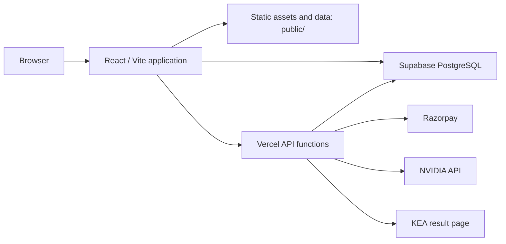

# KCETCoded Platform Documentation

## 1. Purpose and scope

KCETCoded is a web application for KCET and COMEDK counselling research and preparation. It brings together rank-estimation tools, historical cutoff exploration, college discovery, counselling aids, student utilities, community input and payment-supported access features.

It is an independent application. It is not an official KEA, COMEDK, college, examination-board or government service. Historical datasets and estimates are decision-support material only; users must verify admissions decisions against the relevant authority's current official publications.

This document covers the application in this repository: its deployed runtime shape, code organisation, routes, data, APIs, database integration and operating model. It does not certify accuracy of the source datasets or provide legal, financial or admissions advice.

## 2. System summary

| Area | Implemented approach |
| --- | --- |
| Client | React 18 single-page application written primarily in TypeScript |
| Build | Vite 5 and SWC React plugin |
| Styling | Tailwind CSS, Radix UI primitives and local CSS |
| Hosting / server functions | Vercel configuration plus functions in `api/` |
| Shared backend | Supabase PostgreSQL and client SDK |
| Static data | Cutoff, news, PDF and supporting artifacts in `public/data/` |
| Payments | Razorpay order creation and signature verification |
| AI services | NVIDIA-hosted chat completion endpoints; an OpenRouter client-side module is also present |
| Test tooling | Vitest and Testing Library; three algorithm test files are present |

The browser is the primary execution environment. Much of the product reads static files, calculates results locally, and saves personal preferences in browser storage. Supabase is used for selected shared records such as reviews, questions, results cache, donation/access records and moderation-related content. Vercel functions handle requests that require server-side credentials or edge rendering.

## 3. Product domains

### 3.1 Admission intelligence

The application contains KCET and COMEDK rank-prediction and cutoff-exploration flows, a college predictor, a college-first cutoff view, trends, round prediction and a preference simulation. KCET/COMEDK mode is held by `ExamModeContext` and changes the behaviour of selected shared routes.

Predictions are models based on locally available historical or community data. They are not official rank calculations and must not be presented as guaranteed outcomes.

### 3.2 College research and planning

College pages provide profile, cutoff, comparison, review and suggestion surfaces. College data is assembled from static datasets and, for selected screens, Supabase records. Route aliases redirect older entry points to current ones; the canonical college-prediction route is `/college-predictor`.

### 3.3 Counselling information and utilities

The product includes document guidance, document-verification simulation, round tracking, materials, an information centre, CET news, metro/BMTC tools, hidden-gems discovery and a mock simulator. These are informational aids, not official workflow substitutes.

### 3.4 Community and engagement

The codebase supports college reviews and reports, comments/discussion, suggestions, polls, PYQ practice, daily challenge, Cutoff Clash, Squad Finder, feature requests and supporter views. Some of these features write to Supabase; many personal interaction states are browser-local.

### 3.5 Monetisation and gated features

Razorpay checkout is initiated in the client and mediated by `/api/create-order` and `/api/verify-payment`. A successful verification may create a donor record and an access code. Client-side unlocking is implemented in `src/lib/unlock.ts`; therefore it is a user-experience gate, not a substitute for server-side entitlement enforcement.

## 4. Runtime architecture

### 4.1 Application bootstrap and state

`src/main.tsx` mounts the React tree. `src/App.tsx` creates the route map and wraps it in the app providers. `ExamModeContext` persists the selected exam mode under `kcet.exam-mode.v1`. `PresenceAndBlockProvider` controls site availability / donor-related presentation behaviour. `predictorStore.ts` provides lightweight shared predictor state. React Query is available for asynchronous client state; this repository does not use a single central state-management framework for every feature.

`Layout`, `AppSidebar`, `Navbar`, `MobileNav` and `CommandPalette` provide the main application shell. Several route-level pages intentionally bypass `Layout`, including the homepage and certain immersive tools.

### 4.2 Static data delivery

High-volume cutoff material and supporting datasets reside in `public/data/`, with additional public PDF/XLSX assets under `public/` and `public/cutoffs/`. The application fetches these at runtime; it does not require the database for all core cutoff interactions. This makes the client resilient to database unavailability for static-data pages but means artifacts must be refreshed and published carefully.

### 4.3 Server-side functions

Vercel recognises source files under `api/` as functions. The function set is listed in section 7. API functions use environment variables for credentials. A Vite development plugin mirrors selected server behaviours during local development; production behaviour must be validated through Vercel functions, not assumed from the Vite server alone.

## 5. Route catalogue

All routes below are declared in `src/App.tsx` as of the stated baseline. “Shell” means the route is wrapped by `Layout`; “standalone” means it renders without that wrapper.

| Route | Page / behaviour | Presentation |
| --- | --- | --- |
| `/` | Homepage | Standalone |
| `/dashboard` | Dashboard | Shell |
| `/rank-predictor` | KCET or COMEDK predictor selected by current mode | Shell |
| `/cutoff-explorer` | KCET or COMEDK explorer selected by current mode | Shell |
| `/comedk-explorer` | Dedicated COMEDK explorer | Shell |
| `/college-predictor` | Rank/category-driven college predictor | Shell |
| `/college-finder` | Redirects to `/college-predictor` | Redirect |
| `/cutoff-trends` | Historical cutoff visualisation | Shell |
| `/cutoff-predictor`, `/round-predictor` | Round prediction | Shell |
| `/mock-simulator` | Preference / allocation simulation | Shell |
| `/round-tracker` | Counselling-round guidance | Shell |
| `/college-compare` | College comparison | Shell |
| `/documents` | Counselling document guidance | Shell |
| `/document-verification` | Mock verification experience | Shell |
| `/reviews`, `/reviews/:collegeCode` | Review list and college-specific review page | Shell |
| `/colleges`, `/college-list` | College information hub | Shell |
| `/college-cutoffs` | College-first cutoff view | Shell |
| `/college/:collegeCode` | College detail | Shell |
| `/info-centre`, `/materials`, `/cet-news` | Information, resources and news | Shell |
| `/ai-counselor` | AI guidance UI | Shell |
| `/pyq-test` | Previous-year-question practice | Shell |
| `/donate`, `/supporters` | Donation and supporter surfaces | Shell |
| `/privacy`, `/terms`, `/payment-policy`, `/about` | Policy and product information | Shell |
| `/request-feature` | Feedback intake | Shell |
| `/daily-challenge`, `/cutoff-clash` | Daily engagement tools | Standalone |
| `/squad-finder`, `/metro-mapper`, `/bmtc-mapper`, `/hidden-gems` | Research / utility tools | Standalone |
| `/admin` | Client-side administration hub | Standalone |
| `*` | Not-found fallback | Standalone |

Route files may exist without an active route declaration (for example `Analytics.tsx`, `FeeCalculator.tsx`, `Planner.tsx`, `XLSXDemo.tsx` and admin components). File presence is not proof of an active user-facing feature.

## 6. Codebase map

| Path | Responsibility |
| --- | --- |
| `src/pages/` | Route-level views and feature workflows |
| `src/components/` | Shared UI, community widgets, analytical visualisations and admin panels |
| `src/lib/` | Business logic, predictors, data loading, parsers, security helpers and service wrappers |
| `src/contexts/` | Cross-cutting React context providers |
| `src/data/` | Embedded data, especially the PYQ bank and college metadata |
| `src/integrations/supabase/` | Typed Supabase client and generated schema types |
| `src/store/` | Lightweight shared predictor store |
| `api/` | Vercel serverless/edge endpoints |
| `public/` | PWA assets, SEO assets, downloadable/source data and static datasets |
| `scripts/` | Extraction, merge, inspection, validation, news and data-maintenance scripts |
| `supabase/` | Schema, migrations and Supabase CLI configuration |
| `reports/` | Data quality output artifacts |

The repository also contains raw PDFs, XLSX files, intermediate extraction artifacts, backups and debugging output at the root. These are useful for traceability but increase repository size and make a deliberate retention policy necessary.
